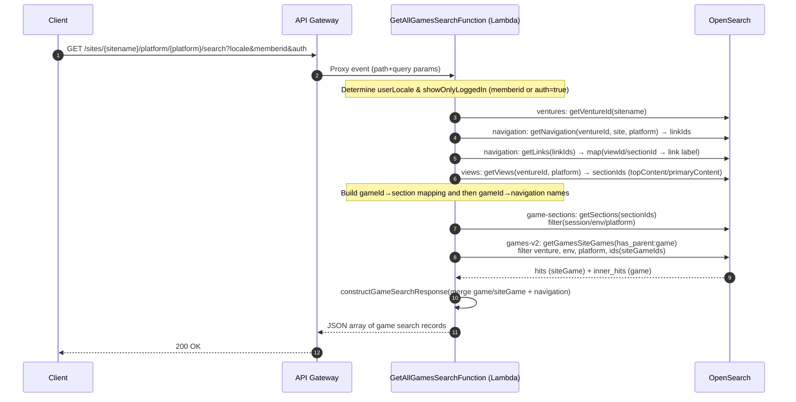
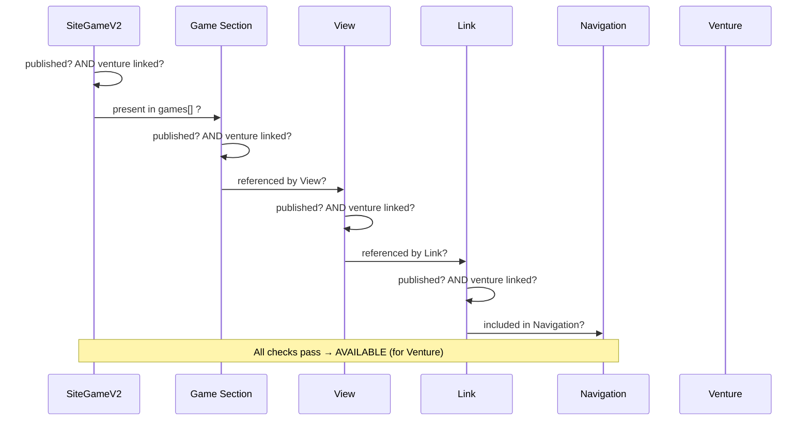

# GET Search API Deep Analysis

Implementation-accurate walkthrough of the current **GET search endpoint** that powers the “All Games” search for a venture.

---

# CURRENT SEARCH ARCHITECTURE FLOW :

## 1) Public contract

**HTTP**
`GET /sites/{sitename}/platform/{platform}/search`

**Query params**

- `locale`: e.g. `en-GB` or `en-US`
- `memberid` (optional): indicates a logged-in user if non-empty
- `auth` (optional, `"true"`/`"false"`): also used to infer logged-in mode

Example events show both **EU** and **NA** shapes, including path parameters and the above query params. &#x20;

---

## 2) End-to-end flow



---

### 2.1) Games Availability Rules

A **SiteGameV2** result is **only available** for a given venture if **all** conditions are true:

1. **SiteGameV2 (in `games-v2`, child of Game)**

   * Published
   * Has **Venture** reference (scopes visibility)
2. **Game Section** (contains SiteGameV2 in `games[]`)

   * Published
   * Has **Venture** reference
3. **View**

   * Published
   * Has **Venture** reference
4. **Link**

   * Published
   * Has **Venture** reference
5. **Navigation**

   * Contains the **Link** in its `navigation[]` array
     (Published; acts as taxonomy/collection validator)

> If any publish/linkedParent/venture condition fails → the SiteGameV2 is **unavailable**.

---
### 2.2) SiteGames Availability Chain


---

---

## 3) Lambda behavior & reasoning (step-by-step)

The core fetch logic; the deployed Lambda follows the same chain, with added filtering/instrumentation.&#x20;

### Step 1 — Resolve the **venture**

- **getVentureId**: Look up `{sitename}` in the `ventures` index to get `ventureId`. Used to scope subsequent queries.&#x20;

### Step 2 — Resolve **Views** for the venture (platform-aware)

- **getViews**: Query the `views` index for the venture; **Views** are modeled 1:1 web↔native via `platformVisibility`. Filter by `{platform}` (`web` vs `app`).&#x20;

### Step 3 — Identify **View names/slugs**

- **getViewData / getViewNames**: From `views` pick only those corresponding to the former “homepage/category” surfaces, then collect their IDs → **view names/slugs** (e.g., `['homepage','bingo','casino','jackpots']`).&#x20;

### Step 4 — Expand Views → **section IDs**

- **getViews / getSectionIds**: Fetch `views` by the selected list; keep each `view.name/viewSlug` and its `topContent[]/primaryContent[]` **section** references. Build:

  - a map `{ viewNameOrSlug → [sectionId,...] }`
  - a **flat** `[sectionId,...]` list for the next query.&#x20;

### Step 5 — Get **Game Sections** with their **siteGame IDs** (aggregated)

- Query `game-sections` with an **aggregation** so each section’s `games` rolls up under its owning **View**—this removes the need for an extra in-memory join later.
- Extract:

  - **allSiteGameIds** = union of siteGame IDs across sections
  - **siteGameId → \[nav/view name,...]** (for the final “navigation” field)&#x20;

> **Implementation detail (from code):**
> Game Sections are filtered by **session**, **environment**, and **platform**:
>
> - session: `sessionVisibility.{locale}.keyword` equals `loggedIn` or `loggedOut` based on `memberid`/`auth`
> - environment: `environmentVisibility.{locale}.keyword` equals the Lambda’s execution environment
> - platform: `platformVisibility.{locale}.keyword` equals `{platform}`
> - classification: restrict to **game-bearing** section classes (e.g., Jackpots / DFG / Grids / Carousels)
>
> This ensures only the **visible** sections for the current context are used.

### Step 6 — Query **games-v2** (siteGame hits + parent **game** inner_hits)

- The Lambda queries `games-v2` using:

  - **terms** on `_id` in `allSiteGameIds`
  - **term** filters for venture, environment, platform
  - **has_parent**: `parent_type: "game"` with `inner_hits` exposing game-level fields (titles, media, config)

- `_source` trimmed to what the response builder needs (siteGame.id, headlessJackpot, liveHidden, gameId, tags; from parent: gamePlatformConfig, title, image/animation media variations, etc.).&#x20;

> **Implementation optimizations (from code):**
>
> - Venture filter (`siteGame.venture.{spaceLocale}.sys.id = ventureId`) reduces the Lucene set _before_ the parent/child join, improving latency under large catalogs.
> - Size limit respects a `GAME_SEARCH_QUERY_LIMIT` constant to prevent over-fetch.

### Step 7 — **Assemble the final payload**

- Merge each siteGame hit with its parent game `inner_hits` and the derived **navigation** names (from Views/Links).
- Localisation fallback: `tryGetValueFromLocalised(userLocale, spaceLocale, ...)` for text and image patterns.
- **Logged-in vs logged-out assets**:

  - If **logged-in** (`memberid` present or `auth=true`), choose `imgUrlPattern`, `animationMedia`, `foregroundLogoMedia`, `backgroundMedia`.
  - Else choose `loggedOutImgUrlPattern`, `loggedOutAnimationMedia`, `loggedOutForegroundLogoMedia`, `loggedOutBackgroundMedia`.

---

## 4) How “logged-in” is inferred

- `showOnlyLoggedIn = (memberid is non-empty) OR (auth === "true")`.
- This drives **Game Section** visibility filters (session) and which **media** fields are used in the final response.&#x20;

---

## 5) OpenSearch Query indices

- `ventures` — resolve venture by sitename (scopes all later queries).&#x20;
- `navigation` — venture navigation + links; derive link→**View** (and labels) used for the “navigation” names.&#x20;
- `views` — page containers; map **Views** to their **section IDs** via `topContent[]/primaryContent[]`.&#x20;
- `game-sections` — fetch **game-bearing sections** (grids/carousels/jackpots/DFG/search results); apply session/env/platform visibility.&#x20;
- `games-v2` — fetch siteGame hits + parent game `inner_hits`; filter by venture, env, platform, and `allSiteGameIds`.&#x20;

---

## 6) Query shapes (summarized)

### Game Sections query (visibility-aware)

- `constant_score.filter.bool` with:

  - `should`: **classification ∈ {Jackpots, Game/Grids, DFG, …}** (game-bearing families)
  - `filter`: `env == lambdaEnv`, `platform == {platform}`, `session == loggedIn|loggedOut`, `ids == sectionIds`

### Games-v2 query (parent/child join)

- `constant_score.filter.bool.must`:

  - `match` ventureId
  - `has_parent` (`parent_type: game`) with `inner_hits` selecting game fields
  - `terms` `_id ∈ allSiteGameIds`
  - `term` `environment == lambdaEnv`
  - `term` `platform == {platform}`

- `_source` on siteGame trimmed to: `id`, `headlessJackpot`, `liveHidden`, `gameId`, `tags`
  (Parent inner_hits include `gamePlatformConfig`, `title`, multiple `...Media` fields, `...ImgUrlPattern`, etc.)

---

## 7) Response model

```json
{
  "entryId": "<siteGame.id>",
  "gameId": "<siteGame.gameId>",
  "name": "<platform-aware gamePlatformConfig.name or mobileName>",
  "title": "<localized game.title>",
  "gameSkin": "<gamePlatformConfig.gameSkin>",
  "demoUrl": "<gamePlatformConfig.demoUrl>",
  "realUrl": "<gamePlatformConfig.realUrl>",
  "imgUrlPattern": "<logged-in or logged-out pattern>",
  "animationMedia": { /* Bynder asset shape */ },
  "foregroundLogoMedia": { /* Bynder */ },
  "backgroundMedia": { /* Bynder */ },
  "sash": "<siteGame.sash>",
  "representativeColor": "<game.representativeColor>",
  "headlessJackpot": { /* if present */ },
  "liveHidden": true|false,
  "tags": [ "..."],
  "navigation": ["<derived nav name>", "..."]
}
```

> The final assembly from **games-v2** + the **siteGame→view/link** dictionary; the implementation expands it with media fields, tags, sash, color, jackpot, etc.&#x20;

---

## 8) Observability & errors

- Centralized error handling returns a JSON error with `{ code, message }` and logs diagnostics with a structured `ErrorCode`. (From implementation.)

---

## 9) Notable nuances and guardrails

- **Logged-in switching**: Either `memberid` present **or** `auth=true` triggers logged-in view—affects **Game Section** filtering and which media/image fields are emitted.&#x20;
- **Platform normalization**: Internally, some Contentful constraints mean app clients are treated as `phone` for certain downstream queries (implementation detail ensuring platform visibility alignment).
- **Environment safety**: All queries include an environment filter so staging/prod content doesn’t bleed across.
- **Performance**: The venture prefilter and `_source` trimming keep the parent/child join snappy even with large catalogs (plus a hard cap via `GAME_SEARCH_QUERY_LIMIT`).

---

## 10) Query logic

1. Parse `sitename`, `platform`, `locale`, `memberid`, `auth`.
2. Compute `showOnlyLoggedIn`.
3. Resolve `ventureId` from `ventures`.&#x20;
4. Pull **Navigation** (top+bottom) → `linkIds` → fetch links → map **view/section → nav label**.
5. Fetch **Views** by IDs; from each, collect **section IDs** (top/primary); query **Game Sections** with (session/env/platform + classification) filters; collect `siteGameIds`; build `gameId → navNames`.
6. Query **games-v2** with venture/env/platform filters, `terms _id`, and `has_parent: game` to pull game fields.&#x20;
7. Merge into the final array of game records (localized, platform-aware media selection, nav names, tags, jackpot/live flags).&#x20;

---

## 11) Summary
- Search must validate a full availability chain across five Contentful/OpenSearch entities (plus venture scoping): 
SiteGameV2 (games-v2 child) → Section → View → Link → Navigation + Venture.
- Relationships are split across content types and indexed as separate OpenSearch documents.This forces the Search Lambda to run sequential dependency-chained queries — effectively doing joins in application code.

- The pattern side-affects :
    * N+1 query flows
    * Low cache hit ratios
    * High OpenSearch CPU/memory usage → p95 latency spikes and escalating cost.
    * API Gateway’s 5-min TTL cache is ineffective — high-entropy queries (free text + multi-filters) mean low cache locality.