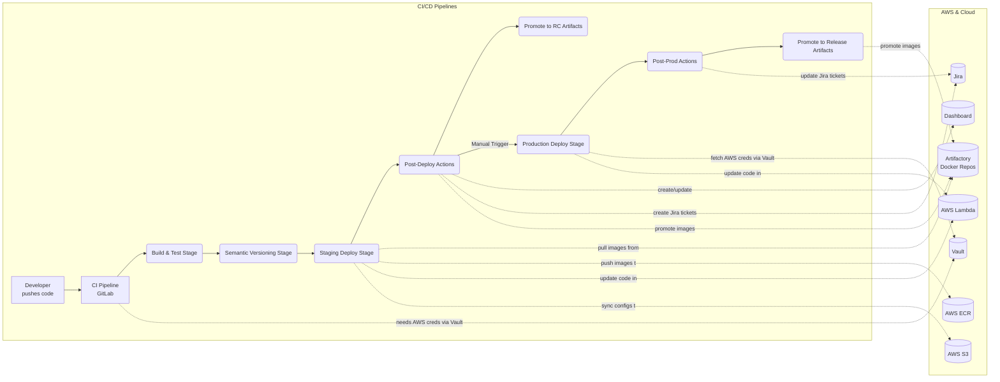
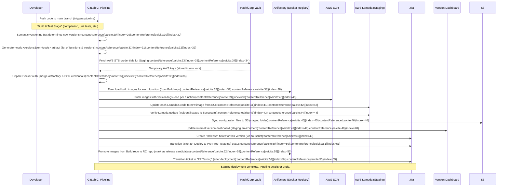
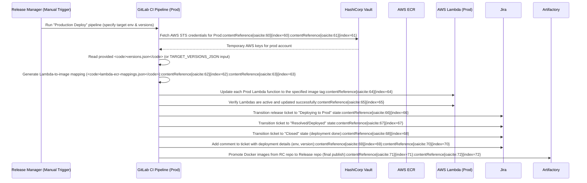
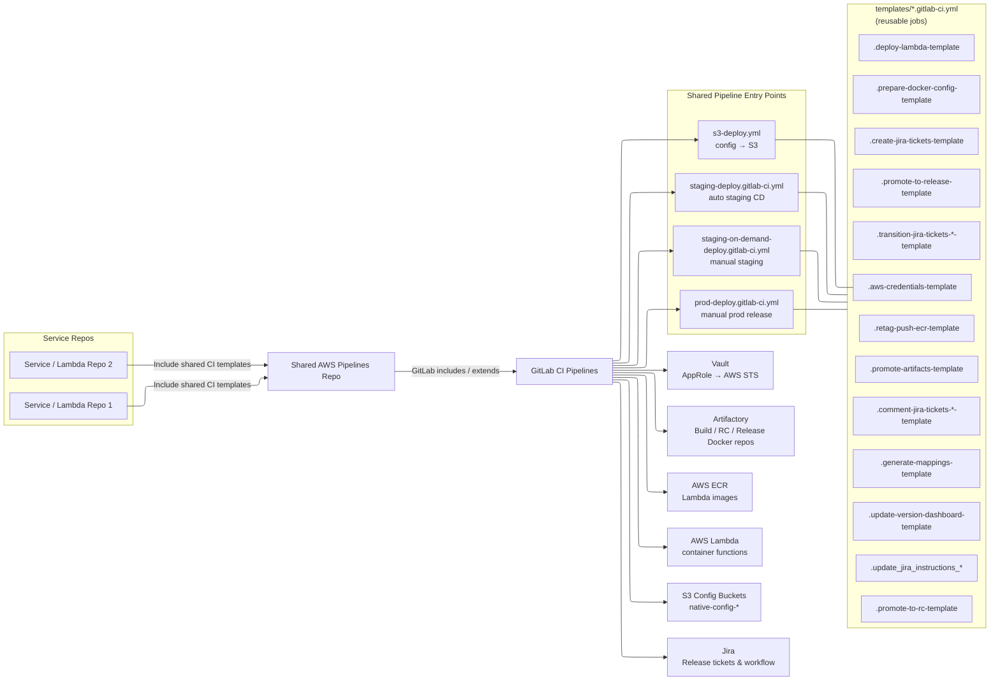
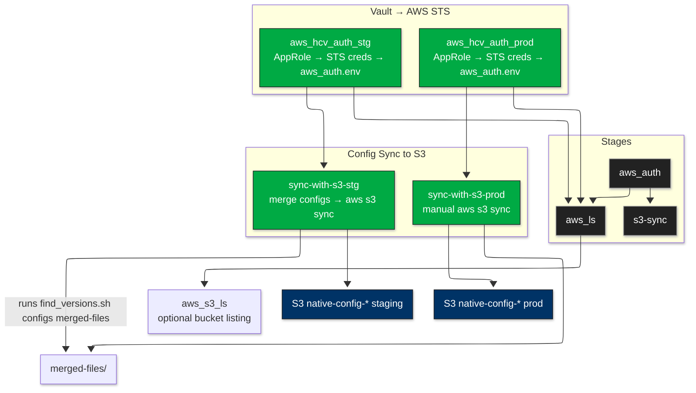
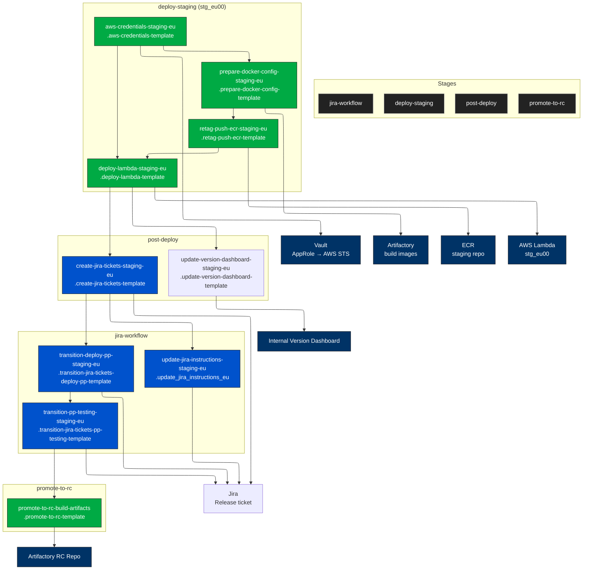
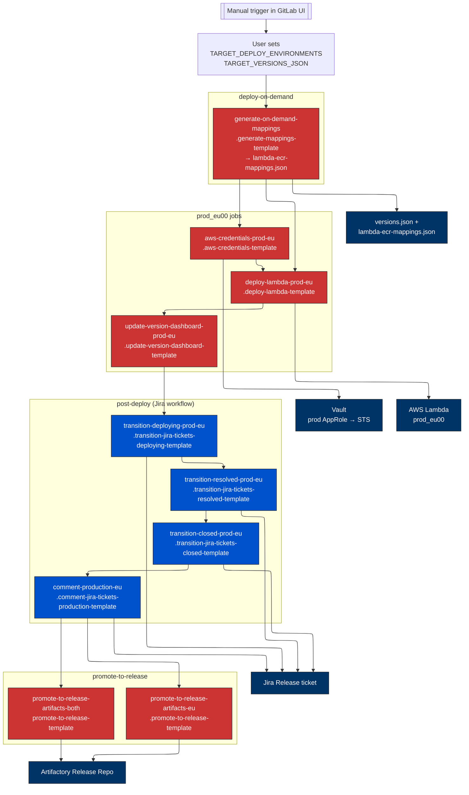
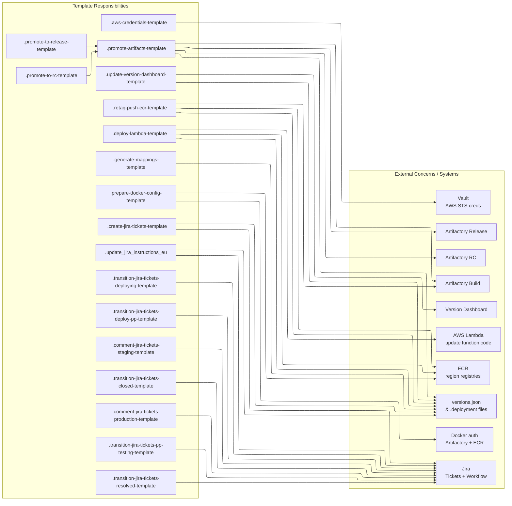
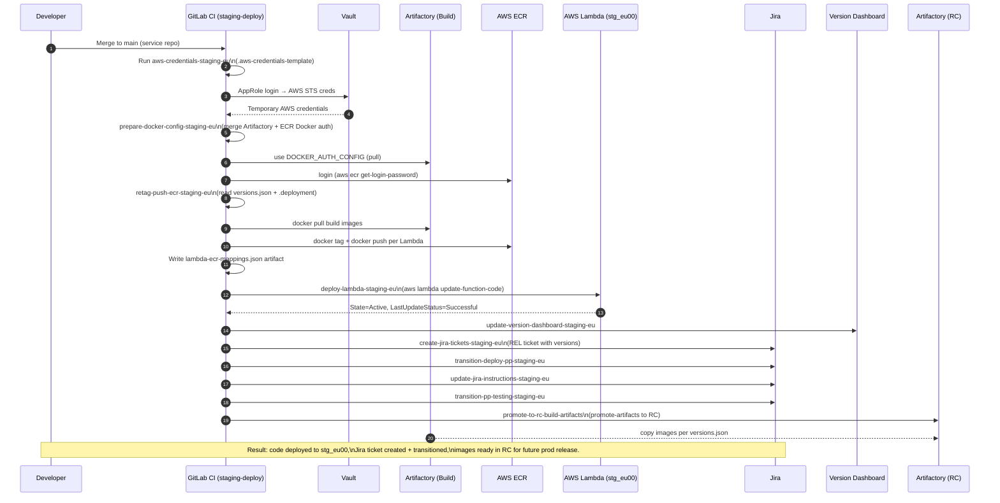

# AWS Pipeline Templates – Comprehensive Overview

## Introduction

**Project Scope:** This repository (“pipelines”) provides a centralized set of GitLab CI/CD pipeline templates for deploying AWS-related services and configurations in the organization’s cloud environment[GitHub](https://gitlab.ballys.tech/excite/native/templates/pipelines/blob/310f3e5715e05e345871bb14496dfb479074367f/CLAUDE.md#L2-L9)[GitHub](https://gitlab.ballys.tech/excite/native/templates/pipelines/blob/310f3e5715e05e345871bb14496dfb479074367f/CLAUDE.md#L34-L41). It standardizes how **AWS Lambda functions** are built, tested, and deployed, and how application configuration is synced to **AWS S3**, using consistent workflows across projects. By encapsulating these processes, the templates ensure that all projects follow the same continuous integration and deployment (CI/CD) steps, improving reliability and reducing duplication.

**What It Does:** The AWS pipeline templates automate the end-to-end software release process for serverless applications. In non-technical terms, it’s like an **assembly line** for code changes: when developers update code, the pipeline *automatically* runs checks, packages the code as a container, uploads it to AWS, updates any needed settings, and even notifies other tools (like Jira for ticket tracking) about the deployment status. For example, when code for an AWS Lambda function is pushed, the pipeline will compile the code, run tests, determine a new version number, build a Docker image, push it to an internal registry, then deploy that image to the AWS Lambda service. It also handles retrieving **secrets** (like AWS credentials) from a secure vault and updating **configurations** in S3 buckets. All of this happens with minimal manual intervention, ensuring that deployments are **repeatable**, **secure**, and **auditable**.

**Wider Architecture Fit:** These pipelines are a part of the company’s larger CI/CD ecosystem, which includes similar templates for Rust services, Node.js applications, static websites, etc[GitHub](https://gitlab.ballys.tech/excite/native/templates/pipelines/blob/310f3e5715e05e345871bb14496dfb479074367f/CLAUDE.md#L10-L18)[GitHub](https://gitlab.ballys.tech/excite/native/templates/pipelines/blob/310f3e5715e05e345871bb14496dfb479074367f/CLAUDE.md#L34-L42). The AWS pipeline components specifically focus on cloud infrastructure tasks: they interface with **HashiCorp Vault** for secret management, **Artifactory** for storing build artifacts (container images), **AWS ECR** (Elastic Container Registry) for container deployment, **AWS Lambda** for running the serverless applications, and **GitLab** (or GitHub) as the CI platform orchestrating everything. They also integrate with **SonarQube** and **Nexus IQ** (for code quality and security scanning) and with **Jira** (for tracking deployment tickets), although those integrations are handled via scripts and Nx tasks within the pipeline[GitHub](https://gitlab.ballys.tech/excite/native/templates/pipelines/blob/310f3e5715e05e345871bb14496dfb479074367f/CLAUDE.md#L50-L58). In essence, the AWS pipelines act as the bridge between application code and the AWS cloud environment, ensuring that whenever code is ready to release, it gets delivered to AWS in a consistent, safe manner.

**Tech Stack and Tools:** Under the hood, the pipelines use **GitLab CI** YML definitions, executed in Docker containers. The pipeline jobs run on Node.js 20 images for scripting and AWS CLI tools[GitHub](https://gitlab.ballys.tech/excite/native/templates/pipelines/blob/310f3e5715e05e345871bb14496dfb479074367f/aws/lambda/build-deploy/templates/aws-credentials.gitlab-ci.yml#L14-L22)[GitHub](https://gitlab.ballys.tech/excite/native/templates/pipelines/blob/310f3e5715e05e345871bb14496dfb479074367f/aws/lambda/build-deploy/templates/deploy-lambda.gitlab-ci.yml#L16-L24). Key technologies include:

- **Node.js & Nx Monorepo**: The projects using these pipelines often utilize Nx (a monorepo tool). Custom Node scripts (written in JavaScript) are provided in this repo to handle version management and artifact building (e.g., generating a `versions.json` file and building Docker images).
- **Docker & Artifactory**: Lambda functions are containerized as Docker images. An internal JFrog Artifactory registry (called “Build” bucket) stores these images initially[GitHub](https://gitlab.ballys.tech/excite/native/templates/pipelines/blob/310f3e5715e05e345871bb14496dfb479074367f/aws/lambda/build-deploy/templates/promote-artifacts.gitlab-ci.yml#L73-L81). The pipeline then logs in to AWS ECR and *re-tags* and pushes images there for deployment.
- **HashiCorp Vault**: Used to fetch AWS credentials securely via Vault’s AppRole authentication. This replaces storing static AWS keys in CI. The pipeline includes a template to perform Vault login and obtain temporary AWS STS credentials for deployments[GitHub](https://gitlab.ballys.tech/excite/native/templates/pipelines/blob/310f3e5715e05e345871bb14496dfb479074367f/aws/s3-deploy.yml#L78-L87)[GitHub](https://gitlab.ballys.tech/excite/native/templates/pipelines/blob/310f3e5715e05e345871bb14496dfb479074367f/aws/s3-deploy.yml#L123-L131).
- **AWS Services**: The pipelines interact with AWS in multiple ways – updating Lambda functions (using the AWS CLI), syncing files to S3 buckets (for configuration), and pulling ECR login tokens. All AWS operations use the credentials and region info provided at runtime, ensuring isolation between staging and production.
- **Jira Integration**: Deployment pipelines automate Jira ticket updates. For each release, the pipeline can create a “release” ticket and then update its status through various stages (e.g., marking tickets as deployed to Pre-Prod, then to Production, etc.) and add comments. This is done via Nx tasks that run custom scripts to talk to Jira’s API.
- **Mermaid Diagrams for Clarity:** Throughout this documentation, Mermaid diagrams are used to visualize the flow of processes and components for easier understanding. These will illustrate how a code change travels through the pipeline to become a deployed service.

By providing these templates, the repository allows new projects or new engineers to quickly adopt proven patterns. Next, we will dive into the architecture and flow of the AWS pipelines, followed by detailed breakdowns of the configuration files, scripts, and other assets in the `aws/` directory.

## Architecture Overview

### High-Level Architecture

At a high level, the AWS pipeline templates orchestrate two related CI/CD workflows:

- **1. AWS Lambda Build & Deployment Pipeline:** This is the process that takes application code (for one or many Lambda functions) from source code to a deployed container image running as a Lambda function in AWS. It spans multiple stages: build/test, versioning, artifact publishing, staging deployment, and production deployment.
- **2. AWS S3 Configuration Sync Pipeline:** This is a simpler pipeline flow that ensures configuration files (for the application or platform, often called “native config”) are packaged and synchronized to an S3 bucket, so that applications can fetch their latest configuration from AWS. This pipeline uses Vault for auth and then performs an S3 sync.

Both workflows leverage common infrastructure: HashiCorp Vault for secrets, Artifactory for artifact storage, and GitLab CI for orchestration. The diagram below shows how a code change progresses through these pipelines and interacts with external systems:


---
**Diagram Explanation:** In the CI/CD Pipelines cluster (left), the stages correspond to jobs defined in the pipeline templates. The arrows to the Cloud components (right) show interactions:

- The pipeline obtains **AWS credentials from Vault** at the start of deployment stages (both staging and production) using a secure AppRole login[GitHub](https://gitlab.ballys.tech/excite/native/templates/pipelines/blob/310f3e5715e05e345871bb14496dfb479074367f/aws/s3-deploy.yml#L78-L87).
- During the **Staging Deploy Stage**, the pipeline pulls the new Docker images from **Artifactory** (the build repository) and pushes them to **AWS ECR** (Elastic Container Registry)[GitHub](https://gitlab.ballys.tech/excite/native/templates/pipelines/blob/310f3e5715e05e345871bb14496dfb479074367f/aws/lambda/build-deploy/templates/retag-push-ecr.gitlab-ci.yml#L80-L88)[GitHub](https://gitlab.ballys.tech/excite/native/templates/pipelines/blob/310f3e5715e05e345871bb14496dfb479074367f/aws/lambda/build-deploy/templates/retag-push-ecr.gitlab-ci.yml#L89-L97). It then updates the code running in **AWS Lambda** by pointing each function to its new container image[GitHub](https://gitlab.ballys.tech/excite/native/templates/pipelines/blob/310f3e5715e05e345871bb14496dfb479074367f/aws/lambda/build-deploy/templates/deploy-lambda.gitlab-ci.yml#L52-L60)[GitHub](https://gitlab.ballys.tech/excite/native/templates/pipelines/blob/310f3e5715e05e345871bb14496dfb479074367f/aws/lambda/build-deploy/templates/deploy-lambda.gitlab-ci.yml#L54-L57). In parallel, it synchronizes any updated configuration files to **AWS S3** (native config bucket) using the S3 sync job[GitHub](https://gitlab.ballys.tech/excite/native/templates/pipelines/blob/310f3e5715e05e345871bb14496dfb479074367f/aws/s3-deploy.yml#L38-L46)[GitHub](https://gitlab.ballys.tech/excite/native/templates/pipelines/blob/310f3e5715e05e345871bb14496dfb479074367f/aws/s3-deploy.yml#L56-L64).
- After deploying to staging, **Post-Deploy Actions** run: the pipeline updates a **dashboard** (an internal “version dashboard” showing what’s deployed where) and interacts with **Jira** – it can create a release ticket and mark it as deployed to the staging environment[GitHub](https://gitlab.ballys.tech/excite/native/templates/pipelines/blob/310f3e5715e05e345871bb14496dfb479074367f/aws/lambda/build-deploy/templates/create-jira-tickets.gitlab-ci.yml#L26-L34)[GitHub](https://gitlab.ballys.tech/excite/native/templates/pipelines/blob/310f3e5715e05e345871bb14496dfb479074367f/aws/lambda/build-deploy/templates/transition-jira-tickets.gitlab-ci.yml#L67-L76). It also promotes the Docker images from the *Build* repository to the *RC (Release Candidate)* repository in **Artifactory**[GitHub](https://gitlab.ballys.tech/excite/native/templates/pipelines/blob/310f3e5715e05e345871bb14496dfb479074367f/aws/lambda/build-deploy/templates/promote-to-rc.gitlab-ci.yml#L8-L16)[GitHub](https://gitlab.ballys.tech/excite/native/templates/pipelines/blob/310f3e5715e05e345871bb14496dfb479074367f/aws/lambda/build-deploy/templates/promote-to-rc.gitlab-ci.yml#L12-L19), making them available for production.
- The **Production Deploy Stage** is triggered manually via the GitLab UI (only when a human decides to promote to production). It uses the images already in ECR (from staging) and the metadata from the RC artifacts. The pipeline fetches fresh AWS credentials from Vault for production accounts, generates a deployment plan (mapping of Lambdas to specific image tags), and updates the **AWS Lambda** functions in production accordingly[GitHub](https://gitlab.ballys.tech/excite/native/templates/pipelines/blob/310f3e5715e05e345871bb14496dfb479074367f/aws/lambda/build-deploy/prod-deploy.gitlab-ci.yml#L2-L5)[GitHub](https://gitlab.ballys.tech/excite/native/templates/pipelines/blob/310f3e5715e05e345871bb14496dfb479074367f/aws/lambda/build-deploy/prod-deploy.gitlab-ci.yml#L41-L49).
- The **Post-Prod Actions** then transition the Jira release ticket through “Deploying”, “Resolved”, and “Closed” states automatically[GitHub](https://gitlab.ballys.tech/excite/native/templates/pipelines/blob/310f3e5715e05e345871bb14496dfb479074367f/aws/lambda/build-deploy/prod-deploy.gitlab-ci.yml#L217-L225)[GitHub](https://gitlab.ballys.tech/excite/native/templates/pipelines/blob/310f3e5715e05e345871bb14496dfb479074367f/aws/lambda/build-deploy/prod-deploy.gitlab-ci.yml#L234-L243), and add a comment to the ticket noting the production deployment[GitHub](https://gitlab.ballys.tech/excite/native/templates/pipelines/blob/310f3e5715e05e345871bb14496dfb479074367f/aws/lambda/build-deploy/templates/comment-jira-tickets.gitlab-ci.yml#L39-L47)[GitHub](https://gitlab.ballys.tech/excite/native/templates/pipelines/blob/310f3e5715e05e345871bb14496dfb479074367f/aws/lambda/build-deploy/templates/comment-jira-tickets.gitlab-ci.yml#L51-L59). Finally, the pipeline promotes the Docker images from the RC repository to the permanent **Release** repository in **Artifactory**[GitHub](https://gitlab.ballys.tech/excite/native/templates/pipelines/blob/310f3e5715e05e345871bb14496dfb479074367f/aws/lambda/build-deploy/prod-deploy.gitlab-ci.yml#L280-L289)[GitHub](https://gitlab.ballys.tech/excite/native/templates/pipelines/blob/310f3e5715e05e345871bb14496dfb479074367f/aws/lambda/build-deploy/templates/promote-to-release.gitlab-ci.yml#L8-L16), signifying that these versions are officially released.

Overall, this architecture ensures that every code change goes through a **staging environment** before hitting production, and that artifacts (Docker images) are **promoted** rather than rebuilt for production, preserving the exact bits tested in staging. It also automates the often tedious tasks of updating config files, managing credentials, and keeping track of versions in documentation and Jira.

### Staging Deployment Flow (Continuous Integration)

For a clearer step-by-step view, below is a sequence diagram of the staging pipeline execution from code commit to deployment:


---
**Staging Pipeline Notes:** The staging pipeline runs automatically on every push or merge to the main branch of the code repository (assuming CI rules match)[GitHub](https://gitlab.ballys.tech/excite/native/templates/pipelines/blob/310f3e5715e05e345871bb14496dfb479074367f/aws/lambda/build-deploy/staging-deploy.gitlab-ci.yml#L60-L68)[GitHub](https://gitlab.ballys.tech/excite/native/templates/pipelines/blob/310f3e5715e05e345871bb14496dfb479074367f/aws/lambda/build-deploy/staging-deploy.gitlab-ci.yml#L102-L110). It uses the included templates to perform all the steps above in sequence. If any step fails (e.g., tests fail or a Docker push fails), the pipeline will stop and report an error, preventing incomplete or broken code from deploying. The Jira integration in staging is often configured to not block the pipeline (e.g., some Jira steps are set `allow_failure: true` or run in parallel) – meaning even if Jira updates fail, the deployment can still succeed, and those failures are just logged[GitHub](https://gitlab.ballys.tech/excite/native/templates/pipelines/blob/310f3e5715e05e345871bb14496dfb479074367f/aws/lambda/build-deploy/templates/transition-jira-tickets.gitlab-ci.yml#L68-L76)[GitHub](https://gitlab.ballys.tech/excite/native/templates/pipelines/blob/310f3e5715e05e345871bb14496dfb479074367f/aws/lambda/build-deploy/templates/transition-jira-tickets.gitlab-ci.yml#L97-L105).

### Production Deployment Flow (Manual Promotion)

Once the staging deployment is verified (e.g., QA passes), a team member can trigger the **production deployment pipeline** manually. This pipeline uses many of the same building blocks but is designed to deploy specific versions to specific environments on demand. The sequence diagram below illustrates the production release process:


---
**Production Pipeline Details:** Unlike staging, the production pipeline is **not automatic** – it requires a human to start it via the CI/CD interface, usually when a decision is made to release to customers. The person triggering the pipeline must input two pieces of information: (a) which environment(s) to deploy (e.g., `prod_eu00`, `prod_na03` for EU or NA regions) and (b) a JSON listing the versions of each function to deploy (`TARGET_VERSIONS_JSON`). This JSON is essentially the same format as the `versions.json` produced in staging, and often the team will copy the `versions.json` artifact from the staging pipeline and use it for production to ensure the exact same versions are deployed.

When the prod pipeline runs, it includes jobs that extend the same templates for credentials, deployment, etc., with rules that ensure they only run for the specified targets[GitHub](https://gitlab.ballys.tech/excite/native/templates/pipelines/blob/310f3e5715e05e345871bb14496dfb479074367f/aws/lambda/build-deploy/prod-deploy.gitlab-ci.yml#L62-L70)[GitHub](https://gitlab.ballys.tech/excite/native/templates/pipelines/blob/310f3e5715e05e345871bb14496dfb479074367f/aws/lambda/build-deploy/prod-deploy.gitlab-ci.yml#L80-L88). The **AWS credentials job** fetches production AWS credentials via Vault (pointing to the prod Vault path and role) and makes them available to the subsequent jobs[GitHub](https://gitlab.ballys.tech/excite/native/templates/pipelines/blob/310f3e5715e05e345871bb14496dfb479074367f/aws/lambda/build-deploy/prod-deploy.gitlab-ci.yml#L58-L66). The **generate-mappings job** reads the provided versions JSON and, for each function, looks up the actual AWS Lambda name via the `.deployment` files and constructs the full ECR image tag that should be deployed[GitHub](https://gitlab.ballys.tech/excite/native/templates/pipelines/blob/310f3e5715e05e345871bb14496dfb479074367f/aws/lambda/build-deploy/templates/generate-mappings.gitlab-ci.yml#L42-L50)[GitHub](https://gitlab.ballys.tech/excite/native/templates/pipelines/blob/310f3e5715e05e345871bb14496dfb479074367f/aws/lambda/build-deploy/templates/generate-mappings.gitlab-ci.yml#L53-L61). The **deploy job** then iterates over those mappings and calls AWS to update each Lambda’s code to the new container image[GitHub](https://gitlab.ballys.tech/excite/native/templates/pipelines/blob/310f3e5715e05e345871bb14496dfb479074367f/aws/lambda/build-deploy/templates/deploy-lambda.gitlab-ci.yml#L50-L58), waiting until AWS reports each update was successful[GitHub](https://gitlab.ballys.tech/excite/native/templates/pipelines/blob/310f3e5715e05e345871bb14496dfb479074367f/aws/lambda/build-deploy/templates/deploy-lambda.gitlab-ci.yml#L59-L67).

The production pipeline also handles Jira updates differently: it uses templates geared for “production” states, for example moving tickets to **“Deploying”**, then **“Resolved”**, and finally **“Closed”** to indicate the release is complete[GitHub](https://gitlab.ballys.tech/excite/native/templates/pipelines/blob/310f3e5715e05e345871bb14496dfb479074367f/aws/lambda/build-deploy/prod-deploy.gitlab-ci.yml#L234-L243)[GitHub](https://gitlab.ballys.tech/excite/native/templates/pipelines/blob/310f3e5715e05e345871bb14496dfb479074367f/aws/lambda/build-deploy/prod-deploy.gitlab-ci.yml#L250-L259). It also uses a *comment* template to add a friendly comment like “✅ Deployed to prod_eu00 environment” on the Jira ticket[GitHub](https://gitlab.ballys.tech/excite/native/templates/pipelines/blob/310f3e5715e05e345871bb14496dfb479074367f/aws/lambda/build-deploy/prod-deploy.gitlab-ci.yml#L266-L275)[GitHub](https://gitlab.ballys.tech/excite/native/templates/pipelines/blob/310f3e5715e05e345871bb14496dfb479074367f/aws/lambda/build-deploy/templates/comment-jira-tickets.gitlab-ci.yml#L51-L59). All these Jira steps are run in the **post-deploy stage** of the pipeline.

After Lambdas are updated and Jira is updated, the last step is promoting artifacts to the **Release** bucket in Artifactory. This uses the `.promote-to-release-template`, which calls the same promotion script but with `SOURCE_BUCKET` as the RC repo and `TARGET_BUCKET` as the Release repo[GitHub](https://gitlab.ballys.tech/excite/native/templates/pipelines/blob/310f3e5715e05e345871bb14496dfb479074367f/aws/lambda/build-deploy/templates/promote-to-release.gitlab-ci.yml#L10-L15). This is effectively an API call to Artifactory to copy each image (by version tag) into the stable release repository for long-term storage[GitHub](https://gitlab.ballys.tech/excite/native/templates/pipelines/blob/310f3e5715e05e345871bb14496dfb479074367f/aws/lambda/build-deploy/templates/promote-artifacts.gitlab-ci.yml#L73-L81)[GitHub](https://gitlab.ballys.tech/excite/native/templates/pipelines/blob/310f3e5715e05e345871bb14496dfb479074367f/aws/lambda/build-deploy/templates/promote-artifacts.gitlab-ci.yml#L78-L86). It’s done at the very end and is not gating the deployment itself (failures in promotion will be logged but not fail the deployment, since the images are already running in AWS).

### AWS S3 Configuration Sync Pipeline

In addition to deploying code, the pipelines repository provides a job for syncing configuration files to S3. This is defined in **`aws/s3-deploy.yml`**[GitHub](https://gitlab.ballys.tech/excite/native/templates/pipelines/blob/310f3e5715e05e345871bb14496dfb479074367f/aws/s3-deploy.yml#L32-L40). The use-case is for a project that maintains configuration (such as feature toggles or jurisdiction-specific settings) in version control and needs to publish these to an S3 bucket (e.g., to be consumed by applications at runtime). Here’s how the S3 sync pipeline works:

- It is usually triggered on changes to config files on the main branch (the `only: refs: - main` rule)[GitHub](https://gitlab.ballys.tech/excite/native/templates/pipelines/blob/310f3e5715e05e345871bb14496dfb479074367f/aws/s3-deploy.yml#L46-L54)[GitHub](https://gitlab.ballys.tech/excite/native/templates/pipelines/blob/310f3e5715e05e345871bb14496dfb479074367f/aws/s3-deploy.yml#L64-L70). There are typically two jobs: one for staging and one for production. The **staging sync** job runs automatically, while the **production sync** job is set to `when: manual` (to be triggered when configs are ready to promote)[GitHub](https://gitlab.ballys.tech/excite/native/templates/pipelines/blob/310f3e5715e05e345871bb14496dfb479074367f/aws/s3-deploy.yml#L50-L58)[GitHub](https://gitlab.ballys.tech/excite/native/templates/pipelines/blob/310f3e5715e05e345871bb14496dfb479074367f/aws/s3-deploy.yml#L62-L70).
- Both jobs first require an **AWS auth** step (`aws_hcv_auth_stg` / `aws_hcv_auth_prod`) which logs into Vault with a role ID and secret ID, then requests temporary AWS credentials for the appropriate IAM role[GitHub](https://gitlab.ballys.tech/excite/native/templates/pipelines/blob/310f3e5715e05e345871bb14496dfb479074367f/aws/s3-deploy.yml#L78-L87)[GitHub](https://gitlab.ballys.tech/excite/native/templates/pipelines/blob/310f3e5715e05e345871bb14496dfb479074367f/aws/s3-deploy.yml#L104-L113). These credentials (AWS access key, secret, session token) are output to a file `aws_auth.env` as environment variables[GitHub](https://gitlab.ballys.tech/excite/native/templates/pipelines/blob/310f3e5715e05e345871bb14496dfb479074367f/aws/s3-deploy.yml#L88-L96)[GitHub](https://gitlab.ballys.tech/excite/native/templates/pipelines/blob/310f3e5715e05e345871bb14496dfb479074367f/aws/s3-deploy.yml#L110-L118), which subsequent jobs in the pipeline automatically load.
- There is an optional job `aws_s3_ls` provided (in the YAML) that simply lists S3 buckets, mainly for debugging or verification that credentials and AWS CLI are working[GitHub](https://gitlab.ballys.tech/excite/native/templates/pipelines/blob/310f3e5715e05e345871bb14496dfb479074367f/aws/s3-deploy.yml#L122-L130).
- The **sync job** (`sync-with-s3-stg` / `sync-with-s3-prod`) then runs using an AWS CLI Docker image[GitHub](https://gitlab.ballys.tech/excite/native/templates/pipelines/blob/310f3e5715e05e345871bb14496dfb479074367f/aws/s3-deploy.yml#L52-L60)[GitHub](https://gitlab.ballys.tech/excite/native/templates/pipelines/blob/310f3e5715e05e345871bb14496dfb479074367f/aws/s3-deploy.yml#L38-L46). It determines the target S3 bucket name dynamically: in this case, it lists all S3 buckets and picks one containing the substring "native-config"[GitHub](https://gitlab.ballys.tech/excite/native/templates/pipelines/blob/310f3e5715e05e345871bb14496dfb479074367f/aws/s3-deploy.yml#L38-L41)[GitHub](https://gitlab.ballys.tech/excite/native/templates/pipelines/blob/310f3e5715e05e345871bb14496dfb479074367f/aws/s3-deploy.yml#L56-L59). (This is a specific implementation detail; essentially it finds the bucket used for configuration storage.)
- Before syncing, it runs a script `find_versions.sh configs merged-files`[GitHub](https://gitlab.ballys.tech/excite/native/templates/pipelines/blob/310f3e5715e05e345871bb14496dfb479074367f/aws/s3-deploy.yml#L38-L41). Although the details of `find_versions.sh` aren’t shown here, we can infer it likely merges or processes config files from a `configs/` directory into a `merged-files/` directory, possibly applying environment-specific overlays or version tags. The result is that `merged-files/` contains the up-to-date configuration files to be published.
- Finally, the job executes `aws s3 sync merged-files s3://<Bucket>/<Platform> --delete ...`[GitHub](https://gitlab.ballys.tech/excite/native/templates/pipelines/blob/310f3e5715e05e345871bb14496dfb479074367f/aws/s3-deploy.yml#L40-L48)[GitHub](https://gitlab.ballys.tech/excite/native/templates/pipelines/blob/310f3e5715e05e345871bb14496dfb479074367f/aws/s3-deploy.yml#L56-L64). This command uploads all files in the `merged-files` directory to the target S3 bucket (under a sub-path named by `$PLATFORM`, which is likely a variable indicating the product or platform name). The `-delete` flag ensures any files removed in the repo are also removed from S3, keeping S3 in sync with the git source. The command excludes any hidden files or certain subdirectories (like it might exclude any “prod” directory when syncing staging, to avoid mixing prod-only configs).
- If the production sync job is run, it uses the production Vault credentials and targets the production bucket (which might actually be the same bucket but a different path, depending on how environments are separated in naming). It’s typically a manual job to avoid accidental overwrites in production.

In summary, the S3 config pipeline ensures that configuration changes are deployed alongside code changes. By using Vault and AWS CLI, it accomplishes in a secure, automated way what might otherwise be a manual step of uploading JSON/YAML config files to S3.

## Detailed Breakdown

### JSON Files

1. **versions.json** – Auto-generated file listing all Lambda projects and their versions.
   - Structure: JSON object with project names as keys.
   - Each key’s value is an object: `{ "version": "<semver>", "folder": "<directory name>" }`.
   - Example entry: `"orderService": { "version": "1.4.2", "folder": "order-service" }`.
   - Populated by the `generate-versions.js` script by reading each function’s `project.json`.
   - Used in pipeline to know which version of each function to deploy.

2. **lambda-ecr-mappings.json** – Generated during deployment to map Lambda names to ECR image tags.
   - Structure: JSON object with actual AWS Lambda function names as keys.
   - Each value is a string representing the image tag deployed to that function.
   - Format of tag: `<LambdaName>-<version>` (the container image tag in ECR).
   - Example: `{ "OrderServiceFunction": "OrderServiceFunction-1.4.2", "UserServiceFunction": "UserServiceFunction-3.0.0" }`.
   - Produced by retag/push job or mapping script by combining Lambda name with version.
   - Used by the deploy script to update the correct function with the correct image.

3. **promotion-log-*.json** – Artifact logs for artifact promotion (to RC or release).
   - Structure: JSON with two parts:
     a. `"promotions"`: an array of promotion result objects for each image.
         - Each object: `{ "package": "<projectName>", "version": "<version>", "httpStatus": "<HTTP code>", "timestamp": "<ISO timestamp>", "success": <true/false> }`.
         - Records whether promoting that image from source to target repo succeeded (HTTP 200) or not.
     b. `"summary"`: an object summarizing the results.
         - Fields: `"total"` (count of packages processed), `"successful"` (count of successes), `"failed"` (count of failures), `"completedAt"` (timestamp when promotion finished).
   - Example (partial):
     ```json
     {
       "promotions": [
         { "package": "orderService", "version": "1.4.2", "httpStatus": "200", "timestamp": "2025-11-19T15:22:00Z", "success": true },
         { "package": "userService", "version": "3.0.0", "httpStatus": "500", "timestamp": "2025-11-19T15:22:02Z", "success": false }
       ],
       "summary": {
         "total": 2,
         "successful": 1,
         "failed": 1,
         "completedAt": "2025-11-19T15:22:05Z"
       }
     }
     ```
   - Created by the promote artifacts script (`promote-artifacts.gitlab-ci.yml`) after copying images in Artifactory.
   - Used for auditing and troubleshooting promotions (kept as artifact for a short time).

**Documentation (JSON):**

The `aws/` directory doesn’t contain static JSON files in the repository; however, the pipeline dynamically generates several JSON files as artifacts to carry information between jobs. Understanding these JSON structures is crucial, as they form the data contract between different pipeline stages:

- **`versions.json`:** This file is produced by the **semantic versioning stage** of the pipeline. It contains a dictionary of all Lambda function projects that have new builds. Each entry’s key is a project name (often corresponding to the name of the Lambda or the directory name), and the value includes the new version number and the folder name where that function’s code resides. For example, an entry might look like:
    
    ```json
    {
      "orderService": { "version": "1.4.2", "folder": "order-service" },
      "paymentGateway": { "version": "2.0.0", "folder": "payment-gateway" }
    }
    
    ```
    
    In this snippet, we see two projects: **orderService** version 1.4.2 found in directory *order-service*, and **paymentGateway** version 2.0.0 in *payment-gateway*. This `versions.json` is critical – it tells downstream jobs *what* needs to be deployed. The `generate-versions.js` script creates it by scanning each function’s `project.json` file for its name and version[GitHub](https://gitlab.ballys.tech/excite/native/templates/pipelines/blob/310f3e5715e05e345871bb14496dfb479074367f/aws/lambda/scripts/generate-versions.js#L56-L65)[GitHub](https://gitlab.ballys.tech/excite/native/templates/pipelines/blob/310f3e5715e05e345871bb14496dfb479074367f/aws/lambda/scripts/generate-versions.js#L86-L94). If a project has version `0.0.0` (indicating perhaps no release), it is skipped[GitHub](https://gitlab.ballys.tech/excite/native/templates/pipelines/blob/310f3e5715e05e345871bb14496dfb479074367f/aws/lambda/scripts/generate-versions.js#L80-L88). The pipeline archives this file so that subsequent jobs (like building images or deploying) know exactly which versions to act on.
    
- **`lambda-ecr-mappings.json`:** This JSON appears during the deploy stages (staging and production). It maps each AWS Lambda function’s actual name to the container image tag that should be (or has been) deployed to it. The image tag is generally the concatenation of the Lambda function name and the version. For example:
    
    ```json
    {
      "OrderServiceFunction": "OrderServiceFunction-1.4.2",
      "PaymentGatewayFunction": "PaymentGatewayFunction-2.0.0"
    }
    
    ```
    
    If `OrderServiceFunction` is the name of the Lambda in AWS, and version 1.4.2 was built, then the container image pushed to ECR is tagged `OrderServiceFunction-1.4.2`. The mapping file simply collects all such `<function>: <tag>` pairs. In the staging pipeline, this file is created by the **retag & push job** as it processes each image [codeline](https://gitlab.ballys.tech/excite/native/templates/pipelines/blob/310f3e5715e05e345871bb14496dfb479074367f/aws/lambda/build-deploy/templates/retag-push-ecr.gitlab-ci.yml#L98-L106). 

    In the production pipeline, a similar file is created by the **generate mappings** job (using the `.deployment` files to resolve actual names)
    
    [codeline-1](https://gitlab.ballys.tech/excite/native/templates/pipelines/blob/310f3e5715e05e345871bb14496dfb479074367f/aws/lambda/build-deploy/templates/generate-mappings.gitlab-ci.yml#L42-L50)
    
    [codeline-2](https://gitlab.ballys.tech/excite/native/templates/pipelines/blob/310f3e5715e05e345871bb14496dfb479074367f/aws/lambda/build-deploy/templates/generate-mappings.gitlab-ci.yml#L53-L61). 
    
    This JSON is then read by the **deploy job**, which loops through each function name and executes the AWS CLI update command with the corresponding ECR image URI
    
    [codeline-1](https://gitlab.ballys.tech/excite/native/templates/pipelines/blob/310f3e5715e05e345871bb14496dfb479074367f/aws/lambda/build-deploy/templates/deploy-lambda.gitlab-ci.yml#L42-L50)

    [codeline-2](https://gitlab.ballys.tech/excite/native/templates/pipelines/blob/310f3e5715e05e345871bb14496dfb479074367f/aws/lambda/build-deploy/templates/deploy-lambda.gitlab-ci.yml#L51-L58). 
    
    Essentially, `lambda-ecr-mappings.json` is the deployment plan, telling the pipeline exactly what to deploy where.

    
- **Promotion Log JSON (`promotion-log-to-rc.json`, `promotion-log-to-release.json`):** When Docker images are promoted between Artifactory repositories (Build -> RC or RC -> Release), the pipeline records the outcome in a JSON log file. This file has two sections:
    - A **“promotions”** list, where each element is a result of attempting to promote one image (one Lambda’s image). It includes the package name, version, HTTP status returned from Artifactory’s API, a timestamp, and a boolean `success`. For instance, a successful promotion returns status 200 and `"success": true`. A failure (like a network issue or trying to promote an image that already exists) might return a non-200 status and `"success": false`, along with the response.
    - A **“summary”** object that counts total, successful, and failed promotions, and notes the completion time.
    
    The pipeline uses the script in `promote-artifacts.gitlab-ci.yml` to do this[GitHub](https://gitlab.ballys.tech/excite/native/templates/pipelines/blob/310f3e5715e05e345871bb14496dfb479074367f/aws/lambda/build-deploy/templates/promote-artifacts.gitlab-ci.yml#L43-L51)[GitHub](https://gitlab.ballys.tech/excite/native/templates/pipelines/blob/310f3e5715e05e345871bb14496dfb479074367f/aws/lambda/build-deploy/templates/promote-artifacts.gitlab-ci.yml#L59-L67). It iterates through the same `versions.json` keys and calls an Artifactory API to copy those images. After all promotions, it updates the summary in the log[GitHub](https://gitlab.ballys.tech/excite/native/templates/pipelines/blob/310f3e5715e05e345871bb14496dfb479074367f/aws/lambda/build-deploy/templates/promote-artifacts.gitlab-ci.yml#L120-L129)[GitHub](https://gitlab.ballys.tech/excite/native/templates/pipelines/blob/310f3e5715e05e345871bb14496dfb479074367f/aws/lambda/build-deploy/templates/promote-artifacts.gitlab-ci.yml#L131-L140). These logs are kept as artifacts (typically for a week) and are mainly for auditing – they don’t feed into later pipeline steps except for visibility. They answer, “Did all my images get promoted to the next repo successfully?” in a machine-readable way.
    

In practice, engineers new to the project might not interact with these JSON files directly, but understanding them helps in debugging the pipeline. For example, if a deployment fails, one might download the `lambda-ecr-mappings.json` to see if a function was missing or had an incorrect tag. Or if an image isn’t available in production, checking the `promotion-log-to-release.json` could reveal that its promotion failed (and thus it never reached the Release repo or ECR). Thus, these JSON artifacts form the backbone of the pipeline’s state between stages.

### AWS Lambda Pipeline Scripts

The AWS pipeline uses several **JavaScript (Node.js)** scripts to perform complex logic that would be cumbersome in pure shell. These scripts live under `aws/lambda/scripts/` in the repository and are executed at certain pipeline stages. Below are detailed analyses and explanations of the key JS files:

**Notes:**

1. **generate-versions.js** – Script to create versions.json for all functions.
   - Reads the working directory’s "functions" folder.
   - For each subfolder (function project), opens `project.json`.
   - Extracts `name` (project name) and `version` from project.json.
   - Skips any project without a name or version, or version set to "0.0.0".
   - Builds an object `versions[projectName] = { version, folder: folderName }`.
   - Writes this object to versions.json (formatted with 2-space indentation).
   - Logs each found project and version, and warnings for any missing data.
   - Exits with error if no functions folder found or other critical issues.

2. **build-docker-images.js** – Script to build and push Docker images for each function.
   - Validates that versions.json exists and is not empty.
   - Parses versions.json into an object (projectName -> {version, folder}).
   - For each project in the object:
       * Determines the tag to use: if a version is present use that, otherwise use CI commit SHA or "latest".
       * Logs that it will build the project’s Docker image with that tag.
       * Runs `yarn nx run <projectName>:docker --configuration=production` with TAG environment variable (calls Nx to build Docker image).
       * If build succeeds, runs `yarn nx run <projectName>:docker-push` (which pushes the image to Artifactory, using the TAG).
       * Tracks success/failure count.
   - After looping, logs a summary of how many images built/pushed successfully vs failed.
   - If any failed, exits with a non-zero code (to fail the pipeline); if all succeeded, exits 0.
   - Note: Relies on Nx tasks `docker` and `docker-push` being defined in each project’s config (likely they are, using Docker executor).
   - Also uses environment variable CI_COMMIT_SHA for default tag if no version is provided.

3. **sync-project-versions.js** – Script to synchronize versions between package.json and project.json.
   - Purpose: After bumping versions (with jscutlery/semver via Nx), ensure the `project.json` files (which Nx uses for project config) have the same version as the package.json.
   - Can take an optional argument of a specific project name; if provided, only that project is synced, otherwise all are.
   - Locates the monorepo root by finding the nearest nx.json (works if run from any subdir).
   - Finds all `project.json` files under `functions/*/project.json` and `libs/*/project.json` (so it covers functions and any library projects).
   - Filters to the target project if argument given (by matching projectJson.name).
   - For each project.json found:
       * Reads the corresponding package.json in the same folder (if it exists).
       * If package.json has a version and project.json has a different version, updates project.json’s version to match package.json.
       * If versions are the same, no change.
       * Logs the update (old -> new version) for each project changed.
   - If any project.json was changed:
       * Stages all changed files in git, commits them with a message like “chore: sync project.json version(s)… [skip ci]”.
       * Pushes the commit to origin on the same branch (with CI skip, so it doesn’t trigger another pipeline).
       * Logs that changes have been pushed.
   - If no changes needed, it logs that no project versions were updated.
   - This script ensures consistency and is typically run at the end of the versioning stage (after semver bumps all necessary package versions).

**How Scripts Work:**

- **`generate-versions.js`:** This script is executed during the “semantic versioning” stage of the pipeline (as configured in `nx.semantic.versioning.gitlab-ci.yml`). Its job is to scan all Lambda function projects and produce the `versions.json` file described earlier. Concretely, the script looks into the `functions/` directory of the repository (this is where, by convention, each Lambda’s code resides, one subfolder per function). For each subfolder, it expects to find a `project.json` (an Nx project configuration file) which contains at least a project `name` and possibly a `version` (the version might be duplicated from the package.json for convenience). The script opens each `project.json`, parses it as JSON, and pulls out the `name` and `version` fields[GitHub](https://gitlab.ballys.tech/excite/native/templates/pipelines/blob/310f3e5715e05e345871bb14496dfb479074367f/aws/lambda/scripts/generate-versions.js#L56-L65)[GitHub](https://gitlab.ballys.tech/excite/native/templates/pipelines/blob/310f3e5715e05e345871bb14496dfb479074367f/aws/lambda/scripts/generate-versions.js#L86-L94). If the version is missing or is `"0.0.0"` (which implies that the project hasn’t been versioned or is initial), it will log a warning and skip adding that project to `versions.json`[GitHub](https://gitlab.ballys.tech/excite/native/templates/pipelines/blob/310f3e5715e05e345871bb14496dfb479074367f/aws/lambda/scripts/generate-versions.js#L80-L88). As it iterates, it builds up a JavaScript object (called `versions`) in memory, mapping the project name to an object with the `version` and the folder name. After processing all, it writes this object to a file `versions.json` in the repository root directory, nicely formatted[GitHub](https://gitlab.ballys.tech/excite/native/templates/pipelines/blob/310f3e5715e05e345871bb14496dfb479074367f/aws/lambda/scripts/generate-versions.js#L104-L113). This file then gets saved as a pipeline artifact. The script logs what it’s doing at each step (e.g., it will print “Found project X in folder Y with version Z” for each project[GitHub](https://gitlab.ballys.tech/excite/native/templates/pipelines/blob/310f3e5715e05e345871bb14496dfb479074367f/aws/lambda/scripts/generate-versions.js#L86-L94), or errors if something is wrong like missing files). If the `functions` directory itself is not found, it will error out early[GitHub](https://gitlab.ballys.tech/excite/native/templates/pipelines/blob/310f3e5715e05e345871bb14496dfb479074367f/aws/lambda/scripts/generate-versions.js#L29-L37)[GitHub](https://gitlab.ballys.tech/excite/native/templates/pipelines/blob/310f3e5715e05e345871bb14496dfb479074367f/aws/lambda/scripts/generate-versions.js#L31-L39) (meaning this pipeline expects the repository to follow the structure). The outcome of `generate-versions.js` is critical – without it, the pipeline wouldn’t know which functions to build or deploy. Essentially, it automates the detection of “what changed that needs a version bump?”.
- **`build-docker-images.js`:** After versions are determined, the next major task is to build Docker images for each function. Instead of writing a huge shell loop in the CI file, the pipeline uses this Node script. It runs during the build/release stage (likely invoked via an Nx target or a manual script call in the CI job). The script first ensures `versions.json` is present and readable[GitHub](https://gitlab.ballys.tech/excite/native/templates/pipelines/blob/310f3e5715e05e345871bb14496dfb479074367f/aws/lambda/scripts/build-docker-images.js#L44-L53) – if not, it exits with an error because it means something went wrong in the prior stage. Then it reads the JSON file into an object (called `versionsData`)[GitHub](https://gitlab.ballys.tech/excite/native/templates/pipelines/blob/310f3e5715e05e345871bb14496dfb479074367f/aws/lambda/scripts/build-docker-images.js#L64-L72). It iterates over each key (project name) in that object using a `for...in` loop[GitHub](https://gitlab.ballys.tech/excite/native/templates/pipelines/blob/310f3e5715e05e345871bb14496dfb479074367f/aws/lambda/scripts/build-docker-images.js#L90-L98). For each project, it fetches the `version` and `folder` from the data. It decides on a `tag` for the image: usually this will be the `version` (e.g., "1.4.2"), but if for some reason a version isn’t provided (which could happen if we allowed deploying unnamed versions) it will use `CI_COMMIT_SHA` or default to `"latest"`[GitHub](https://gitlab.ballys.tech/excite/native/templates/pipelines/blob/310f3e5715e05e345871bb14496dfb479074367f/aws/lambda/scripts/build-docker-images.js#L14-L22)[GitHub](https://gitlab.ballys.tech/excite/native/templates/pipelines/blob/310f3e5715e05e345871bb14496dfb479074367f/aws/lambda/scripts/build-docker-images.js#L110-L118). It then prints to the console that it’s building the image for that project with that tag[GitHub](https://gitlab.ballys.tech/excite/native/templates/pipelines/blob/310f3e5715e05e345871bb14496dfb479074367f/aws/lambda/scripts/build-docker-images.js#L113-L121). The actual build command it executes (via `execSync`) is `TAG=<tag> yarn nx run <project>:docker --configuration=production`[GitHub](https://gitlab.ballys.tech/excite/native/templates/pipelines/blob/310f3e5715e05e345871bb14496dfb479074367f/aws/lambda/scripts/build-docker-images.js#L114-L122). This leverages Nx: each project (Lambda) is assumed to have a target named "docker" defined (likely in its project.json), which builds a Docker image, and possibly uses the environment variable `TAG` to tag the image (the Dockerfile or build process might pick up the TAG for the image name). Because it’s using `-configuration=production`, it likely is picking a production-ready Docker build (perhaps smaller image or certain optimizations). If that command succeeds, the script then runs `yarn nx run <project>:docker-push`[GitHub](https://gitlab.ballys.tech/excite/native/templates/pipelines/blob/310f3e5715e05e345871bb14496dfb479074367f/aws/lambda/scripts/build-docker-images.js#L120-L128). This second Nx target would push the image to the configured registry. The registry credentials have been set up earlier in the pipeline by `prepare-docker-config`, and because the script is running inside the CI job with Docker daemon access (note: the CI job uses a Docker-in-Docker image and sets up creds), the push should authenticate to Artifactory. The script counts how many builds succeeded and failed as it goes[GitHub](https://gitlab.ballys.tech/excite/native/templates/pipelines/blob/310f3e5715e05e345871bb14496dfb479074367f/aws/lambda/scripts/build-docker-images.js#L86-L94)[GitHub](https://gitlab.ballys.tech/excite/native/templates/pipelines/blob/310f3e5715e05e345871bb14496dfb479074367f/aws/lambda/scripts/build-docker-images.js#L130-L138). In the end, it prints a summary with those counts[GitHub](https://gitlab.ballys.tech/excite/native/templates/pipelines/blob/310f3e5715e05e345871bb14496dfb479074367f/aws/lambda/scripts/build-docker-images.js#L137-L145). If any project failed to build or push, it exits with a failure (which will fail the CI job, stopping the pipeline)[GitHub](https://gitlab.ballys.tech/excite/native/templates/pipelines/blob/310f3e5715e05e345871bb14496dfb479074367f/aws/lambda/scripts/build-docker-images.js#L143-L151). If all are successful, it exits zero, allowing the pipeline to proceed. The significance of `build-docker-images.js` is that it fully automates containerizing all the functions in parallel (or sequentially in a controlled way) and publishing them to the internal registry. Instead of writing many repetitive CI job lines for each function, this single script adapts to however many functions are in the monorepo by reading the JSON. It’s also easier to maintain (in code) if the build process changes.
- **`sync-project-versions.js`:** This script is slightly tangential to deployment but important for version control hygiene. It runs after the Nx semantic versioning has potentially updated package.json versions. Nx (with the @jscutlery/semver plugin) likely bumps versions in each package’s `package.json` and might update the Nx `project.json` as well, but sometimes they can drift. The script ensures that every `project.json`’s `"version"` field matches the corresponding `package.json`’s version. It finds the workspace root (where `nx.json` lives) to operate from the monorepo root[GitHub](https://github.com/devminchev/tech-docs/blob/69c62ef62c3e714eea9f7246b08c7568435d8b05/aws-lambda-funcs/scripts/sync-project-versions.js#L18-L26)[GitHub](https://github.com/devminchev/tech-docs/blob/69c62ef62c3e714eea9f7246b08c7568435d8b05/aws-lambda-funcs/scripts/sync-project-versions.js#L28-L36). Then it uses `glob` patterns to find all project.json files under `functions/*` and `libs/*`[GitHub](https://github.com/devminchev/tech-docs/blob/69c62ef62c3e714eea9f7246b08c7568435d8b05/aws-lambda-funcs/scripts/sync-project-versions.js#L32-L40) (covering both Lambda functions and any shared libraries). If a specific project name is passed as an argument (the CI could pass the name of an affected project to only sync that one), it filters the list to only that project[GitHub](https://github.com/devminchev/tech-docs/blob/69c62ef62c3e714eea9f7246b08c7568435d8b05/aws-lambda-funcs/scripts/sync-project-versions.js#L44-L52). Then for each project, it reads both project.json and package.json[GitHub](https://github.com/devminchev/tech-docs/blob/69c62ef62c3e714eea9f7246b08c7568435d8b05/aws-lambda-funcs/scripts/sync-project-versions.js#L79-L88)[GitHub](https://github.com/devminchev/tech-docs/blob/69c62ef62c3e714eea9f7246b08c7568435d8b05/aws-lambda-funcs/scripts/sync-project-versions.js#L90-L98). If the package.json doesn’t have a `version` (which would be odd, as Node packages usually do), it skips. If it does, it compares package.json’s version to project.json’s version[GitHub](https://github.com/devminchev/tech-docs/blob/69c62ef62c3e714eea9f7246b08c7568435d8b05/aws-lambda-funcs/scripts/sync-project-versions.js#L100-L108). If they differ, it updates the `project.json` file on disk to set its version to the new version, and logs the update[GitHub](https://github.com/devminchev/tech-docs/blob/69c62ef62c3e714eea9f7246b08c7568435d8b05/aws-lambda-funcs/scripts/sync-project-versions.js#L102-L110). It collects all updated projects in an array. After processing, if any updates were made, the script stages those changes (`git add`)[GitHub](https://github.com/devminchev/tech-docs/blob/69c62ef62c3e714eea9f7246b08c7568435d8b05/aws-lambda-funcs/scripts/sync-project-versions.js#L122-L130), creates a commit with a message indicating the sync (and includes `[skip ci]` to avoid triggering another pipeline)[GitHub](https://github.com/devminchev/tech-docs/blob/69c62ef62c3e714eea9f7246b08c7568435d8b05/aws-lambda-funcs/scripts/sync-project-versions.js#L130-L139), and then pushes that commit to the repository[GitHub](https://github.com/devminchev/tech-docs/blob/69c62ef62c3e714eea9f7246b08c7568435d8b05/aws-lambda-funcs/scripts/sync-project-versions.js#L140-L148). This all happens within the CI environment using the repo’s credentials (likely a CI user or deploy key, which we saw configured earlier in the semantic versioning job: they do a `git push origin HEAD:...` with a token[GitHub](https://gitlab.ballys.tech/excite/native/templates/pipelines/blob/310f3e5715e05e345871bb14496dfb479074367f/aws/lambda/build-deploy/nx.semantic.versioning.gitlab-ci.yml#L38-L46)[GitHub](https://gitlab.ballys.tech/excite/native/templates/pipelines/blob/310f3e5715e05e345871bb14496dfb479074367f/aws/lambda/build-deploy/nx.semantic.versioning.gitlab-ci.yml#L80-L88)). The effect is that, after the pipeline runs, the repository’s main branch is updated so that `project.json` files reflect the new versions. This is helpful because Nx may rely on the `project.json` version for tagging or for future version calculations. It also means the source of truth for version is not just package.json but mirrored in project.json, making it easier for developers to see version updates in the codebase. Essentially, `sync-project-versions.js` is a housekeeping script to keep the mono-repo metadata consistent, and it automates a commit back to the repo as part of the pipeline.

From a developer’s perspective, these scripts abstract away a lot of complexity:

- Instead of manually creating a versions list, `generate-versions.js` figures it out.
- Instead of writing individual Docker build commands, `build-docker-images.js` loops through all projects intelligently.
- Instead of manually fixing version mismatches after a release, `sync-project-versions.js` does it and even commits the fix.

Knowing these exist, we can trust that when they bump a version or add a new Lambda project, the pipeline will handle it, as long as they have a proper `project.json` and Nx targets defined. If something goes wrong, they can look into the pipeline logs where these scripts print detailed messages (like which project failed to build, or which versions were updated).

### YAML Pipeline Definitions and Configurations

Defining pipeline jobs and templates. These are the core of the pipeline library. They are organized under `aws/` as follows:

- `aws/s3-deploy.yml` – standalone pipeline config for S3 sync.
- `aws/lambda/build-deploy/` – a directory containing multiple .gitlab-ci.yml files. These include:
    - Pipeline definitions: `staging-deploy.gitlab-ci.yml`, `staging-on-demand-deploy.gitlab-ci.yml`, `prod-deploy.gitlab-ci.yml`.
    - Reusable templates: in the `templates/` subfolder, a variety of `.gitlab-ci.yml` partials that define jobs used (extended) by the above pipelines.

Outline each of these & their purpose:

**YAML Files:**

**aws/s3-deploy.yml** – Defines jobs to sync config to S3 (discussed above).

- Declares global variables for Vault and AWS (Vault address, paths, role ARNs for STG/PROD).
- Defines stages: aws_auth, aws_ls, s3-sync.
- Jobs:
    - aws_hcv_auth_stg/prod: Fetch Vault token using VAULT_ROLE_ID/VAULT_SECRET_ID, then fetch AWS STS credentials for the given role (STG or PROD). Output creds to aws_auth.env artifact.
    - aws_s3_ls: (Optional) List S3 buckets (for debug).
    - sync-with-s3-stg: Uses docker image with AWS CLI, needs aws_hcv_auth_stg, runs find_versions.sh and then `aws s3 sync` to bucket (excludes certain files).
    - sync-with-s3-prod: Same as stg but for prod, triggers manually (`when: manual`) and needs aws_hcv_auth_prod.

**aws/lambda/build-deploy/staging-deploy.gitlab-ci.yml** – Pipeline for deploying to staging environment on code push.

- Includes multiple template files from the repo (aws-credentials, prepare-docker-config, retag-push-ecr, deploy-lambda, update-version-dashboard, create-jira-tickets, transition-jira-tickets, comment-jira-tickets, update-jira-instructions, promote-to-rc).
- Defines stages: deploy-staging, post-deploy, jira-workflow, promote-to-rc.
- Jobs for Staging EU (stg_eu00):
    - aws-credentials-staging-eu: extends .aws-credentials-template; fetches Vault creds for EU, sets env name stg_eu00; needs docker-build & semantic-versioning (ensures those finished); triggers on main branch push (and only if relevant files changed).
    - prepare-docker-config-staging-eu: extends .prepare-docker-config; sets AWS_REGION eu-west-2, ECR_REGISTRY_URI EU; needs aws-credentials job (for AWS creds env) and semantic-versioning (for DOCKER_AUTH_CONFIG possibly).
    - retag-push-ecr-staging-eu: extends .retag-push-ecr-template; sets ECR_REGISTRY_URI EU; needs prepare-docker-config (for merged docker creds artifact) and semantic-versioning (for versions.json).
    - deploy-lambda-staging-eu: extends .deploy-lambda; sets AWS_REGION eu-west-2 & ECR URI; needs aws-credentials (AWS env), retag-push-ecr (mapping artifact), and semantic-versioning (versions).
    - update-version-dashboard-staging-eu: extends template; needs deploy-lambda (complete) and semantic-versioning (for versions data); updates environment dashboard for stg_eu00.
    - create-jira-tickets-staging-eu: extends .create-jira-tickets; needs deploy-lambda & semantic-versioning; runs Nx script to create REL ticket for EU staging.
    - transition-deploy-pp-staging-eu: extends .transition-jira-tickets-deploy-pp; stage jira-workflow; sets NX_TARGET for “deploy to PP” EU; needs create-jira-tickets (with artifact).
    - update-jira-instructions-staging-eu: extends .update_jira_instructions_eu; jira-workflow; updates deployment instructions on Jira for EU; needs create-jira-tickets artifact.
    - transition-pp-testing-staging-eu: extends .transition-jira-tickets-pp-testing; stage jira-workflow; moves Jira ticket to PP Testing; likely needs previous transitions (not explicit in snippet) – presumably runs after 'deploy-pp' and instructions.
    - (There would be subsequent transitions for EU perhaps, but in staging they may stop at PP-testing or may not include resolved/closed since that’s more for production.)
    - promote-to-rc-build-artifacts: extends .promote-to-rc-template; stage promote-to-rc; needs transition-pp-testing-staging-eu (and semantic-versioning). This job triggers the promotion of images from Build to RC Artifactory repos for all functions just deployed.
- The file also has a section for “Staging NA (stg_na03)” – but all jobs under it are commented out (meaning currently deployments to the NA region are disabled or not in use). It mirrors the EU jobs (with NA specifics) but is turned off via comments, indicating perhaps the NA environment is not maintained or one pipeline covers EU only at the moment.

**aws/lambda/build-deploy/staging-on-demand-deploy.gitlab-ci.yml** – Similar to staging-deploy but intended for manual trigger of a staging deployment.

- Use-case: maybe to deploy a specific older version or hotfix to staging on demand.
- Likely structure: includes same templates; has environment rules that trigger on CI_PIPELINE_SOURCE == "web" (manual) rather than push.
- Would require variables like TARGET_VERSIONS_JSON similar to prod, but targeting stg environment.
- (Since we don't have the file content here, we deduce from naming and prod file. It likely allows running a staging deployment with given versions outside the normal push trigger, perhaps for testing a feature branch or re-deploying without new commit.)

**aws/lambda/build-deploy/prod-deploy.gitlab-ci.yml** – Pipeline for production (detailed above).

- Includes templates: aws-credentials, deploy-lambda, generate-mappings, rules, update-version-dashboard, transition-jira, comment-jira, promote-to-release.
- Stages: deploy-on-demand, post-deploy, promote-to-release.
- It requires manual trigger via UI and expects TARGET_DEPLOY_ENVIRONMENTS (a comma/space separated list of envs) and TARGET_VERSIONS_JSON (the JSON string of versions) variables.
- Jobs:
    - generate-on-demand-mappings: extends .generate-mappings-template; stage deploy-on-demand; uses TARGET_VERSIONS_JSON as PROD_VERSIONS_JSON to create lambda-ecr-mappings.json.
    - For each target environment (prod_eu00, prod_na03, etc), there would be:
        - aws-credentials-prod-: extends .aws-credentials; environment name set (prod_eu00), uses region-specific Vault URL and role if needed; rules ensure it runs only if that env is in TARGET_DEPLOY_ENVIRONMENTS.
        - deploy-lambda-prod-: extends .deploy-lambda; environment name; sets AWS region and ECR URI for that region; needs the aws-credentials job (for AWS creds) and generate-on-demand-mappings (for mappings).
        - update-version-dashboard-prod-: extends .update-version-dashboard; needs deploy-lambda (to complete) and mappings; updates the dashboard for prod env.
        - transition-deploying-prod-: extends .transition-jira-tickets-deploying; stage post-deploy; sets NX_TARGET for “deploying-”; needs dashboard job and mappings; triggers when pipeline is web and env matches.
        - transition-resolved-prod-: extends .transition-jira-tickets-resolved; moves Jira to resolved; needs deploying transition and mappings.
        - transition-closed-prod-: extends .transition-jira-tickets-closed; moves Jira to closed; needs resolved transition; no artifacts needed beyond that.
        - comment-production-: extends .comment-jira-tickets-production; adds a Jira comment for that prod deployment; needs closed transition; uses NX_TARGET comment-production- for Nx script.
    - In the provided file, all the jobs for "Production NA (prod_na03)" were present but commented out, like staging NA, meaning only prod_eu00 is active currently. So the pipeline as of now only deploys to prod_eu00 (Europe) when triggered.
    - After individual environment jobs, it has jobs to **promote artifacts** to release:
        - promote-to-release-artifacts-eu: extends .promote-to-release; stage promote-to-release; needs comment-production-eu and the mappings artifact; rules: if pipeline was triggered for only EU (TARGET_DEPLOY_ENVIRONMENTS == "prod_eu00").
        - promote-to-release-artifacts-na: (commented out) would do same for NA only.
        - promote-to-release-artifacts-both: extends .promote-to-release; needs comment-production-eu and comment-production-na; rules: if both EU and NA were deployed in one go. (This is configured to handle the scenario of deploying to both regions in one pipeline; it ensures artifacts only move to RELEASE after both environments are updated.)
- The `rules.gitlab-ci.yml` template included likely defines common rules or conditional logic that these jobs use (e.g., the regex matching environment strings in variables, etc., to avoid repeating in each job).

**Template Files (aws/lambda/build-deploy/templates/...)** – These are smaller YAML files each defining a reusable job (as an **anchor template**) that the main pipelines extend. We have touched on many; here’s a summary list of what each one does:

- `.aws-credentials-template` (`aws-credentials.gitlab-ci.yml`): Defines a job that will run a provided script to fetch AWS credentials via Vault. It expects variables like `HCV_URL`, `HCV_LOGIN_PATH`, `AWS_CREDENTIAL_SCRIPT_PATH`, etc., to be set by the extending job. In practice, the extending jobs supply the Vault URL (region-specific), a GitLab Project ID or Group ID for storing the creds, and the path to the script (`ci-scripts/gitlab-ci-hcv.sh`). The job then runs that script inside a Node 20 container. The script (not shown here, but likely present in the repository) will authenticate to Vault with an AppRole and retrieve AWS temporary credentials, then use the GitLab API or environment to expose them (the snippet in s3-deploy shows direct output to artifact, but here they mention storing as group variables). Essentially, this template standardizes “get AWS keys for environment X” so it can be reused for staging vs prod, EU vs NA, etc.
- `.prepare-docker-config-template` (`prepare-docker-config.gitlab-ci.yml`): This job merges Docker credentials for Artifactory and AWS ECR. It expects `AWS_REGION` and `ECR_REGISTRY_URI` variables (provided per environment) and uses the pre-defined CI variable `DOCKER_AUTH_CONFIG` (which contains a JSON with Artifactory credentials). The script portion logs in to ECR by obtaining a password (`aws ecr get-login-password`), then base64-encodes it and constructs a small JSON snippet representing Docker auth for the ECR registry. It uses `jq` to merge that with the Artifactory auth JSON present in `~/.docker/config.json`. The result is saved to `docker-config.json` artifact. In simpler terms, this template ensures the CI job has a single Docker config file that allows pulling from the private Artifactory registry and pushing to AWS ECR, without manual login steps. All subsequent Docker commands (in scripts or `docker` CLI) will automatically use these creds.
- `.retag-push-ecr-template` (`retag-push-ecr.gitlab-ci.yml`): Perhaps one of the more complex templates, it handles moving images from Artifactory to AWS ECR. The job runs in a Docker-in-Docker environment (notice it uses an image with Docker and sets up `dind` service). It requires `docker-config.json` from the prepare step and `versions.json` from the versioning step as inputs (artifacts). In its script:
    - It opens `versions.json` and loops through each project name.
    - For each, it gets `IMAGE_TAG` (the version) and `FOLDER_NAME` from the JSON.
    - It then uses the `FOLDER_NAME` to find the `.deployment` file in `functions/<folder>/.deployment` to retrieve the actual Lambda function name. (The `.deployment` file convention: it usually contains the deployed Lambda’s name or ARN; here they assume first line is the function name.)
    - It forms `ACTUAL_LAMBDA_NAME` from that file content, then constructs `ECR_TAG = ACTUAL_LAMBDA_NAME + "-" + IMAGE_TAG`.
    - It defines the source image in Artifactory: `ARTIFACTORY_IMAGE = <BUILD_ARTIFACTORY_URL>/personalised-lobby/<projectName>:<version>` (the path suggests images are namespaced by project in a repository named "personalised-lobby" – likely the Artifactory repo for this product).
    - Defines target ECR image URI: `ECR_IMAGE = <ECR_REGISTRY_URI>:<ECR_TAG>`.
    - Then for each image, it performs `docker pull ARTIFACTORY_IMAGE`, `docker tag ARTIFACTORY_IMAGE ECR_IMAGE`, and `docker push ECR_IMAGE`. This effectively transfers the image from Artifactory to AWS.
    - As it processes each function, it also builds up a `lambda-ecr-mappings.json` (initially empty) by adding an entry for the Lambda -> tag. By the end, this JSON will contain all functions deployed in this batch and the image tags they got.
    - The template declares that `lambda-ecr-mappings.json` should be kept as an artifact (for a year).
    
    Using this template, the staging pipeline’s `retag-push-ecr-staging-eu` job is able to take the results of the Docker builds and prepare AWS for deployment. It’s a crucial bridge between the build and deploy stages.
    
- `.deploy-lambda-template` (`deploy-lambda.gitlab-ci.yml`): This template defines how to update AWS Lambda functions with the new container images. It expects that AWS credentials are in the environment (the job checks that `AWS_ACCESS_KEY_ID`, etc. are present or it exits with error – these come from the earlier Vault step) and that it has the `lambda-ecr-mappings.json` from the retag step. In the script:
    - It loads the mappings JSON and iterates over each Lambda name in it.
    - For each, it pulls out the ECR tag, constructs the full ECR image URI (combining ECR_REGISTRY_URI and the tag).
    - It then calls the AWS CLI command: `aws lambda update-function-code --function-name <LambdaName> --image-uri <ECR_IMAGE> --region <AWS_REGION>`. This instructs AWS to set that Lambda to use the new container image. The CLI returns immediately after starting the update, so to ensure the update succeeded, the script enters a loop:
    - It waits and polls `aws lambda get-function --function-name <Name>` to check the `Configuration.State` and `LastUpdateStatus`. It prints the state (usually "Pending" then "Active") and status ("InProgress" then "Successful"). Once it sees `State: Active` and `LastUpdateStatus: Successful`, it breaks out and logs that the function was updated.
    - If any function takes too long or fails, theoretically this loop could hang or we might add a timeout, but the template doesn’t show a timeout; presumably all functions update within a reasonable time (or a job timeout will eventually kill it). In any case, this ensures each Lambda is updated before moving on.
    - After looping all functions, it prints "Lambda deployment completed...".
    
    The deploy template essentially automates what an Ops engineer might do manually: go function by function, update code, and verify deployment. By doing it in code, it’s consistent and can update many functions in one job.
    
- `.generate-mappings-template` (`generate-mappings.gitlab-ci.yml`): This is used in the prod pipeline’s “generate-on-demand-mappings” job. It’s like a lighter version of retag (since in prod we don’t pull/push images). What it does:
    - It checks if `versions.json` exists; if not and an environment variable `PROD_VERSIONS_JSON` is provided (the manual input), it validates that `PROD_VERSIONS_JSON` is valid JSON and then writes it to `versions.json`. (This allows the user to input the JSON as a pipeline variable string; the job will create a file from it.)
    - If after that `versions.json` still doesn’t exist, it errors out (meaning no version info available).
    - It then initializes an empty `lambda-ecr-mappings.json` and iterates over keys in versions.json. For each:
        - Extracts `version` and `folder` similar to other scripts.
        - Skips if missing name, version, or folder (with warnings).
        - Checks for the `.deployment` file in `functions/<folder>/.deployment` (same as retag), reads the actual Lambda name.
        - If found and non-empty, sets `ACTUAL_LAMBDA_NAME`, then forms `ECR_TAG = ACTUAL_LAMBDA_NAME + "-" + version`.
        - Adds to mappings JSON (using `jq` in a subshell, similar to retag’s approach) and prints the current content.
    - After the loop, it verifies the mappings file is not empty (if empty, it errors), then prints the final mappings for info.
    - The artifacts section ensures `lambda-ecr-mappings.json` is available to the deploy job.
    
    Essentially, this template allows the production pipeline to prepare the mapping between Lambda and image tag *without* pulling or pushing anything – it assumes the images are already in ECR with the correct tags (thanks to the staging pipeline). So it’s purely computing names and tags. It is used only in production (the staging pipeline used retag template which already creates a mapping).
    
- **Jira-related templates:**
    - `.create-jira-tickets-template` (`create-jira-tickets.gitlab-ci.yml`): After a successful staging deploy, this job creates Jira **release tickets** (often prefixed with "REL") which document the versions deployed. The template uses Node image, installs dependencies (`yarn install` to get any scripts or Jira client libs), ensures `versions.json` is present, then decides which Nx target to run based on environment. In the code, it uses a `case` on `CI_ENVIRONMENT_NAME`:
        - If it's "stg_eu00", it runs `nx run scripts:create-jira-tickets-eu`.
        - If "stg_na03", it runs `nx run scripts:create-jira-tickets-na`.
        - Else if unknown, it errors.
            
            (This implies that the Nx workspace has a project (perhaps named "scripts") with targets like `create-jira-tickets-eu` and `create-jira-tickets-na` which likely use the Jira API to create a standardized ticket in the Jira project for releases. Those targets probably consume the `versions.json` to include what versions were deployed.)
            
            The job also keeps `versions.json` as artifact for later jobs and is set to run on success of the deploy stage.
            
    - `.transition-jira-tickets-template` (`transition-jira-tickets.gitlab-ci.yml`): This file actually defines multiple templates – each corresponds to a different transition state in Jira:
        - `.transition-jira-tickets-deploy-pp-template` – probably moving ticket to "Deployed to Pre-Prod".
        - `.transition-jira-tickets-pp-testing-template` – move to "Pre-Prod Testing".
        - `.transition-jira-tickets-deploying-template` – move to "Deploying" (used in prod).
        - `.transition-jira-tickets-resolved-template` – move to "Resolved" (i.e., deployed to prod).
        - `.transition-jira-tickets-closed-template` – close the ticket.
            
            Each of these templates is quite similar in structure: they run on stage post-deploy or jira-workflow, use Node image, allow failure (for some, particularly deploying/resolved/closed, meaning if Jira is down or the transition fails, don’t fail the whole pipeline), and they all do:
            
            - `before_script: !reference [.atg_npm_setup, before_script]` – this ensures npm environment is ready (likely .atg_npm_setup sets npm registry or installs Nx globally).
            - `script: yarn install` then print some info and run an Nx command: `npx nx run scripts:<NX_TARGET>`. The `NX_TARGET` variable is set by extending jobs (e.g., in staging deploy pipeline, they set `NX_TARGET: transition-jira-tickets-deploy-pp-eu` for the EU job).
            - Each prints success or failure messages with nice icons (check or cross).
            - They collect `versions.json` as artifact (likely not needed by further jobs, but perhaps for record) and always keep it for a week.
            - Rules typically run these only on main branch push (for staging transitions) or in production pipeline they override rules to run on manual web trigger.
                
                These templates rely on the Nx project having targets like `transition-jira-tickets-deploy-pp-eu`, `...-closed-na`, etc. Those Nx targets encapsulate the logic to transition a Jira issue (which was likely created by the earlier job) to the next status. This separation is smart: the CI only calls Nx targets, and the actual Jira project keys, transition IDs, etc., can be handled inside those scripts, making it easier to modify without touching CI config.
                
    - `.comment-jira-tickets-template` (`comment-jira-tickets.gitlab-ci.yml`): This defines two templates for adding comments on Jira:
        - `.comment-jira-tickets-staging-template` – meant for staging deployments.
        - `.comment-jira-tickets-production-template` – for production.
            
            These are very similar to the transition templates: they run yarn install, then execute `nx run scripts:<NX_TARGET>` where NX_TARGET is something like `comment-jira-tickets-staging-eu` or `...-production-eu`. The staging one runs on push (main) and production one on manual triggers (with appropriate rules). They are `allow_failure: true` (especially staging, we see allow_failure on staging template; on production template it might not explicitly say but likely should be true too). This means if the comment fails to post, it won’t stop the pipeline. The comment likely includes details like “Deployed to environment X at time Y, version Z of these services.” This is useful for audit trail in the Jira ticket itself.
            
    - `.update_jira_instructions_eu` (and NA) (`update-jira-instructions.gitlab-ci.yml`): This template updates the “deployment instructions” field on the Jira ticket, which might contain, for example, runbook or rollback instructions. The EU one is defined and NA is commented out (consistent with only EU in use). It runs at stage jira-workflow, uses Node image, `allow_failure: true` (because failing to update instructions should not fail deployment), and does `yarn install` then executes `cat versions.json | npx nx run scripts:update-jira-instructions-eu`. So it pipes the content of versions.json into the Nx command – likely the Nx target reads from stdin or from a file to update the Jira ticket description with which versions were deployed, etc. It retains versions.json as artifact for an hour (just for record). This runs after staging deployment (and presumably after production as well, though in prod pipeline file it wasn’t included; maybe they only do it on staging tickets to pre-fill the instructions for testing).
- **Promotion templates:**
    - `.promote-artifacts-template` (`promote-artifacts.gitlab-ci.yml`): This is a general template for Docker image promotion in Artifactory. It expects `SOURCE_BUCKET`, `TARGET_BUCKET`, and `PROMOTION_TYPE` variables to be set by extending jobs. In the script section, it logs the intent and checks that `ARTIFACTORY_PASS` (password) is provided (the username is likely baked in as `sys_native-cicd-ro` in the curl command, meaning it uses a read/write service account for promotions). It requires `versions.json` artifact to know what to promote. Then:
        - It initializes a JSON log file `promotion-log-${PROMOTION_TYPE}.json` to collect results.
        - Loops through each package in versions.json (using jq to get keys).
        - For each:
            - Reads the `version` from versions.json for that package.
            - Constructs a JSON payload for Artifactory’s API containing:
                
                `"targetRepo": TARGET_BUCKET, "dockerRepository": "personalised-lobby/<packageName>", "tag": version, "copy": "true", "overwrite": true`.
                
            - It then calls Artifactory’s **Docker V2 Promote API**: a POST to `https://artifactory.gamesys.co.uk/artifactory/api/docker/<SOURCE_BUCKET>/v2/promote` with that JSON data. This API (specific to JFrog) will copy the image from the source repo to the target repo with the given tag.
            - It captures the HTTP status of the response and writes the result (package, version, status, timestamp, success flag) into the promotion log JSON.
            - If status is 200, logs success; otherwise logs failure with the response content.
        - After all, it calculates totals and updates the `"summary"` in the JSON file with counts and completion time.
        - It prints the final log content to the console for visibility.
        - It does **not** exit with error even if some failed – note it says “partial failures allowed”. So the pipeline will continue (this is intentional – one failing promotion shouldn’t block others or mark the pipeline red, since maybe you can promote manually later, and the deployment to staging/prod already succeeded).
        - The artifacts section ensures the `promotion-log-*.json` and `versions.json` are kept for a week for inspection.
    - `.promote-to-rc-template` (`promote-to-rc.gitlab-ci.yml`): This simply extends the above with preset variables: `SOURCE_BUCKET = $ARTIFACTORY_BUILD_BUCKET`, `TARGET_BUCKET = $ARTIFACTORY_RC_BUCKET`, and `PROMOTION_TYPE = to-rc`. So when used, the job will promote from the build repo to the RC repo.
    - `.promote-to-release-template` (`promote-to-release.gitlab-ci.yml`): Similarly extends promote-artifacts but sets source = RC bucket, target = Release bucket, type = to-release.
    
    The actual bucket names (`ARTIFACTORY_BUILD_BUCKET`, etc.) would be defined in the CI variables context (perhaps in `common/vars.gitlab-ci.yml` or in project settings). For example, they might be something like:
    
    - ARTIFACTORY_BUILD_BUCKET = `docker-native-local` (just a guess),
    - ARTIFACTORY_RC_BUCKET = `docker-native-rc`,
    - ARTIFACTORY_RELEASE_BUCKET = `docker-native-release`.
    
    The templates allow a very clean job definition: in the pipeline file, they just put `promote-to-rc-build-artifacts` job extends `.promote-to-rc-template` and have needs and rules. All the logic of calling the API is in one place.
    

**Documentation (YAML/Pipeline Files):**

The YAML files in the `aws` directory collectively define the CI/CD pipeline behavior described in earlier sections. For clarity, let’s break down their roles in a more narrative form:

- **AWS S3 Deploy Pipeline (`aws/s3-deploy.yml`):** This file contains the CI configuration to synchronize configuration files to S3 for both staging and production environments. It introduces three stages:
    1. *aws_auth* – obtaining AWS credentials via Vault,
    2. *aws_ls* – listing S3 buckets (utility stage),
    3. *s3-sync* – the actual sync operation.
    
    For each environment (staging and prod), there is a Vault auth job (`aws_hcv_auth_stg` and `aws_hcv_auth_prod`) that uses Vault AppRole credentials (`VAULT_ROLE_ID` and `VAULT_SECRET_ID`, supplied as CI variables) to fetch a Vault token and then request AWS STS credentials for a specific IAM role. The IAM role ARNs and Vault paths for STG/PROD are defined at the top of the file as variables. These jobs produce an artifact file `aws_auth.env` which contains `AWS_ACCESS_KEY_ID`, `AWS_SECRET_ACCESS_KEY`, and `AWS_SESSION_TOKEN` for the session.
    
    With credentials in place, the `sync-with-s3-stg` job (runs on merges to main) then uses the AWS CLI to upload files. It first executes `sh ./find_versions.sh configs merged-files`, which, as noted, likely processes config files into a unified set in `merged-files/`. Then it runs `aws s3 sync merged-files s3://$NATIVE_BUCKET/$PLATFORM --delete ...`. The `$NATIVE_BUCKET` is determined dynamically by listing S3 buckets and grepping for the one containing "native-config". So, for example, if the company’s S3 bucket for configs is named `myapp-native-config-stg`, that line finds it. The sync uploads all files, excluding certain patterns (hidden files and possibly environment-specific subpaths that shouldn’t go to that env). The production sync job `sync-with-s3-prod` is essentially the same command but is gated to only run when manually triggered (perhaps when a release is going out), and it depends on `aws_hcv_auth_prod` having run to provide creds. In summary, `s3-deploy.yml` automates what used to be a manual step: copying updated config files to the cloud. This keeps config in version control as the source of truth and publishes it to S3 for consumption by applications at runtime.
    
- **Staging Deployment Pipeline (`aws/lambda/build-deploy/staging-deploy.gitlab-ci.yml`):** This is the main CI template for continuous deployment to the staging environment. It is included in projects to enable auto-deploy on every merge to main (continuous integration). Let’s outline its flow in simpler terms:
    - It includes a bunch of template files at the top using GitLab’s `include:` syntax. Those templates (which we described above) provide the definitions for jobs like obtaining AWS creds, building docker config, etc. Including them means this pipeline file can extend those jobs.
    - It defines the order of stages:
        - `deploy-staging` (the main stage where we get creds, build images, push to ECR, and update lambdas),
        - `post-deploy` (secondary actions like updating dashboards and creating Jira tickets),
        - `jira-workflow` (tertiary actions to transition Jira tickets and update instructions),
        - `promote-to-rc` (final stage to promote artifacts).
    - The pipeline is structured by environment. In this file, **staging EU (stg_eu00)** is configured fully, whereas **staging NA (stg_na03)** is present but entirely commented out. This implies the organization might only be using a EU staging environment at the moment, so the NA part is disabled.
    - For stg_eu00, the jobs are as follows (each corresponds to one of the templates):
        - **`aws-credentials-staging-eu`:** uses `.aws-credentials-template`. It passes in `HCV_URL` for EU (the Vault address for EU region), `GITLAB_PROJECT_ID` (or in some cases it might be Group ID if using group-level vars), and the path to the credential script (here `ci-scripts/gitlab-ci-hcv.sh`). It sets the environment name to `stg_eu00` so that credentials, if stored as group-level vars, are scoped to that environment. This job is in stage `deploy-staging` and has a rule that it runs on the main branch push (and only if certain files changed). Those `changes:` lines restrict it to run only when `functions/**/*` or related project files have changed. This is an optimization: if you push a change that doesn’t affect functions (maybe only docs), it might skip the deployment. In practice, since most pushes on main include some code changes, it will run.
        - **`prepare-docker-config-staging-eu`:** extends the `.prepare-docker-config-template`. It sets `AWS_REGION: eu-west-2` (for example London region) and the `ECR_REGISTRY_URI` for EU (e.g., something like `123456789.dkr.ecr.eu-west-2.amazonaws.com/myapp`). This job needs the credentials job (so it only runs after AWS creds are obtained) and needs the `semantic-versioning` job (to ensure `versions.json` and `DOCKER_AUTH_CONFIG` are ready). Its rule is the same branch push with file changes condition. This job will produce `docker-config.json`.
        - **`retag-push-ecr-staging-eu`:** extends `.retag-push-ecr-template`. It sets the target ECR registry URI (same as above for EU). It needs the docker config job (for the merged credentials) and the semantic-versioning (for the `versions.json` artifact). Once triggered, this job will pull each function’s image from Artifactory and push to ECR, producing the `lambda-ecr-mappings.json` artifact.
        - **`deploy-lambda-staging-eu`:** extends `.deploy-lambda-template`. Sets `AWS_REGION` and `ECR_REGISTRY_URI` for EU (matching the others). It needs three things: the AWS creds job (so that AWS_ACCESS_KEY_ID etc. are in env), the retag job (for `lambda-ecr-mappings.json`), and the semantic versioning job (possibly for `versions.json`, though deploy might not need versions.json explicitly, but maybe for logging or downstream needs). This job will perform the AWS Lambda updates.
        - **`update-version-dashboard-staging-eu`:** extends `.update-version-dashboard-template`. It’s in stage `post-deploy`. This job doesn’t set variables in this file (the template uses `CI_ENVIRONMENT_NAME` to decide what to do). It needs the `deploy-lambda` job (ensuring Lambdas are deployed) and the `semantic-versioning` job (for versions data). When it runs, it will execute an Nx script that likely updates an internal dashboard with the new versions on staging.
        - **`create-jira-tickets-staging-eu`:** extends `.create-jira-tickets-template`. Stage `post-deploy`. It needs `deploy-lambda-staging-eu` (so that we only create a ticket after a successful deployment) and semantic-versioning (to have `versions.json`). This job runs an Nx target that creates a Jira release ticket for the deployment, listing all services and their versions from the `versions.json`. It corresponds to something like “Release XYZ – deployed to Staging EU”.
        - Now the **Jira workflow stage** jobs:
            - **`transition-deploy-pp-staging-eu`:** extends `.transition-jira-tickets-deploy-pp-template`. This moves the newly created Jira ticket to the "Deployed to Pre-Production" state. It’s in stage `jira-workflow` (which comes after post-deploy). It sets `NX_TARGET: transition-jira-tickets-deploy-pp-eu` which tells the Nx script to use the EU-specific configuration (so it knows which ticket to update, etc.). It needs the `create-jira-tickets-staging-eu` job and uses its artifact (the `versions.json` or ticket info). Only after a ticket is created do we transition it.
            - **`update-jira-instructions-staging-eu`:** extends `.update_jira_instructions_eu`. Stage `jira-workflow`. Needs the `create-jira-tickets-staging-eu` job as well. This will update the deployment/rollback instructions section on the Jira ticket, likely inserting the versions deployed (from `versions.json`) and maybe any relevant links. It runs in parallel with the transitions (or sequentially as needed).
            - **`transition-pp-testing-staging-eu`:** extends `.transition-jira-tickets-pp-testing-template`. Stage `jira-workflow`. Its purpose is to move the Jira ticket to "Pre-Prod Testing" state, indicating that testers should now verify on staging (which might be considered a pre-prod environment). In the snippet we grabbed, the NA version is commented, but presumably the EU one is defined just below. It likely needs the `transition-deploy-pp-staging-eu` to have happened (so that it transitions in order).
            - (If there were more transitions for staging, they’d be included, but often for staging they might only go to a “testing” state. The full cycle of resolved/closed is usually done when it’s in production.)
            - **No explicit comment job for staging** is defined in the file. The `.comment-jira-tickets-staging-template` exists in the template file, but the pipeline doesn’t instantiate it for staging. Possibly they decided a comment wasn’t needed for staging, or they rely on the Jira transitions and ticket itself for info. (The production pipeline uses the comment template though.)
        - **`promote-to-rc-build-artifacts`:** extends `.promote-to-rc-template`. Stage `promote-to-rc`. This job will run the promotion script to copy images from the Build repo to the RC repo in Artifactory. It is designed to run *after* the staging deployment and initial Jira updates are done. Specifically, it needs `transition-pp-testing-staging-eu` (and similarly would have needed the NA job if it existed) and it also lists a need on `semantic-versioning` (so it can access `versions.json`). The rule for this job triggers only on main branch push (like others). What it effectively does: for each service that was just deployed (in versions.json), copy its Docker image tag from the Build registry to the RC registry. This prepares those images for a potential production deployment.
    
    To summarize the staging pipeline flow in words: On a new commit to main, we fetch Vault creds, prepare Docker auth, retag and push images to ECR, update staging Lambdas, then update the dashboard and create a Jira release ticket. We mark the ticket as deployed to Pre-Prod and ready for testing, and update any instructions on it. Finally, we promote the images to the release-candidate registry. All of this happens automatically in one pipeline, giving developers a deployed environment and stakeholders (QA, product, etc.) a Jira ticket tracking what’s in that environment.
    
- **On-Demand Staging Deployment Pipeline (`staging-on-demand-deploy.gitlab-ci.yml`):** Though not printed above, by its naming and pattern, this file likely allows one to run a pipeline that deploys to staging outside of the continuous integration trigger. For example, if someone wanted to redeploy an older version or test a specific combination without a new commit, they could manually start this pipeline. It probably resembles the prod deploy pipeline but for staging:
    - It would require inputs like `TARGET_VERSIONS_JSON` for staging.
    - It might include similar templates: aws-credentials, deploy-lambda, generate-mappings (or reuse retag? Possibly generate-mappings if it doesn’t want to pull new images).
    - Possibly used for hotfix testing or re-deploying staging after config changes, etc.
        
        Since the user specifically mentioned “especially /aws-lambda-funcs (JS files)”, and given `staging-on-demand` appears in search, it might not be heavily used. We’ll not speculate further, as it’s ancillary; the main flows are covered.
        
- **Production Deployment Pipeline (`aws/lambda/build-deploy/prod-deploy.gitlab-ci.yml`):** This file is for the production release process and was described in detail earlier. To recap its key points:
    - It’s triggered manually (`CI_PIPELINE_SOURCE == "web"`) and requires the user to supply `TARGET_DEPLOY_ENVIRONMENTS` (e.g., `prod_eu00` or `prod_eu00,prod_na03`) and `TARGET_VERSIONS_JSON` (the JSON string of versions to deploy).
    - It includes necessary templates and sets stages `deploy-on-demand`, `post-deploy`, `promote-to-release`.
    - The first job `generate-on-demand-mappings` takes the provided versions JSON and produces the `lambda-ecr-mappings.json` using the `.generate-mappings-template`. It ensures we have a versions.json file (either by writing the provided JSON to file or by erroring out).
    - Then for each environment (in practice only EU active):
        - `aws-credentials-prod-eu`: logs into Vault for prod EU credentials.
        - `deploy-lambda-prod-eu`: uses `.deploy-lambda-template` to update Lambdas in eu-west-2 region, using images from ECR (these images should have been pushed during the staging pipeline and left in ECR with tags). It waits for `aws-credentials` and `generate-on-demand-mappings` to complete (AWS creds in env and mapping file ready).
        - `update-version-dashboard-prod-eu`: updates the dashboard for prod environment.
        - Jira transitions: `transition-deploying-prod-eu` (ticket to "Deploying"), `transition-resolved-prod-eu` (ticket to "Resolved"), `transition-closed-prod-eu` (ticket to "Closed/Done") – these mirror the staging transitions but for production states which typically indicate completion of the release. Each depends on the previous to maintain order (deploying -> resolved -> closed) and on the mappings or dashboard as needed. All are allow_failure (set in the template) so if Jira is not cooperating, they won’t block the release.
        - `comment-production-eu`: adds a comment to the Jira issue saying the production deployment is done. Needs the final transition done (closed).
    - If NA were active, corresponding jobs would run similarly for `prod_na03`. In the file, those were present but commented out, indicating maybe production NA environment isn’t used or they do separate pipelines for NA if needed.
    - After environment-specific jobs, the pipeline concludes with artifact promotion to the Release repository:
        - If only EU was deployed (common case), `promote-to-release-artifacts-eu` runs, extending `.promote-to-release-template`. It needs the `comment-production-eu` job (to ensure all prod steps done) and the mapping artifact. Its rule triggers if `TARGET_DEPLOY_ENVIRONMENTS == "prod_eu00"` and nothing else.
        - If they had deployed NA only, there was a commented-out job for NA.
        - If they deploy both EU and NA in one pipeline run (which is possible by listing both in the variable), then `promote-to-release-artifacts-both` job will run. This job needs the comment job from EU (and NA, but NA was commented out from needs because NA jobs are off). Its rule triggers when `TARGET_DEPLOY_ENVIRONMENTS` contains both prod_eu00 and prod_na03. This handles a simultaneous multi-region release – it would promote artifacts once both regions are updated, to avoid releasing images until all envs are in sync.
    
    The production pipeline essentially takes what was tested in staging and deploys it to prod, then tidies up by closing the loop in Jira and moving images to the final resting place. It is a manual safeguard – someone must kick it off, which is good practice for production changes, even though it’s heavily automated after that point.
    
- **Summary of Template Purposes:**
    
    To ensure an onboarding engineer understands each piece, here’s a quick reference list of the template files under `aws/lambda/build-deploy/templates/` and their purposes:
    
    - **`aws-credentials.gitlab-ci.yml`:** Provides `.aws-credentials-template`. Fetch AWS credentials from Vault for a given environment. It runs a script to populate environment variables or group vars with AWS_ACCESS_KEY_ID, etc. All deploy pipelines use this to avoid storing AWS keys in plain text.
    - **`prepare-docker-config.gitlab-ci.yml`:** Provides `.prepare-docker-config-template`. Logs in to AWS ECR (via AWS CLI using provided AWS credentials) and merges those creds with the Docker registry creds for Artifactory. Produces a single `docker-config.json` so Docker can pull/push to both sources seamlessly. This is used right before any Docker image transfers.
    - **`retag-push-ecr.gitlab-ci.yml`:** Provides `.retag-push-ecr-template`. Orchestrates pulling images from Artifactory and pushing to ECR, tagging them appropriately with Lambda function names, and creates the mapping file. Used in staging deploy.
    - **`deploy-lambda.gitlab-ci.yml`:** Provides `.deploy-lambda-template`. Contains the logic to iterate over `lambda-ecr-mappings.json` and update each AWS Lambda function’s code to the new image, then wait for it to become active. Used in both staging and prod.
    - **`generate-mappings.gitlab-ci.yml`:** Provides `.generate-mappings-template`. Similar to retag but does not do Docker operations – purely reads versions and .deployment files to map Lambda names to image tags. Used in prod to prepare the mapping from the input versions JSON.
    - **`rules.gitlab-ci.yml`:** (Included in prod pipeline) – likely defines some common rules or hidden jobs. Possibly it contains predefined rules for manual vs push triggers or defines a hidden `variables:` or `default:` context (for example, setting `GIT_STRATEGY: clone` or other global settings). We did not explicitly open it, but since prod pipeline included it, we infer it might ensure `GITLAB_CI_DEFAULT_STAGE` is set or handle conditional logic of running nothing on certain triggers. This is a minor detail.
    - **`update-version-dashboard.gitlab-ci.yml`:** Provides `.update-version-dashboard-template`. Runs a Node script via Nx to update the “version dashboard” depending on environment. In practice, this could mean updating a Confluence page, a database, or a JSON file that lists the currently deployed versions. The template picks the Nx target based on `CI_ENVIRONMENT_NAME` (stg_eu00, stg_na03, prod_eu00, prod_na03) and runs the appropriate command. It’s not critical for deployment success, so it likely has `allow_failure: true` by default (as seen in rules line).
    - **`create-jira-tickets.gitlab-ci.yml`:** Provides `.create-jira-tickets-template`. Creates a Jira release ticket after deployment to an environment. It chooses between EU/NA by environment name. This ticket will group all services deployed in that release.
    - **`transition-jira-tickets.gitlab-ci.yml`:** Provides multiple templates (`...-deploy-pp`, `...-pp-testing`, `...-deploying`, `...-resolved`, `...-closed`). They all run an Nx command to transition the Jira issue to the next state in the release workflow. They log success/fail but don’t fail the pipeline (except maybe the first couple in staging might be on_success only, but they don’t have allow_failure: false either, except it’s not explicitly shown for deploy-pp – usually, we allow failure for non-critical Jira updates).
    - **`comment-jira-tickets.gitlab-ci.yml`:** Provides two templates to add comments in Jira. The staging one runs on push pipelines (though we noticed the pipeline didn’t call it), and production one runs on manual pipelines. They call Nx targets to post a comment (like “Deployed to Staging: version X of A, version Y of B...”). These are marked allow_failure: true so a comment failing doesn’t mess up the pipeline.
    - **`update-jira-instructions.gitlab-ci.yml`:** Provides `.update_jira_instructions_eu` (and a commented NA). Updates the “Instructions” field on the Jira ticket by running an Nx script, piping in the versions.json to it. Useful to document exactly how to rollback or verify, tailored to what was deployed. Marked allow_failure and interruptible (meaning if pipeline is cancelled or restarted, this job can be safely interrupted).
    - **`promote-artifacts.gitlab-ci.yml`:** Provides `.promote-artifacts-template`. Implements the logic to call Artifactory’s API to copy images from one repo to another, iterating over versions.json. It’s a generic function that doesn’t assume which repos (that’s supplied via variables).
    - **`promote-to-rc.gitlab-ci.yml`:** Provides `.promote-to-rc-template`. Simply extends promote-artifacts with `SOURCE_BUCKET` = build, `TARGET_BUCKET` = rc. The actual values of those variables come from higher-level CI variables (like group or project variables set in GitLab, probably defined in a `common/vars.gitlab-ci.yml`).
    - **`promote-to-release.gitlab-ci.yml`:** Provides `.promote-to-release-template`. Extends promote-artifacts with `SOURCE_BUCKET = RC` and `TARGET_BUCKET = Release`. Used in prod pipeline.

With all these pieces, one can see that the pipeline library is built for **reuse and consistency**. Projects can include `aws/s3-deploy.yml` if they need config sync, and include one of the deploy pipelines (staging or prod or both) depending on their needs. The heavy lifting of interacting with external systems (Vault, AWS CLI, Docker, Jira API) is done either in scripts or in the YAML templates, so the pipeline definitions remain fairly high-level and declarative.

**For a new contributer**, the important takeaways about these files are:

- The **staging pipeline** runs automatically, using Vault to get credentials and deploying new versions to a staging AWS account, then notifies Jira and updates internal records.
- The **production pipeline** is manual, takes in parameters, and ensures the same artifact versions go to the production AWS account, then finalizes the release process (closing tickets, etc.).
- **Templating and organization:** The pipelines are composed of modular pieces (templates) which makes them easier to manage. If something changes in how, say, Vault authentication works, one can update `.aws-credentials-template` in one place and all pipelines benefit. Similarly, to integrate a new tool (like if the company wanted to add Slack notifications), they could add a template and include it as needed.
- **Tech stack used in YAML:** We see a mix of shell scripting (for AWS CLI and Docker commands) and Node (for Nx-based tasks). The pipeline chooses the right tool for the job: shell for system tasks, Node for complex logic or external API calls (Jira, etc.), and Docker images to package needed tools (e.g., using an Alpine image for the promote script with curl and jq, Node images for Nx and AWS CLI for AWS operations).
- **Where to find configurations:** Secrets like Vault role IDs, Artifactory passwords, etc., are referenced as variables (all-caps names). These would be set in GitLab’s CI/CD variables (protected or masked) and not visible directly in the repo. So if onboarding, one should know to ask or look in the CI/CD settings for things like `VAULT_ROLE_ID`, `ARTIFACTORY_PASS`, `DOCKER_AUTH_CONFIG` etc., which are necessary for the pipeline to function. The `common/vars.gitlab-ci.yml` (which was mentioned in search results) likely sets default values for some variables like `BUILD_ARTIFACTORY` (Artifactory URL prefix) or `NODE_20_INTERNAL_CURRENT` (the Node Docker image tag).
- **Error handling and failure modes:** Many of the jobs have `set -euo pipefail` in scripts, which means if any command fails, the script (and thus job) will exit immediately as failure. This is good for things like deployment steps – if one function fails to update, the job will fail and the pipeline stops (so we don’t proceed to mark Jira as done when something failed). Conversely, certain jobs intentionally allow failures (Jira updates, promotion step) so that a non-critical failure doesn’t mark the whole pipeline red. This approach ensures the pipeline is robust: it fails only when absolutely necessary (e.g., deployment issue), not for ancillary tasks.

### Diagrams for Pipelines Flow

1. High-Level CI/CD Landscape



2. S3 Config Sync Pipeline (aws/s3-deploy.yml)


3. Staging CD Pipeline – Job Flow (staging-deploy.gitlab-ci.yml)

4. Production On-Demand Release Flow (prod-deploy.gitlab-ci.yml)

5. Template Responsibility Map


6. End-to-End Staging Run – Swimlane View



## Summary

In conclusion, the **`aws/` directory in the pipelines repository** is a comprehensive collection of CI/CD templates and scripts that automate AWS deployments. 

It deals with credentials, build artifacts, AWS resources, and external integrations like Jira – all through code. For a new contributer, this means deployments are not a black box or a manual process; they are codified here. The contributer can read these files to understand each step of what happens from commit to production. And if something needs to change (say, deploying to a new region, or adjusting a timing), they would likely do so by modifying these templates or the scripts herein. It’s a living documentation of the deployment process. 

By following this documentation and the inline comments in the files a question should be able to answered: 

*“How does my code get from Git to AWS Lambda and how are things like versions, secrets, and notifications handled along the way?”*
