# ✅ **1. Architecture Poster**

**A single visual that shows the entire system at once — from developer commit → CI templates → Vault → Artifactory → ECR → Lambda → Jira → RC/Release promotion.**

---

## **CI/CD ARCHITECTURE POSTER**

---

## Files relationship diagram

---

## End-to-end lifecycle (Staging → RC → Prod)

```mermaid
---
config:
  theme: default
---
sequenceDiagram
    autonumber
    participant Ver as semantic-versioning<br/>(staging pipeline)
    participant Repo as Repo Filesystem
    participant Retag as retag-push-ecr<br/>(staging)
    participant Gen as generate-on-demand-mappings<br/>(prod)
    participant DeployS as deploy-lambda-staging
    participant DeployP as deploy-lambda-prod
    participant ECR as AWS ECR
    participant Lambda as AWS Lambda
    Note over Ver,Repo: STAGING PIPELINE (AUTOMATIC)
    Ver->>Repo: Produce versions.json<br/>(project → version + folder)
    Repo->>Retag: versions.json
    Repo->>Retag: functions/*/.deployment
    Retag->>Retag: For each project:<br/>Read deployment file → ACTUAL_LAMBDA_NAME<br/>Build ECR_TAG = name-version
    Retag->>ECR: docker push image:tag
    Retag->>Repo: Generate lambda-ecr-mappings.json
    Retag->>DeployS: mappings file
    DeployS->>Lambda: update-function-code (staging)
    Note over Gen,Repo: PRODUCTION PIPELINE (MANUAL TRIGGER)
    Repo->>Gen: versions.json (provided via variable or file)
    Repo->>Gen: functions/*/.deployment
    Gen->>Repo: Generate lambda-ecr-mappings.json (no Docker operations)
    Gen->>DeployP: mappings file
    DeployP->>Lambda: update-function-code (prod)
```

## Minimal lifecycle map (for newcomers)

## What reads/writes each artifact (truth table)

---

### C4 Level 2 — CI/CD Deployment Architecture

---
### C4 Level 2 — Service Repo Detail (Lambda Deployment Container View)

---
### “Failure Scenario” Flowchart

---
### Universal CI/CD Debugging Decision Tree

```mermaid

---
config:
  theme: default
  layout: elk
---
flowchart LR
    START(["Pipeline Failure"]) --> STEP1{"Which stage failed?"}
    STEP1 -- "aws-credentials" --> FIX_CREDS["FIX_CREDS"]
    STEP1 -- "prepare-docker-config" --> FIX_DOCKER["FIX_DOCKER"]
    STEP1 -- "retag-push-ecr" --> FIX_RETAG["FIX_RETAG"]
    STEP1 -- "deploy-lambda" --> FIX_LAMBDA["FIX_LAMBDA"]
    STEP1 -- jira --> FIX_JIRA["FIX_JIRA"]
    STEP1 -- "promote-artifacts" --> FIX_PROMOTE["FIX_PROMOTE"]
    STEP1 -- "s3-sync" --> FIX_S3["FIX_S3"]
    FIX_CREDS --> C1{"Vault credentials correct?"}
    C1 -- No --> C_REMEDY1["Update VAULT_ROLE_ID / VAULT_SECRET_ID"]
    C1 -- Yes --> C2{"Vault policy allows STS?"}
    C2 -- No --> C_REMEDY2["Fix Vault AWS engine policy"]
    C2 -- Yes --> C3{"IAM role trust matches Vault?"}
    C3 -- No --> C_REMEDY3["Fix IAM trust"]
    C3 -- Yes --> C_DONE(["Credentials Fixed"])
    FIX_DOCKER --> D1{"DOCKER_AUTH_CONFIG exists?"}
    D1 -- No --> D_REMEDY1["Fix CI variable DOCKER_AUTH_CONFIG"]
    D1 -- Yes --> D2{"ECR login works?"}
    D2 -- No --> D_REMEDY2["Fix AWS creds or region"]
    D2 -- Yes --> D_DONE(["Docker OK"])
    FIX_RETAG --> R1{"Image exists in Artifactory Build?"}
    R1 -- No --> R_FIX1["Check build stage / publish job"]
    R1 -- Yes --> R2{".deployment file exists?"}
    R2 -- No --> R_FIX2["Add .deployment file"]
    R2 -- Yes --> R3{"versions.json valid?"}
    R3 -- No --> R_FIX3["Fix semantic versioning / format"]
    R3 -- Yes --> R_DONE(["Retag OK"])
    FIX_LAMBDA --> L1{"Lambda name correct?"}
    L1 -- No --> L_FIX1["Fix .deployment contents"]
    L1 -- Yes --> L2{"ECR tag exists?"}
    L2 -- No --> L_FIX2["Check retag step"]
    L2 -- Yes --> L3{"Lambda permissions correct?"}
    L3 -- No --> L_FIX3["Update IAM for lambda:update-function-code"]
    L3 -- Yes --> L_DONE(["Lambda OK"])
    FIX_JIRA --> J1{"Blocking?"}
    J1 -- "No - allow_failure" --> J_DONE("Ignore safely")
    J1 -- Yes --> J2["Check Jira API token / creds"]
    J2 --> J_DONE
    FIX_PROMOTE --> P1{"Has ARTIFACTORY_PASS?"}
    P1 -- No --> P_FIX1["Add CI variable"]
    P1 -- Yes --> P2{"Source tag exists?"}
    P2 -- No --> P_FIX2["Verify build → RC tag exists"]
    P2 -- Yes --> P_DONE(["Promotion OK"])
    FIX_S3 --> S1{"Bucket exists?"}
    S1 -- No --> S_FIX1["Check bucket name env"]
    S1 -- Yes --> S2{"AWS permissions ok?"}
    S2 -- No --> S_FIX2["Update IAM for s3 sync"]
    S2 -- Yes --> S_DONE(["Sync OK"])

```

---

# **🚀 CI/CD Contributor Onboarding Guide**

Welcome! This guide helps engineers confidently contribute to the deployment ecosystem by explaining:

* What each file does
* Where failures typically happen
* How to debug each stage
* How all artifacts (`versions.json`, `.deployment`, `lambda-ecr-mappings.json`) flow through the system

---

# **1. Mental Model: "One Service → One Journey"**

Every service / Lambda function goes through:

1. **Version Calculation** → `versions.json`
2. **Image Promotion (Build → ECR)** → staging pipeline
3. **Lambda Update (Staging)**
4. **Jira Workflows & Dashboard Updates**
5. **RC Promotion (post-staging)**
6. **Prod Deployment (manual)**
7. **Final Release Promotion**

Understanding this full chain is the key to debugging.

---

# **2. Core Files You Must Know**

### **`versions.json`**

* Produced by semantic-versioning
* Defines *what version* of each service should deploy
* Source of truth for both staging and prod pipelines

### **`.deployment`**

* Lives inside each `functions/<folder>/`
* Maps repo folder → actual AWS Lambda name
* Without this file, deployment cannot infer which Lambda to update

### **`lambda-ecr-mappings.json`**

* Created in staging pipeline
* Rebuilt manually in prod pipeline
* The contract passed to deploy-lambda step

---

# **3. Pipeline Families**

## ✅ *Staging Pipeline (automatic)*

Location:
`aws/lambda/build-deploy/staging-deploy.gitlab-ci.yml`

Does the heavy lifting:

* Gets AWS creds from Vault
* Builds Docker auth
* Transfers images from Artifactory Build → ECR
* Updates staging Lambdas
* Creates + transitions Jira release tickets
* Updates version dashboards
* Promotes artifacts to **RC**

When it breaks:

* Most likely root causes:

  * Vault auth failure
  * Artifactory pull error
  * ECR push unauthorized
  * Missing .deployment file
  * versions.json format issues

---

## 🚀 *Production Pipeline (manual)*

Location:
`aws/lambda/build-deploy/prod-deploy.gitlab-ci.yml`

Runs when a human clicks *Run Pipeline*.

It:

* Consumes user-provided `TARGET_VERSIONS_JSON`
* Rebuilds mappings (using `.deployment` files)
* Updates production Lambdas
* Moves Jira ticket to:

  * deploying
  * resolved
  * closed
* Promotes artifacts from **RC → Release**

When it breaks:

* Usually:

  * Incorrect input JSON
  * Missing `.deployment` file
  * Lambda update failure
  * Vault STS permissions

---

## 🪣 *S3 Config Sync Pipeline*

Location:
`aws/s3-deploy.yml`

Used for pushing config assets (not Lambda code):

* Reads configs
* Merges via `find_versions.sh`
* Uploads to S3 buckets
* Has staging + prod variants

Failure modes:

* Wrong IAM role ARN
* Missing files in `merged-files`
* S3 bucket naming mismatch

---

# **4. Debugging Cheat Sheet**

## 🔍 **If staging deploy fails early**

Check:

* Vault (AppRole vars)
* versions.json existence & format
* DOCKER_AUTH_CONFIG availability
* ECR permissions

## 🔍 **If staging Lambda updates fail**

Check:

* Is `.deployment` file missing?
* Does Lambda exist with that name?
* ECR tag actually exists?
* Function stuck in “Pending” state?

## 🔍 **If Jira step fails**

* Usually safe to ignore (allow_failure)
* Pipeline continues
* Only check if release process depends on it

## 🔍 **If RC promotion fails**

* Usually caused by Artifactory permissions
* Check `ARTIFACTORY_PASS` variable

## 🔍 **If prod deploy fails**

Check:

* Input JSON (TARGET_VERSIONS_JSON)
* Missing `.deployment` files
* AWS region mismatch
* IAM role mismatches

---

# **5. How to Add a New Lambda to This System**

1. Create folder: `functions/your-lambda-name/`
2. Add `.deployment` with actual AWS Lambda name
3. Add your code
4. Merge to main
5. Staging pipeline:

   * version calculated
   * image built & pushed
   * staging Lambda updated
6. After verification → prod pipeline

That’s it — the scaffolding already handles everything.

---

# **6. How to Trace a Deployment End-to-End**

Use this checklist:

| Step                  | Artifact                 | CI Job                             | External System |
| --------------------- | ------------------------ | ---------------------------------- | --------------- |
| Version created       | versions.json            | semantic-versioning                | —               |
| Resolve Lambda name   | .deployment              | retag-push-ecr / generate-mappings | —               |
| Compute ECR tags      | lambda-ecr-mappings.json | retag / generate-mappings          | —               |
| Copy images → ECR     | docker push              | retag-push-ecr                     | ECR             |
| Update Lambda         | —                        | deploy-lambda                      | Lambda          |
| Create release ticket | versions.json            | create-jira-tickets                | Jira            |
| Promote to RC         | versions.json            | promote-to-rc-template             | Artifactory     |
| Promote to Release    | versions.json            | promote-to-release-template        | Artifactory     |

---

