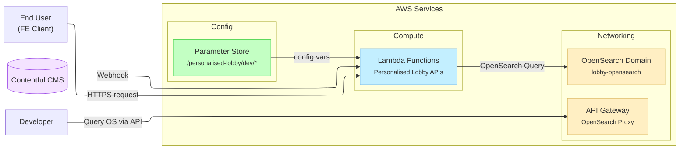

## 📌 Overview and Purpose

The *Personalised Lobby AWS Infrastructure* repository (`lobby-aws-infra`) automates the setup of a development environment for the **Personalised Lobby** backend. Its primary purpose is to provision an **OpenSearch** cluster and related AWS resources consistently across dev environments[GitHub](https://gitlab.ballys.tech/excite/native/applications/lobby-aws-infra/blob/05f5d70945d6a6a37fb8610c2b9bbf3075967667/Readme.md#L18-L21). By using Infrastructure as Code (CloudFormation), it ensures that developers can easily deploy a sandbox OpenSearch domain and an API Gateway to interact with it. This allows the Personalised Lobby’s microservices (AWS Lambda functions) to have a search backend (OpenSearch) available in dev/test, and also provides a secure way to query OpenSearch directly via an API Gateway proxy[GitHub](https://gitlab.ballys.tech/excite/native/applications/lobby-aws-infra/blob/05f5d70945d6a6a37fb8610c2b9bbf3075967667/Readme.md#L164-L172). In simpler terms, this repo delivers the “plumbing” – the search engine service (OpenSearch) and configuration management – needed for the Personalised Lobby features to work.

Beyond provisioning OpenSearch, the repo also includes scripts to manage **configuration secrets** and **deployment automation**. For example, it provides a way to push sensitive credentials (OpenSearch credentials, Contentful API keys, etc.) into AWS Systems Manager **Parameter Store** prior to deployment[GitHub](https://gitlab.ballys.tech/excite/native/applications/lobby-aws-infra/blob/05f5d70945d6a6a37fb8610c2b9bbf3075967667/Readme.md#L84-L91)[GitHub](https://gitlab.ballys.tech/excite/native/applications/lobby-aws-infra/blob/05f5d70945d6a6a37fb8610c2b9bbf3075967667/Readme.md#L100-L108). It also offers utilities to track and update the versions of various Lambda function components in a “version dashboard” (stored in Consul KV) for monitoring deployments[GitHub](https://gitlab.ballys.tech/excite/native/applications/lobby-aws-infra/blob/05f5d70945d6a6a37fb8610c2b9bbf3075967667/scripts/README.md#L21-L29).

Overall, **new developers** should understand that this repository is about **infrastructure and environment setup** for the Personalised Lobby service – it is **not** the application logic itself, but the supporting AWS resources and deployment scripts that the application relies on.

## 🛠 Tech Stack and Components

This project brings together several technologies and AWS services. Below is a summary of the key tech stack elements and components involved:

- **AWS CloudFormation** – Used for defining and deploying infrastructure as code. The repo contains CloudFormation **YAML templates** for creating resources like OpenSearch domains, API Gateways, and Parameter Store entries[GitHub](https://gitlab.ballys.tech/excite/native/applications/lobby-aws-infra/blob/05f5d70945d6a6a37fb8610c2b9bbf3075967667/Readme.md#L30-L38). This ensures repeatable environment setup.
- **AWS OpenSearch Service** – Provides a managed Elasticsearch-compatible search cluster. In dev, a single-node OpenSearch domain (version 2.17) is deployed[GitHub](https://gitlab.ballys.tech/excite/native/applications/lobby-aws-infra/blob/05f5d70945d6a6a37fb8610c2b9bbf3075967667/templates/osGatewayDevStack.yml#L22-L31) (with options to deploy larger clusters if needed, e.g. a 3-node cluster for experiments[GitHub](https://gitlab.ballys.tech/excite/native/applications/lobby-aws-infra/blob/05f5d70945d6a6a37fb8610c2b9bbf3075967667/templates/osGatewayDevStack_big.yml#L24-L32)).
- **AWS API Gateway (HTTP Proxy)** – An API Gateway is configured to proxy HTTP requests to the OpenSearch domain. This acts as a secure endpoint to query OpenSearch (e.g. for cluster health or index queries) over HTTPS[GitHub](https://gitlab.ballys.tech/excite/native/applications/lobby-aws-infra/blob/05f5d70945d6a6a37fb8610c2b9bbf3075967667/templates/osGatewayDevStack.yml#L54-L63)[GitHub](https://gitlab.ballys.tech/excite/native/applications/lobby-aws-infra/blob/05f5d70945d6a6a37fb8610c2b9bbf3075967667/templates/osGatewayDevStack.yml#L74-L82). In this dev stack, the gateway simply passes any requests on the path `/lobby/{proxy+}` through to the OpenSearch domain’s REST API[GitHub](https://gitlab.ballys.tech/excite/native/applications/lobby-aws-infra/blob/05f5d70945d6a6a37fb8610c2b9bbf3075967667/templates/osGatewayDevStack.yml#L74-L82).
- **AWS Lambda (Node.js)** – The Personalised Lobby backend is composed of numerous AWS Lambda functions (written in Node.js/TypeScript) that implement the business logic (retrieving games, layouts, navigation, etc.). While the Lambda function code resides in a separate repository (an Nx-monorepo called **personalised-lobby-ts-lambda-v3**[GitHub](https://github.com/devminchev/tech-docs/blob/69c62ef62c3e714eea9f7246b08c7568435d8b05/docs/tech-stack.md#L3-L8)), this infra project interfaces with those lambdas by supplying configuration (via Parameter Store) and a backend OpenSearch service. The Lambdas run on **Node.js 18+** runtime[GitHub](https://gitlab.ballys.tech/excite/native/applications/lobby-aws-infra/blob/05f5d70945d6a6a37fb8610c2b9bbf3075967667/node_scripts/README.md#L5-L13) and utilize dependencies like AWS SDK, OpenSearch client, Contentful SDK, etc.[GitHub](https://github.com/devminchev/tech-docs/blob/69c62ef62c3e714eea9f7246b08c7568435d8b05/docs/tech-stack.md#L3-L8).
- **AWS Systems Manager Parameter Store** – Used for managing configuration and secrets (API keys, credentials) per environment. This repo’s templates create Parameter Store entries under a common path (`/personalised-lobby/dev/...`) to hold values like Contentful API tokens, OpenSearch credentials, feature flags (e.g. X-Ray enabled), etc.[GitHub](https://gitlab.ballys.tech/excite/native/applications/lobby-aws-infra/blob/05f5d70945d6a6a37fb8610c2b9bbf3075967667/templates/parameterStoreVariables.yml#L40-L48)[GitHub](https://gitlab.ballys.tech/excite/native/applications/lobby-aws-infra/blob/05f5d70945d6a6a37fb8610c2b9bbf3075967667/templates/parameterStoreVariables.yml#L94-L103). Storing these in SSM allows Lambdas to fetch configuration at runtime or have them injected as environment variables securely.
- **AWS CLI & Bash Scripts** – Deployment is driven via AWS CLI commands wrapped in shell scripts. The repository includes bash scripts for deploying CloudFormation stacks and other automation (these require AWS CLI installed and configured with the appropriate profile/credentials[GitHub](https://gitlab.ballys.tech/excite/native/applications/lobby-aws-infra/blob/05f5d70945d6a6a37fb8610c2b9bbf3075967667/Readme.md#L43-L51)). For example, `deploy.sh` uses `aws cloudformation deploy` under the hood to launch the stack[GitHub](https://gitlab.ballys.tech/excite/native/applications/lobby-aws-infra/blob/05f5d70945d6a6a37fb8610c2b9bbf3075967667/deploy.sh#L30-L38), and `deploy-ssm.sh` similarly uses CLI to create Parameter Store entries[GitHub](https://gitlab.ballys.tech/excite/native/applications/lobby-aws-infra/blob/05f5d70945d6a6a37fb8610c2b9bbf3075967667/deploy-ssm.sh#L109-L117). Bash scripts also handle querying AWS Lambda and Consul (via `curl`) for the version dashboard.
- **Node.js Scripts** – Some utility scripts are written in Node.js to leverage JavaScript for orchestration. Notably, `node_scripts/versionDashboardUpdate.js` is a Node script that interacts with AWS Lambda and Consul KV to update the “version dashboard” – it calls AWS APIs (via AWS CLI) to get current Lambda image versions and then prepares or executes `curl` commands to update a Consul key-value store with those versions[GitHub](https://gitlab.ballys.tech/excite/native/applications/lobby-aws-infra/blob/05f5d70945d6a6a37fb8610c2b9bbf3075967667/node_scripts/README.md#L22-L29)[GitHub](https://gitlab.ballys.tech/excite/native/applications/lobby-aws-infra/blob/05f5d70945d6a6a37fb8610c2b9bbf3075967667/node_scripts/versionDashboardUpdate.js#L105-L114). Node was chosen here for convenience (using `child_process.exec` to call AWS CLI and Curl, and for JSON processing).
- **Infrastructure Composition Tools** – The Lambdas codebase uses AWS SAM (Serverless Application Model) and Nx (Nrwl) for building and bundling functions[GitHub](https://github.com/devminchev/tech-docs/blob/69c62ef62c3e714eea9f7246b08c7568435d8b05/docs/tech-stack.md#L3-L8). SAM is used to define the serverless resources (Lambda functions, their own API Gateway endpoints) in the application repository. However, **SAM could not deploy the OpenSearch domain** (since OpenSearch is not a serverless resource), so this separate CloudFormation approach is used for OpenSearch[GitHub](https://gitlab.ballys.tech/excite/native/applications/lobby-aws-infra/blob/05f5d70945d6a6a37fb8610c2b9bbf3075967667/docs/infra_deployment.md#L8-L16)[GitHub](https://gitlab.ballys.tech/excite/native/applications/lobby-aws-infra/blob/05f5d70945d6a6a37fb8610c2b9bbf3075967667/docs/infra_deployment.md#L24-L32). In short, the infra repo covers what SAM cannot (the OpenSearch cluster and proxy), while the Lambda repo covers the API and compute.
- **Contentful (Headless CMS)** – Contentful is an external service used to manage game content and configurations for the lobby. The infra doesn’t deploy Contentful (since it’s SaaS), but it manages credentials to allow Lambdas to connect to Contentful. For instance, Contentful API tokens, space IDs, and a webhook signing secret are stored in Parameter Store via this infra[GitHub](https://gitlab.ballys.tech/excite/native/applications/lobby-aws-infra/blob/05f5d70945d6a6a37fb8610c2b9bbf3075967667/templates/parameterStoreVariables.yml#L4-L13)[GitHub](https://gitlab.ballys.tech/excite/native/applications/lobby-aws-infra/blob/05f5d70945d6a6a37fb8610c2b9bbf3075967667/templates/parameterStoreVariables.yml#L58-L66). Lambdas use these credentials to fetch content or validate incoming webhooks. This integration enables dynamic content updates: Contentful can trigger Lambdas (via webhooks) to update OpenSearch indexes with new content, ensuring the lobby data stays in sync.

By combining these technologies, developers get a full-stack environment: a **search database (OpenSearch)**, **compute (Lambdas)**, and supporting configuration, closely mirroring production architecture but scoped for development use. Next, we’ll break down the project structure and how each piece works together.

## 📂 Project Structure

Understanding the repository layout will help you navigate the code and scripts. Here’s the high-level structure (as described in the README)[GitHub](https://gitlab.ballys.tech/excite/native/applications/lobby-aws-infra/blob/05f5d70945d6a6a37fb8610c2b9bbf3075967667/Readme.md#L25-L34):

```
lobby-aws-infra/
├── scripts/                   # Helper Bash scripts for managing resources and versions
├── node_scripts/              # Node.js utility scripts for version dashboard updates
├── templates/                 # AWS CloudFormation templates for stacks (OpenSearch, SSM params, etc.)
├── docs/                      # Documentation for deployment and design (e.g., reasoning, guides)
├── .env_example               # Example environment variable file (to be copied to .env)
├── deploy.sh                  # Shell script to deploy the OpenSearch & API Gateway stack (interactive)
├── deploy-ssm.sh              # Shell script to deploy secrets to Parameter Store (interactive)
└── README.md                  # Comprehensive usage and contribution guide

```

Let’s briefly explain each major folder/file:

- **scripts/**: Contains Bash scripts that simplify common tasks:
    - `get_latest_deployed_lambda_versions.sh` – Fetches all Lambda functions in a given AWS account/region, extracts the container image version tag for each, and prints a list of Lambda names with their current version[GitHub](https://gitlab.ballys.tech/excite/native/applications/lobby-aws-infra/blob/05f5d70945d6a6a37fb8610c2b9bbf3075967667/scripts/README.md#L3-L11)[GitHub](https://gitlab.ballys.tech/excite/native/applications/lobby-aws-infra/blob/05f5d70945d6a6a37fb8610c2b9bbf3075967667/scripts/get_latest_deployed_lambda_versions.sh#L16-L25). This helps in tracking which version of each service is deployed.
    - `get_deployed_versions_vers_dash.sh` – Queries the *versions dashboard* (Consul KV store) to list the current version values stored for each component, for staging and production environments[GitHub](https://gitlab.ballys.tech/excite/native/applications/lobby-aws-infra/blob/05f5d70945d6a6a37fb8610c2b9bbf3075967667/scripts/README.md#L23-L31). It prints a table of “Component -> Version” for each environment[GitHub](https://gitlab.ballys.tech/excite/native/applications/lobby-aws-infra/blob/05f5d70945d6a6a37fb8610c2b9bbf3075967667/scripts/README.md#L23-L31)[GitHub](https://gitlab.ballys.tech/excite/native/applications/lobby-aws-infra/blob/05f5d70945d6a6a37fb8610c2b9bbf3075967667/scripts/README.md#L40-L48).
    - `generate_component_json.sh` – A helper script that maps a Lambda function name to a standardized **deployable component name** and outputs a small JSON snippet with that name and version[GitHub](https://gitlab.ballys.tech/excite/native/applications/lobby-aws-infra/blob/05f5d70945d6a6a37fb8610c2b9bbf3075967667/scripts/generate_component_json.sh#L28-L37). (This was used to generate JSON payloads for another system – not used by the main Node script, but useful for manual or future automation.)
- **node_scripts/**: Contains Node.js scripts for version management:
    - `versionDashboardUpdate.js` – A Node script that uses the data from `get_latest_deployed_lambda_versions.sh` to build **Consul update commands** for each known component. It maintains a mapping of Lambda function names to “dashboard” component keys (e.g., `"personalisation-lobby-game-config" -> "igaming_lobby_game_config_v3"`)[GitHub](https://gitlab.ballys.tech/excite/native/applications/lobby-aws-infra/blob/05f5d70945d6a6a37fb8610c2b9bbf3075967667/node_scripts/versionDashboardUpdate.js#L12-L20). In **manual mode**, it writes a JSON file containing all the `curl` commands needed to update Consul with the latest versions; in **auto mode**, it will execute those `curl` PUT requests immediately and verify the values[GitHub](https://gitlab.ballys.tech/excite/native/applications/lobby-aws-infra/blob/05f5d70945d6a6a37fb8610c2b9bbf3075967667/node_scripts/README.md#L23-L31)[GitHub](https://gitlab.ballys.tech/excite/native/applications/lobby-aws-infra/blob/05f5d70945d6a6a37fb8610c2b9bbf3075967667/node_scripts/README.md#L24-L27). This helps keep a centralized version dashboard in sync with actual deployments.
    - `getDeployedVersions.js` – A Node script that reads from the Consul version dashboard for all components across staging and production. It simply queries each expected key via `curl` (through a proxy) and prints out the component and stored version[GitHub](https://gitlab.ballys.tech/excite/native/applications/lobby-aws-infra/blob/05f5d70945d6a6a37fb8610c2b9bbf3075967667/node_scripts/getDeployedVersions.js#L43-L51)[GitHub](https://gitlab.ballys.tech/excite/native/applications/lobby-aws-infra/blob/05f5d70945d6a6a37fb8610c2b9bbf3075967667/node_scripts/getDeployedVersions.js#L58-L66). Essentially a Node.js alternative to the `get_deployed_versions_vers_dash.sh` Bash script, but with a fixed list of components to check.
        
        *(These Node scripts require Node 18+, AWS CLI credentials, and `curl` to be available[GitHub](https://gitlab.ballys.tech/excite/native/applications/lobby-aws-infra/blob/05f5d70945d6a6a37fb8610c2b9bbf3075967667/node_scripts/README.md#L5-L13). They are primarily for developer convenience in monitoring versions and are not part of the deployment pipeline directly.)*
        
- **templates/**: Contains CloudFormation template files defining AWS resources:
    - `osGatewayDevStack.yml` – The main template that defines the **OpenSearch domain** and **API Gateway** for the dev environment (EU instance by default)[GitHub](https://gitlab.ballys.tech/excite/native/applications/lobby-aws-infra/blob/05f5d70945d6a6a37fb8610c2b9bbf3075967667/templates/osGatewayDevStack.yml#L18-L27)[GitHub](https://gitlab.ballys.tech/excite/native/applications/lobby-aws-infra/blob/05f5d70945d6a6a37fb8610c2b9bbf3075967667/templates/osGatewayDevStack.yml#L54-L62). It parameterizes the OpenSearch master username/password for secure access[GitHub](https://gitlab.ballys.tech/excite/native/applications/lobby-aws-infra/blob/05f5d70945d6a6a37fb8610c2b9bbf3075967667/templates/osGatewayDevStack.yml#L4-L12). The template uses the AWS SAM transform for defining the API Gateway easily[GitHub](https://gitlab.ballys.tech/excite/native/applications/lobby-aws-infra/blob/05f5d70945d6a6a37fb8610c2b9bbf3075967667/templates/osGatewayDevStack.yml#L16-L24). We’ll dive into its contents in the next section.
    - `osGatewayDevStackUS.yml` – A variant of the above template for the US environment. It’s nearly identical except using a different domain name (`lobby-opensearch-us`) and stack output path to distinguish it[GitHub](https://gitlab.ballys.tech/excite/native/applications/lobby-aws-infra/blob/05f5d70945d6a6a37fb8610c2b9bbf3075967667/templates/osGatewayDevStackUS.yml#L20-L28)[GitHub](https://gitlab.ballys.tech/excite/native/applications/lobby-aws-infra/blob/05f5d70945d6a6a37fb8610c2b9bbf3075967667/templates/osGatewayDevStackUS.yml#L84-L92). This is deployed when a developer chooses the “US” option in `deploy.sh` (using a separate AWS profile and region).
    - `osGatewayExperimental.yml` – Another variant meant for an “Experimental Lab” environment. This likely points to a lab-specific setup (possibly same as EU but with a different stack name or slight modifications for testing).
    - `osGatewayDevStack_big.yml` – Defines a larger OpenSearch cluster (3 data nodes + 2 dedicated masters) for more robust testing[GitHub](https://gitlab.ballys.tech/excite/native/applications/lobby-aws-infra/blob/05f5d70945d6a6a37fb8610c2b9bbf3075967667/templates/osGatewayDevStack_big.yml#L24-L32)[GitHub](https://gitlab.ballys.tech/excite/native/applications/lobby-aws-infra/blob/05f5d70945d6a6a37fb8610c2b9bbf3075967667/templates/osGatewayDevStack_big.yml#L26-L34). This could be used if a developer needs to simulate a cluster closer to production scale or run heavier load tests in dev.
    - `parameterStoreVariables.yml` – A template to create numerous SSM Parameter Store entries under the path `/personalised-lobby/dev/`[GitHub](https://gitlab.ballys.tech/excite/native/applications/lobby-aws-infra/blob/05f5d70945d6a6a37fb8610c2b9bbf3075967667/templates/parameterStoreVariables.yml#L40-L48). Each parameter corresponds to a configuration or secret needed by the Personalised Lobby app, such as `CONTENTFUL_ACCESS_TOKEN`, `CONTENTFUL_SPACE_LOCALE`, `OS_USER`, `OS_PASS`, etc.[GitHub](https://gitlab.ballys.tech/excite/native/applications/lobby-aws-infra/blob/05f5d70945d6a6a37fb8610c2b9bbf3075967667/templates/parameterStoreVariables.yml#L40-L48)[GitHub](https://gitlab.ballys.tech/excite/native/applications/lobby-aws-infra/blob/05f5d70945d6a6a37fb8610c2b9bbf3075967667/templates/parameterStoreVariables.yml#L94-L103). The values for these are provided at deployment time from your local `.env` file (which you’ll configure). This template is deployed via `deploy-ssm.sh` to ensure all required parameters exist in AWS before launching the main stack.
- **docs/**: Contains documentation files. Currently, the notable doc is `infra_deployment.md`, which explains *why* we use CloudFormation for OpenSearch instead of trying to use AWS SAM[GitHub](https://gitlab.ballys.tech/excite/native/applications/lobby-aws-infra/blob/05f5d70945d6a6a37fb8610c2b9bbf3075967667/docs/infra_deployment.md#L6-L14). It provides context on limitations of SAM (it doesn’t support OpenSearch domains) and suggests best practices for combining SAM (for Lambdas) with CloudFormation (for OpenSearch)[GitHub](https://gitlab.ballys.tech/excite/native/applications/lobby-aws-infra/blob/05f5d70945d6a6a37fb8610c2b9bbf3075967667/docs/infra_deployment.md#L8-L16)[GitHub](https://gitlab.ballys.tech/excite/native/applications/lobby-aws-infra/blob/05f5d70945d6a6a37fb8610c2b9bbf3075967667/docs/infra_deployment.md#L32-L41). Newcomers can read this to understand architectural decisions. *(There may be additional overview docs in the future or referenced from an internal tech-docs repository, covering system architecture or tech stack details, but the main guidance for this repo is the README and infra_deployment doc.)*
- **.env_example**: A template environment file containing placeholders for all necessary environment variables. You should copy this to `.env` and fill in actual values (passwords, tokens, etc.) before deploying[GitHub](https://gitlab.ballys.tech/excite/native/applications/lobby-aws-infra/blob/05f5d70945d6a6a37fb8610c2b9bbf3075967667/Readme.md#L70-L78). For example, it will have keys like `MASTER_OS_USER_NAME`, `MASTER_OS_USER_PASSWORD` (for OpenSearch admin login), `CONTENTFUL_ACCESS_TOKEN`, `CONTENTFUL_SPACE_ID`, etc. This file is not committed with real values (and `.env` is git-ignored) to keep secrets safe[GitHub](https://gitlab.ballys.tech/excite/native/applications/lobby-aws-infra/blob/05f5d70945d6a6a37fb8610c2b9bbf3075967667/Readme.md#L31-L38).
- **deploy.sh**: A user-friendly deployment script for the OpenSearch + API Gateway stack. Running this script will prompt you to choose a region (EU, US, Lab, etc.)[GitHub](https://gitlab.ballys.tech/excite/native/applications/lobby-aws-infra/blob/05f5d70945d6a6a37fb8610c2b9bbf3075967667/deploy.sh#L20-L28) and then internally call the AWS CLI to deploy the corresponding CloudFormation template with the appropriate parameters[GitHub](https://gitlab.ballys.tech/excite/native/applications/lobby-aws-infra/blob/05f5d70945d6a6a37fb8610c2b9bbf3075967667/deploy.sh#L29-L37)[GitHub](https://gitlab.ballys.tech/excite/native/applications/lobby-aws-infra/blob/05f5d70945d6a6a37fb8610c2b9bbf3075967667/deploy.sh#L38-L46). It sources your `.env` to get needed variables like `MASTER_OS_USER_NAME` and sets the AWS profile/region automatically[GitHub](https://gitlab.ballys.tech/excite/native/applications/lobby-aws-infra/blob/05f5d70945d6a6a37fb8610c2b9bbf3075967667/deploy.sh#L30-L38)[GitHub](https://gitlab.ballys.tech/excite/native/applications/lobby-aws-infra/blob/05f5d70945d6a6a37fb8610c2b9bbf3075967667/deploy.sh#L39-L47). In short, this script abstracts the `aws cloudformation deploy ...` commands so you don’t have to remember them. After running, it prints a success message indicating the stack was created[GitHub](https://gitlab.ballys.tech/excite/native/applications/lobby-aws-infra/blob/05f5d70945d6a6a37fb8610c2b9bbf3075967667/deploy.sh#L32-L40).
- **deploy-ssm.sh**: Another interactive script, used **before** deploying the main stack, to push secrets/config into AWS Parameter Store. It loads your `.env`, asks which environment’s region you want to target (Dev EU, Dev US, Lab, etc.)[GitHub](https://gitlab.ballys.tech/excite/native/applications/lobby-aws-infra/blob/05f5d70945d6a6a37fb8610c2b9bbf3075967667/deploy-ssm.sh#L33-L42), then uses the AWS CLI to deploy the `parameterStoreVariables.yml` template with all the values from your .env file injected as parameters[GitHub](https://gitlab.ballys.tech/excite/native/applications/lobby-aws-infra/blob/05f5d70945d6a6a37fb8610c2b9bbf3075967667/deploy-ssm.sh#L108-L116). Essentially, this will create or update parameters like `/personalised-lobby/dev/CONTENTFUL_ACCESS_TOKEN` in SSM with the values from your local env. The script ensures you have all required env vars set and will error out if any are missing[GitHub](https://gitlab.ballys.tech/excite/native/applications/lobby-aws-infra/blob/05f5d70945d6a6a37fb8610c2b9bbf3075967667/deploy-ssm.sh#L80-L88)[GitHub](https://gitlab.ballys.tech/excite/native/applications/lobby-aws-infra/blob/05f5d70945d6a6a37fb8610c2b9bbf3075967667/deploy-ssm.sh#L89-L97). It also selects the correct AWS profile to use based on your choice (for example, `US` choice expects an `US_AWS_PROFILE` set in .env)[GitHub](https://gitlab.ballys.tech/excite/native/applications/lobby-aws-infra/blob/05f5d70945d6a6a37fb8610c2b9bbf3075967667/deploy-ssm.sh#L50-L58). After running, your AWS account will have all the needed keys so that the Lambdas and other resources can retrieve configuration from a centralized secure store rather than hardcoding secrets.
- **README.md**: The primary documentation with quickstart commands, detailed steps, and contribution guidelines. It’s highly recommended to read it end-to-end as a new joiner. It covers the purpose of the project[GitHub](https://gitlab.ballys.tech/excite/native/applications/lobby-aws-infra/blob/05f5d70945d6a6a37fb8610c2b9bbf3075967667/Readme.md#L18-L21), how to set up your environment and credentials, how to deploy and test, and best practices for contributing (like cleaning up test stacks to save cost, using proper stack naming, etc. [GitHub](https://gitlab.ballys.tech/excite/native/applications/lobby-aws-infra/blob/05f5d70945d6a6a37fb8610c2b9bbf3075967667/Readme.md#L196-L204)[GitHub](https://gitlab.ballys.tech/excite/native/applications/lobby-aws-infra/blob/05f5d70945d6a6a37fb8610c2b9bbf3075967667/Readme.md#L206-L214)).

With this structure in mind, you can navigate the repo depending on what you need to do: e.g., use **scripts/** for ops tasks, refer to **templates/** to understand infrastructure definitions, and read **docs/** for background context. Next, we’ll go through the workflow of setting up and deploying the stack.

## ⚙️ Setup and Configuration

Before diving into deployment, you need to prepare your local environment:

1. **Install Required Tools**: Make sure you have the AWS CLI, AWS SAM CLI, Node.js, and Docker installed on your machine[GitHub](https://github.com/devminchev/tech-docs/blob/69c62ef62c3e714eea9f7246b08c7568435d8b05/aws-lambda-funcs/README.md#L5-L13). At minimum, AWS CLI v2 is needed (for CloudFormation deploy commands)[GitHub](https://gitlab.ballys.tech/excite/native/applications/lobby-aws-infra/blob/05f5d70945d6a6a37fb8610c2b9bbf3075967667/Readme.md#L43-L51), and Node.js (v18+ recommended) for running the Node scripts[GitHub](https://gitlab.ballys.tech/excite/native/applications/lobby-aws-infra/blob/05f5d70945d6a6a37fb8610c2b9bbf3075967667/node_scripts/README.md#L5-L13) or any local builds. Docker is needed if you plan to build or run Lambda containers locally (optional for pure infrastructure work)[GitHub](https://github.com/devminchev/tech-docs/blob/69c62ef62c3e714eea9f7246b08c7568435d8b05/aws-lambda-funcs/README.md#L7-L15).
2. **AWS Credentials**: You must configure your AWS CLI with credentials that have permission to deploy CloudFormation stacks. Typically, your team will provide an AWS account (or role) for the Personalised Lobby dev environment. The README suggests using `aws configure --profile lobby-playground` to set up a profile named “lobby-playground”[GitHub](https://gitlab.ballys.tech/excite/native/applications/lobby-aws-infra/blob/05f5d70945d6a6a37fb8610c2b9bbf3075967667/Readme.md#L56-L64). This profile (and possibly a “lobby-playground-us” for US) should correspond to the AWS account/role for this project’s dev environments. Ensure the IAM user/role has **CloudFormation permissions** (`cloudformation:*`) as well as the ability to create the specific resources (OpenSearch, API Gateway, SSM Parameter, Lambda, etc.)[GitHub](https://gitlab.ballys.tech/excite/native/applications/lobby-aws-infra/blob/05f5d70945d6a6a37fb8610c2b9bbf3075967667/Readme.md#L45-L49).
3. **Environment Variables (.env)**: Copy `.env_example` to `.env` in the project root[GitHub](https://gitlab.ballys.tech/excite/native/applications/lobby-aws-infra/blob/05f5d70945d6a6a37fb8610c2b9bbf3075967667/Readme.md#L70-L78). Then edit the `.env` file to add actual values:
    - **OpenSearch Credentials**: Set `MASTER_OS_USER_NAME` and `MASTER_OS_USER_PASSWORD` to the master username and password you want for the OpenSearch domain. These will secure the OpenSearch cluster (which has internal database auth enabled)[GitHub](https://gitlab.ballys.tech/excite/native/applications/lobby-aws-infra/blob/05f5d70945d6a6a37fb8610c2b9bbf3075967667/templates/osGatewayDevStack.yml#L40-L48). Anyone querying OpenSearch (even via API Gateway) will need these creds (as basic auth).
    - **Contentful API Credentials**: Set `CONTENTFUL_SPACE_ID`, `CONTENTFUL_ENVIRONMENT`, `CONTENTFUL_ACCESS_TOKEN` to the details of the Contentful space used for lobby content (your team’s documentation or a lead can provide these). Also set `CONTENTFUL_SIGNING_SECRET` – this is used to verify inbound webhooks from Contentful.
    - **Other Config**: `CONTENTFUL_SPACE_LOCALE` (likely `"en-US"` or as appropriate), `ENABLE_XRAY` (set `"true"` or `"false"` – this toggles AWS X-Ray tracing in Lambdas), `EXECUTION_ENVIRONMENT` (the runtime environment name for Lambdas, e.g. `"nodejs18.x"` if needed), `HOST` (perhaps the base URL or host name of the application – could be used by some services), and `SPACE_ID` (likely same as Contentful Space ID above, or an ID for something else – check with team).
    - **AWS Profiles**: As seen in `deploy-ssm.sh`, you may need to set profiles like `EU_AWS_PROFILE`, `US_AWS_PROFILE`, etc., in the .env. For instance, `EU_AWS_PROFILE=lobby-playground` and `US_AWS_PROFILE=lobby-playground-us` might point the script to use those profiles for deploying in EU or US regions[GitHub](https://gitlab.ballys.tech/excite/native/applications/lobby-aws-infra/blob/05f5d70945d6a6a37fb8610c2b9bbf3075967667/deploy-ssm.sh#L50-L58). Ensure these profile names match what you configured in AWS CLI credentials.
    - **Master OS Credentials for US**: If deploying to US, the deploy script expects `US_MASTER_OS_USER_NAME` and `US_MASTER_OS_USER_PASSWORD` in .env (for the US stack)[GitHub](https://gitlab.ballys.tech/excite/native/applications/lobby-aws-infra/blob/05f5d70945d6a6a37fb8610c2b9bbf3075967667/deploy.sh#L39-L47). Similarly, if any differences for lab or gen-AI environment, provide those.
    - (The `.env_example` file in the repo will list all required variable names. Double-check you filled in each one to avoid deployment errors.)
4. **AWS SSO (if applicable)**: The README’s pre-req section outlines steps for AWS SSO login via Okta, etc., if your org uses SSO[GitHub](https://github.com/devminchev/tech-docs/blob/69c62ef62c3e714eea9f7246b08c7568435d8b05/aws-lambda-funcs/README.md#L14-L23). Follow those if needed to get CLI access (this is one-time, and ensures your AWS profile is authenticated to deploy).

Once the above is done, you’re ready to deploy.

## 🚀 Deployment Workflow

Deployment involves two main steps: **deploying secrets to Parameter Store**, and **deploying the OpenSearch + API Gateway stack**. Always do them in this order to avoid missing configuration.

### 1️⃣ Deploying Secrets to SSM

**Why?** The CloudFormation template for OpenSearch doesn’t directly use these secrets, but your Lambda functions will expect them in SSM when they run. Also, pushing secrets first avoids hardcoding sensitive values in templates or code.

**How:** Run the script `./deploy-ssm.sh` in a terminal.

- Make sure the script is executable (`chmod +x deploy-ssm.sh` if not done yet)[GitHub](https://gitlab.ballys.tech/excite/native/applications/lobby-aws-infra/blob/05f5d70945d6a6a37fb8610c2b9bbf3075967667/Readme.md#L7-L14).
- Execute it: `./deploy-ssm.sh`[GitHub](https://gitlab.ballys.tech/excite/native/applications/lobby-aws-infra/blob/05f5d70945d6a6a37fb8610c2b9bbf3075967667/Readme.md#L86-L94).
- The script will prompt you to **choose a region/environment**: EU, US, Lab, or EU GenAI Space[GitHub](https://gitlab.ballys.tech/excite/native/applications/lobby-aws-infra/blob/05f5d70945d6a6a37fb8610c2b9bbf3075967667/deploy-ssm.sh#L33-L42). Enter the number for the environment you’re setting up. This picks the AWS region (e.g., 1 = Ireland (eu-west-1) for EU, 2 = N. Virginia (us-east-1) for US) and sets some suffixes for naming[GitHub](https://gitlab.ballys.tech/excite/native/applications/lobby-aws-infra/blob/05f5d70945d6a6a37fb8610c2b9bbf3075967667/deploy-ssm.sh#L42-L49).
- Next, the script determines which AWS CLI profile to use for that choice. For example, if you chose “US”, it looks for `US_AWS_PROFILE` in your .env and uses that[GitHub](https://gitlab.ballys.tech/excite/native/applications/lobby-aws-infra/blob/05f5d70945d6a6a37fb8610c2b9bbf3075967667/deploy-ssm.sh#L50-L58). Ensure those are set or it will error.
- It then loads all required variables from your `.env`. The script categorizes variables as *shared* vs *region-specific*. Shared ones (like `CONTENTFUL_ENVIRONMENT`, `ENABLE_XRAY`, `EXECUTION_ENVIRONMENT`) have no region prefix and are used for all envs[GitHub](https://gitlab.ballys.tech/excite/native/applications/lobby-aws-infra/blob/05f5d70945d6a6a37fb8610c2b9bbf3075967667/deploy-ssm.sh#L58-L66). Region-specific ones (like `CONTENTFUL_ACCESS_TOKEN`, `HOST`, `OS_USER`, etc.) should be provided with a prefix (e.g., `EU_CONTENTFUL_ACCESS_TOKEN` for EU) in your .env[GitHub](https://gitlab.ballys.tech/excite/native/applications/lobby-aws-infra/blob/05f5d70945d6a6a37fb8610c2b9bbf3075967667/deploy-ssm.sh#L59-L67)[GitHub](https://gitlab.ballys.tech/excite/native/applications/lobby-aws-infra/blob/05f5d70945d6a6a37fb8610c2b9bbf3075967667/deploy-ssm.sh#L89-L97). The script will combine the prefix from your choice with each key name to find the value. If any required var is missing, it will stop and inform you[GitHub](https://gitlab.ballys.tech/excite/native/applications/lobby-aws-infra/blob/05f5d70945d6a6a37fb8610c2b9bbf3075967667/deploy-ssm.sh#L80-L88)[GitHub](https://gitlab.ballys.tech/excite/native/applications/lobby-aws-infra/blob/05f5d70945d6a6a37fb8610c2b9bbf3075967667/deploy-ssm.sh#L89-L97).
- After validation, it constructs the CloudFormation **parameter overrides** array. Essentially it maps your env vars to the CloudFormation template’s Parameters. For instance, it will take `EU_CONTENTFUL_ACCESS_TOKEN` and format an override `ContentfulAccessToken=<the value>`[GitHub](https://gitlab.ballys.tech/excite/native/applications/lobby-aws-infra/blob/05f5d70945d6a6a37fb8610c2b9bbf3075967667/deploy-ssm.sh#L76-L85)[GitHub](https://gitlab.ballys.tech/excite/native/applications/lobby-aws-infra/blob/05f5d70945d6a6a37fb8610c2b9bbf3075967667/deploy-ssm.sh#L89-L97). (The function `toCamelCase` in the script is used to convert env var names like `CONTENTFUL_ACCESS_TOKEN` into `ContentfulAccessToken` to match the template parameter names[GitHub](https://gitlab.ballys.tech/excite/native/applications/lobby-aws-infra/blob/05f5d70945d6a6a37fb8610c2b9bbf3075967667/deploy-ssm.sh#L63-L71)[GitHub](https://gitlab.ballys.tech/excite/native/applications/lobby-aws-infra/blob/05f5d70945d6a6a37fb8610c2b9bbf3075967667/deploy-ssm.sh#L76-L85).)
- Finally, it runs `aws cloudformation deploy` for the `templates/parameterStoreVariables.yml` with all those parameters[GitHub](https://gitlab.ballys.tech/excite/native/applications/lobby-aws-infra/blob/05f5d70945d6a6a37fb8610c2b9bbf3075967667/deploy-ssm.sh#L109-L117). This creates (or updates) a stack named `personalised-lobby-ssm-<env>` (e.g., `personalised-lobby-ssm-eu`) with the Parameter Store entries[GitHub](https://gitlab.ballys.tech/excite/native/applications/lobby-aws-infra/blob/05f5d70945d6a6a37fb8610c2b9bbf3075967667/deploy-ssm.sh#L108-L116). Each entry is a simple String parameter in the path `/personalised-lobby/dev/…` with the value you provided[GitHub](https://gitlab.ballys.tech/excite/native/applications/lobby-aws-infra/blob/05f5d70945d6a6a37fb8610c2b9bbf3075967667/templates/parameterStoreVariables.yml#L40-L48)[GitHub](https://gitlab.ballys.tech/excite/native/applications/lobby-aws-infra/blob/05f5d70945d6a6a37fb8610c2b9bbf3075967667/templates/parameterStoreVariables.yml#L94-L103). If the stack already exists, CloudFormation will update any changed values.
- On success, you’ll see a “✅ Deployed to <region>” message with the profile and stack name used[GitHub](https://gitlab.ballys.tech/excite/native/applications/lobby-aws-infra/blob/05f5d70945d6a6a37fb8610c2b9bbf3075967667/deploy-ssm.sh#L118-L122). You can also verify in AWS Console under Systems Manager > Parameter Store, navigate to the path to see the keys and values (they should match your .env, with sensitive ones hidden but present).

**Note:** Storing secrets in Parameter Store means your Lambda functions can retrieve them at runtime or have them injected via environment variables (if the SAM template uses `ssm parameter` references). This approach keeps secrets out of your code and out of CloudFormation outputs. Remember that the Parameter Store entries are per environment (the path includes `/dev/` and the stack itself is suffixed with region). So if you deploy to multiple regions, you’ll have separate Parameter Store entries for each (which is good for isolation).

### 2️⃣ Deploying the OpenSearch & API Gateway Stack

Once secrets are in place, deploy the main infrastructure stack:

- Ensure `deploy.sh` is executable (`chmod +x deploy.sh` if needed)[GitHub](https://gitlab.ballys.tech/excite/native/applications/lobby-aws-infra/blob/05f5d70945d6a6a37fb8610c2b9bbf3075967667/Readme.md#L7-L14).
- Run `./deploy.sh` and follow the prompt. This script similarly asks for the environment region (EU, US, Lab, etc.)[GitHub](https://gitlab.ballys.tech/excite/native/applications/lobby-aws-infra/blob/05f5d70945d6a6a37fb8610c2b9bbf3075967667/deploy.sh#L20-L28). Choose the one you want to deploy.
- Based on your choice, the script picks the corresponding template and AWS profile:
    - **For EU Dev** (choice 1): Uses `templates/osGatewayDevStack.yml`, stack name `personalised-lobby-os-dev`, AWS profile `lobby-playground`, region `eu-west-1`[GitHub](https://gitlab.ballys.tech/excite/native/applications/lobby-aws-infra/blob/05f5d70945d6a6a37fb8610c2b9bbf3075967667/deploy.sh#L28-L36).
    - **For US Dev** (choice 2): Uses `templates/osGatewayDevStackUS.yml`, stack name `personalised-lobby-os-dev-us`, profile `lobby-playground-us`, region `us-east-1`[GitHub](https://gitlab.ballys.tech/excite/native/applications/lobby-aws-infra/blob/05f5d70945d6a6a37fb8610c2b9bbf3075967667/deploy.sh#L38-L46).
    - **For Experimental Lab** (choice 3): Uses `templates/osGatewayExperimental.yml`, stack name `personalised-lobby-os-experimental-lab`, profile `lobby-playground`, region `eu-west-1`[GitHub](https://gitlab.ballys.tech/excite/native/applications/lobby-aws-infra/blob/05f5d70945d6a6a37fb8610c2b9bbf3075967667/deploy.sh#L46-L54).
    - **For GenAI EU** (choice 4): Uses `osGatewayDevStack.yml` (same as EU), stack name `personalised-lobby-os-dev`, but profile `lobby-playground-gen-ai` (likely a special account)[GitHub](https://gitlab.ballys.tech/excite/native/applications/lobby-aws-infra/blob/05f5d70945d6a6a37fb8610c2b9bbf3075967667/deploy.sh#L54-L62).
- The script sources your `.env` at start to get the needed variables[GitHub](https://gitlab.ballys.tech/excite/native/applications/lobby-aws-infra/blob/05f5d70945d6a6a37fb8610c2b9bbf3075967667/deploy.sh#L12-L19). In particular, it needs the OpenSearch master username/password. For EU and Lab and GenAI (which use the same template), it uses `MASTER_OS_USER_NAME` and `MASTER_OS_USER_PASSWORD` from .env as parameters[GitHub](https://gitlab.ballys.tech/excite/native/applications/lobby-aws-infra/blob/05f5d70945d6a6a37fb8610c2b9bbf3075967667/deploy.sh#L30-L38)[GitHub](https://gitlab.ballys.tech/excite/native/applications/lobby-aws-infra/blob/05f5d70945d6a6a37fb8610c2b9bbf3075967667/deploy.sh#L56-L64). For US, it uses the `US_MASTER_OS_USER_NAME`/`PASSWORD` vars[GitHub](https://gitlab.ballys.tech/excite/native/applications/lobby-aws-infra/blob/05f5d70945d6a6a37fb8610c2b9bbf3075967667/deploy.sh#L40-L45). These values populate the CloudFormation parameters `MasterUserName` and `MasterUserPassword` in the template, thus setting up the admin credentials for the OpenSearch domain[GitHub](https://gitlab.ballys.tech/excite/native/applications/lobby-aws-infra/blob/05f5d70945d6a6a37fb8610c2b9bbf3075967667/templates/osGatewayDevStackUS.yml#L4-L12)[GitHub](https://gitlab.ballys.tech/excite/native/applications/lobby-aws-infra/blob/05f5d70945d6a6a37fb8610c2b9bbf3075967667/templates/osGatewayDevStackUS.yml#L40-L48).
- The script then calls `aws cloudformation deploy` for the chosen template. This will create the CloudFormation stack and all resources defined. The process can take a few minutes, because creating an OpenSearch domain is not instant – AWS will allocate hardware and initialize the cluster. You can monitor progress in the terminal (it will show stack events) or in AWS CloudFormation Console.
- On success, the script prints a confirmation, e.g., “✅ EU Deployment to eu-west-1 (Ireland) successful!”[GitHub](https://gitlab.ballys.tech/excite/native/applications/lobby-aws-infra/blob/05f5d70945d6a6a37fb8610c2b9bbf3075967667/deploy.sh#L32-L40).

After deployment, two key resources should be up and running in your AWS dev account:

**1. OpenSearch Domain:** Named “lobby-opensearch” (or variant like “lobby-opensearch-us” for US) – this is your searchable index store. In AWS Console under OpenSearch Service, you should see a domain with the configuration from the template:

- Engine version OpenSearch 2.17[GitHub](https://gitlab.ballys.tech/excite/native/applications/lobby-aws-infra/blob/05f5d70945d6a6a37fb8610c2b9bbf3075967667/templates/osGatewayDevStack.yml#L22-L24).
- Instance type t3.medium.search (sufficient for dev)[GitHub](https://gitlab.ballys.tech/excite/native/applications/lobby-aws-infra/blob/05f5d70945d6a6a37fb8610c2b9bbf3075967667/templates/osGatewayDevStack.yml#L24-L31).
- 50 GB gp3 EBS storage attached[GitHub](https://gitlab.ballys.tech/excite/native/applications/lobby-aws-infra/blob/05f5d70945d6a6a37fb8610c2b9bbf3075967667/templates/osGatewayDevStack.yml#L26-L31).
- **Security:** The domain has fine-grained access control with an internal database. The master username is what you set in .env, and the master password is stored internally (not exposed)[GitHub](https://gitlab.ballys.tech/excite/native/applications/lobby-aws-infra/blob/05f5d70945d6a6a37fb8610c2b9bbf3075967667/templates/osGatewayDevStack.yml#L40-L48). The access policy on the domain is currently wide-open (`Principal: '*'` with `es:*` actions on the domain)[GitHub](https://gitlab.ballys.tech/excite/native/applications/lobby-aws-infra/blob/05f5d70945d6a6a37fb8610c2b9bbf3075967667/templates/osGatewayDevStack.yml#L34-L39) – meaning any source can attempt to call the domain’s API. However, because advanced security is enabled, *all requests still need to authenticate* using the master user or other internal users. Essentially, it’s open to the internet but protected by basic auth. This is convenient for dev/testing (no IP whitelisting needed), but in production a stricter policy might be used.
- Node-to-node encryption, encryption at rest, and HTTPS-only are enabled for best practices[GitHub](https://gitlab.ballys.tech/excite/native/applications/lobby-aws-infra/blob/05f5d70945d6a6a37fb8610c2b9bbf3075967667/templates/osGatewayDevStack.yml#L46-L54).
- No VPC is attached (it’s open access domain). So the domain gets a public endpoint in format `https://search-lobby-opensearch-<random>.eu-west-1.es.amazonaws.com` (for example).

**2. API Gateway (OpenSearch Proxy):** The CloudFormation uses an inline OpenAPI definition to create an API Gateway (type AWS::Serverless::Api)[GitHub](https://gitlab.ballys.tech/excite/native/applications/lobby-aws-infra/blob/05f5d70945d6a6a37fb8610c2b9bbf3075967667/templates/osGatewayDevStack.yml#L54-L62). The gateway’s purpose is to act as a **transparent proxy** to the OpenSearch domain’s REST API.

- It defines a single any-method route: `ANY /lobby/{proxy+}` which catches all requests under the path `/lobby/*`[GitHub](https://gitlab.ballys.tech/excite/native/applications/lobby-aws-infra/blob/05f5d70945d6a6a37fb8610c2b9bbf3075967667/templates/osGatewayDevStack.yml#L64-L73).
- The integration is an HTTP proxy that takes the incoming `{proxy}` path part and appends it to the OpenSearch domain endpoint URL[GitHub](https://gitlab.ballys.tech/excite/native/applications/lobby-aws-infra/blob/05f5d70945d6a6a37fb8610c2b9bbf3075967667/templates/osGatewayDevStack.yml#L74-L82). In other words, if you call `GET https://<api-id>.execute-api.region.amazonaws.com/Dev/lobby/_cluster/health`, API Gateway will forward it to `https://<OpenSearchEndpoint>/_cluster/health` [GitHub](https://gitlab.ballys.tech/excite/native/applications/lobby-aws-infra/blob/05f5d70945d6a6a37fb8610c2b9bbf3075967667/templates/osGatewayDevStack.yml#L74-L82). This allows you to use API Gateway as a go-between to OpenSearch.
- The stage is named “Dev” (as per template) and the API name is “lobby_os”[GitHub](https://gitlab.ballys.tech/excite/native/applications/lobby-aws-infra/blob/05f5d70945d6a6a37fb8610c2b9bbf3075967667/templates/osGatewayDevStack.yml#L56-L64).
- The CloudFormation Outputs include the **ApiGatewayEndpoint** – which is a fully-formed URL including the stage and base path[GitHub](https://gitlab.ballys.tech/excite/native/applications/lobby-aws-infra/blob/05f5d70945d6a6a37fb8610c2b9bbf3075967667/templates/osGatewayDevStack.yml#L85-L92). For EU, it ends with `/Dev/lobby/`[GitHub](https://gitlab.ballys.tech/excite/native/applications/lobby-aws-infra/blob/05f5d70945d6a6a37fb8610c2b9bbf3075967667/templates/osGatewayDevStack.yml#L85-L92), for US stack it’s `/Dev/lobby-us/` (the US template altered the output to include “-us”)[GitHub](https://gitlab.ballys.tech/excite/native/applications/lobby-aws-infra/blob/05f5d70945d6a6a37fb8610c2b9bbf3075967667/templates/osGatewayDevStackUS.yml#L86-L92). This output is slightly confusing because the actual resource path is still `/lobby/`, but the US output adds “lobby-us”. (It might be a minor inconsistency in the template output naming for US – but either way, the gateway’s actual resource is the same `/lobby` path unless changed.)
- You can retrieve the API URL from the CloudFormation output or AWS Console. The README gave an example for testing: use `curl` on the API Gateway URL to call `_cluster/health` on OpenSearch[GitHub](https://gitlab.ballys.tech/excite/native/applications/lobby-aws-infra/blob/05f5d70945d6a6a37fb8610c2b9bbf3075967667/Readme.md#L162-L171). You need to provide the OS master user credentials for basic auth in the curl request (e.g., `u os_master_user:os_master_pass`)[GitHub](https://gitlab.ballys.tech/excite/native/applications/lobby-aws-infra/blob/05f5d70945d6a6a37fb8610c2b9bbf3075967667/Readme.md#L164-L172). The expected result is a JSON with cluster health status (e.g., status “green”, number_of_nodes etc.)[GitHub](https://gitlab.ballys.tech/excite/native/applications/lobby-aws-infra/blob/05f5d70945d6a6a37fb8610c2b9bbf3075967667/Readme.md#L172-L179). This confirms both API Gateway and OpenSearch are functioning.

At this point, your infrastructure is up. The OpenSearch domain is empty initially (no indexes except the default ones). The Lambdas (in the other repo) can now be deployed or run locally to start indexing data into OpenSearch and serving queries.

**Diagram: Architecture Overview** – The following diagram illustrates how the pieces from this infrastructure and the larger system fit together:



**Explanation:** The OpenSearch Domain and API Gateway (yellow) are deployed by this **lobby-aws-infra** project. The Lambda functions (blue) are developed in a separate project, but rely on OpenSearch as their database and Parameter Store for their configuration. Contentful (purple) is an external system providing content; it can send webhook events to trigger Lambdas (e.g., to update indexes when content changes). End-user applications (or testers) call the Personalised Lobby Lambdas via their API Gateway (not depicted separately in this diagram, but one can assume the Lambdas are behind an API endpoint). In development, a Dev Engineer can also directly query the OpenSearch cluster through the provided **OpenSearch API Gateway** for debugging or running ad-hoc queries (for example, checking cluster health or inspecting indices). All sensitive configs (green) such as API keys and credentials are stored in Parameter Store, and Lambdas retrieve them either on startup or via environment variables (ensuring that secrets are not hardcoded).

## 🔧 Working with the Infrastructure

After deployment, here are common tasks you might need to perform and how this repo helps with them:

### Testing the Setup

- **OpenSearch API Test:** As mentioned, use the API Gateway endpoint to ensure OpenSearch is accessible. Example:
    
    ```bash
    curl -X GET "https://<api-id>.execute-api.eu-west-1.amazonaws.com/Dev/lobby/_cluster/health" \
      -u "os_master_user:os_master_pass"
    
    ```
    
    Replace `<api-id>` with the API Gateway ID from your stack outputs, and `os_master_user/pass` with the credentials you set. A successful response (HTTP 200 + JSON status) means OS is up and reachable[GitHub](https://gitlab.ballys.tech/excite/native/applications/lobby-aws-infra/blob/05f5d70945d6a6a37fb8610c2b9bbf3075967667/Readme.md#L164-L172).
    
- **Lambda Integration:** If you have the Lambdas running (either deployed via SAM or running locally via `sam local`), you can test that they can connect to OpenSearch. For example, the *GetNavigationFunction* Lambda might query OpenSearch for categories. Ensure the Lambdas know the OpenSearch endpoint and credentials:
    - Locally, you might supply these via your `.env` (the lambdas’ README likely instructs to set `OS_DOMAIN_ENDPOINT`, `OS_USER`, `OS_PASS` env vars for local runs).
    - In AWS, if deployed via SAM, the template might use `!ImportValue` or SSM Parameter references to inject the endpoint and creds. Double-check how the Lambda SAM template gets the OpenSearch domain endpoint – you might need to manually provide it or set an environment variable for it. If not automated, one trick is to get the OpenSearch endpoint from CloudFormation output and put it into Parameter Store as well, so that Lambdas can read it. (Currently, the infra doesn’t push the endpoint to SSM, so coordinate with your team on how Lambdas know the endpoint – possibly via a config file or environment variable.)
- **Contentful Webhook Test:** If content is updated in Contentful, a webhook could trigger a Lambda (e.g., to re-index data). The signing secret from Contentful is stored in SSM (`CONTENTFUL_SIGNING_SECRET`). A Lambda responsible for webhooks would retrieve that to verify the request. You can simulate a Contentful webhook call (with proper signature header) to your API endpoint and see if the Lambda processes it (this is more on the Lambda side to test).

### Managing the Stack

- **Updating the Stack:** If you modify the CloudFormation template (e.g., change instance type, or add a new resource), you can redeploy changes. The README provides the AWS CLI command for updating:
    
    ```bash
    aws cloudformation update-stack --template-file templates/osGatewayDevStack.yml \
      --stack-name personalised-lobby-os-dev --profile lobby-playground --region eu-west-1
    
    ```
    
    or simply re-run `deploy.sh` and select the same environment – CloudFormation will detect changes and apply updates[GitHub](https://gitlab.ballys.tech/excite/native/applications/lobby-aws-infra/blob/05f5d70945d6a6a37fb8610c2b9bbf3075967667/Readme.md#L140-L149). Be cautious: certain changes to OpenSearch (like changing instance count or type) might not be allowed via update (AWS might require replacement of the domain, which could mean data loss if not handled). For minor changes (e.g., Output changes, access policy changes), it should update in-place.
    
- **Deleting the Stack:** When you no longer need the environment, **delete the CloudFormation stack** to avoid incurring AWS costs. The CLI command is given in README[GitHub](https://gitlab.ballys.tech/excite/native/applications/lobby-aws-infra/blob/05f5d70945d6a6a37fb8610c2b9bbf3075967667/Readme.md#L152-L159) or you can do it from AWS Console. Deleting the OpenSearch stack will remove the domain and API Gateway. (If you plan to keep OpenSearch but just tear down lambdas, you can, but generally clean up everything when done.)
- **Cleaning up Parameter Store:** Note that the Parameter Store stack (`personalised-lobby-ssm-...`) is separate. If you delete the OpenSearch stack, the SSM parameters remain (they are in a different stack). It’s fine to leave them (they incur no cost), especially if you’ll reuse them on next deploy. But if you want to completely clean house, you can delete the SSM stack as well. This will remove all those parameters from SSM. Just be sure no other process is relying on them.
- **Multiple Deployments:** You might deploy a separate stack for US and EU. This repo supports that. Just ensure you used the correct AWS profile and the stacks have distinct names (`personalised-lobby-os-dev` vs `personalised-lobby-os-dev-us`). The Parameter Store stacks are also separate per region (so you have separate parameter sets for dev eu vs dev us). Lambdas in each environment should be configured to use the correct parameters (likely by prefix or by environment).

### Version Dashboard Scripts

One unique feature in this repo is the *Version Dashboard* integration. This is an internal tool to keep track of which version of each service (Lambda) is deployed in each environment. It uses Consul KV storage (key path `versions/coreplatform/<instance>/<component>`). Here’s how to use the provided scripts:

- **Checking Current Versions:** Run `node node_scripts/getDeployedVersions.js`. This will query the Consul service (through an internal proxy) for both `aws-stg-eu00` (staging env) and `prod_eu00` (production env) keys[GitHub](https://gitlab.ballys.tech/excite/native/applications/lobby-aws-infra/blob/05f5d70945d6a6a37fb8610c2b9bbf3075967667/node_scripts/getDeployedVersions.js#L59-L67). It prints out a table for each environment listing each component and the stored version[GitHub](https://gitlab.ballys.tech/excite/native/applications/lobby-aws-infra/blob/05f5d70945d6a6a37fb8610c2b9bbf3075967667/node_scripts/getDeployedVersions.js#L44-L51)[GitHub](https://gitlab.ballys.tech/excite/native/applications/lobby-aws-infra/blob/05f5d70945d6a6a37fb8610c2b9bbf3075967667/node_scripts/getDeployedVersions.js#L54-L62). For example, you might see:
    
    ```
    === STG (aws-stg-eu00) ===
    igaming_lobby_game_config_v3        0.13.3
    igaming_lobby_suggested_games_v3    0.15.4
    ...
    === PROD (prod_eu00) ===
    igaming_lobby_game_config_v3        0.13.3
    ...
    
    ```
    
    If any key is missing or returns error, it will show an error message instead of a version[GitHub](https://gitlab.ballys.tech/excite/native/applications/lobby-aws-infra/blob/05f5d70945d6a6a37fb8610c2b9bbf3075967667/scripts/get_deployed_versions_vers_dash.sh#L54-L62). This is a quick read-only check.
    
- **Updating Versions (Manual):** To prepare updates (for example, after you deploy new versions of some Lambdas in dev and want to push those to the dashboard), use the **manual mode** of `versionDashboardUpdate.js`. Run:
    
    ```bash
    ENV=stg MODE=manual node node_scripts/versionDashboardUpdate.js
    
    ```
    
    This sets `ENV=stg` meaning we target the staging instance (aws-stg-eu00)[GitHub](https://gitlab.ballys.tech/excite/native/applications/lobby-aws-infra/blob/05f5d70945d6a6a37fb8610c2b9bbf3075967667/node_scripts/README.md#L13-L19). In manual mode, the script will:
    
    1. Invoke the bash script to get the latest deployed lambda versions in your account[GitHub](https://gitlab.ballys.tech/excite/native/applications/lobby-aws-infra/blob/05f5d70945d6a6a37fb8610c2b9bbf3075967667/node_scripts/README.md#L23-L27).
    2. Match each Lambda name to a dashboard component (using the map inside the script)[GitHub](https://gitlab.ballys.tech/excite/native/applications/lobby-aws-infra/blob/05f5d70945d6a6a37fb8610c2b9bbf3075967667/node_scripts/versionDashboardUpdate.js#L102-L110)[GitHub](https://gitlab.ballys.tech/excite/native/applications/lobby-aws-infra/blob/05f5d70945d6a6a37fb8610c2b9bbf3075967667/node_scripts/versionDashboardUpdate.js#L113-L120).
    3. Produce an output JSON file: `out/version_dashboard_curls.json` containing an array of components with their versions and the corresponding `curl` commands needed to update them[GitHub](https://gitlab.ballys.tech/excite/native/applications/lobby-aws-infra/blob/05f5d70945d6a6a37fb8610c2b9bbf3075967667/node_scripts/versionDashboardUpdate.js#L124-L133)[GitHub](https://gitlab.ballys.tech/excite/native/applications/lobby-aws-infra/blob/05f5d70945d6a6a37fb8610c2b9bbf3075967667/node_scripts/versionDashboardUpdate.js#L135-L143). It also lists any missing functions (if a lambda expected in the map isn’t found in AWS)[GitHub](https://gitlab.ballys.tech/excite/native/applications/lobby-aws-infra/blob/05f5d70945d6a6a37fb8610c2b9bbf3075967667/node_scripts/versionDashboardUpdate.js#L138-L144).
    4. Log to console how many commands were written and any missing entries[GitHub](https://gitlab.ballys.tech/excite/native/applications/lobby-aws-infra/blob/05f5d70945d6a6a37fb8610c2b9bbf3075967667/node_scripts/versionDashboardUpdate.js#L136-L144).
    
    You can open `out/version_dashboard_curls.json` to inspect it. It includes entries like:
    
    ```json
    {
      "environment": "stg",
      "instance": "aws-stg-eu00",
      "commands": [
        {
          "lambda": "personalisation-lobby-game-config",
          "component": "igaming_lobby_game_config_v3",
          "version": "0.13.3",
          "curl": "curl --request PUT --data '0.13.3' --proxy 10.149.16.141:3546 http://10.149.16.95:30085/v1/kv/versions/coreplatform/aws-stg-eu00/igaming_lobby_game_config_v3"
        },
        ...
      ]
    }
    
    ```
    
    Essentially it’s telling you: “for component X, run this curl to set its value to Y in Consul”. In manual mode, the script does **not** actually push anything – it just gives you the info. This is useful if you want to review changes or run the `curl` commands yourself.
    
- **Updating Versions (Auto):** For a direct push, you can run:
    
    ```bash
    ENV=prod MODE=auto AWS_PROFILE=lobby-playground-prod node node_scripts/versionDashboardUpdate.js
    
    ```
    
    (Here `ENV=prod` and perhaps using a profile that has access to production Lambdas/Consul). In auto mode, the script will iterate through each command and execute the `curl` PUT to update the Consul KV with the new version[GitHub](https://gitlab.ballys.tech/excite/native/applications/lobby-aws-infra/blob/05f5d70945d6a6a37fb8610c2b9bbf3075967667/node_scripts/versionDashboardUpdate.js#L155-L164). After each PUT, it immediately does a GET (`?raw`) to verify the stored value[GitHub](https://gitlab.ballys.tech/excite/native/applications/lobby-aws-infra/blob/05f5d70945d6a6a37fb8610c2b9bbf3075967667/node_scripts/versionDashboardUpdate.js#L157-L165)[GitHub](https://gitlab.ballys.tech/excite/native/applications/lobby-aws-infra/blob/05f5d70945d6a6a37fb8610c2b9bbf3075967667/node_scripts/versionDashboardUpdate.js#L166-L174). The output will log success or failure for each component. Missing lambdas will be warned about at the end as well. Use this mode carefully – it’s effectively writing to a shared config (the version dashboard), so ensure you are pointing to the correct environment and you actually want to update all values to match the current AWS deployment. Generally, this might be done as part of a release process or nightly sync for dev.
    
- The **mapping** used in these scripts is defined in code. If new Lambdas are added to the system (with new component names), you’ll need to update `LAMBDA_TO_COMPONENT_MAP` in `versionDashboardUpdate.js`[GitHub](https://gitlab.ballys.tech/excite/native/applications/lobby-aws-infra/blob/05f5d70945d6a6a37fb8610c2b9bbf3075967667/node_scripts/versionDashboardUpdate.js#L12-L20)[GitHub](https://gitlab.ballys.tech/excite/native/applications/lobby-aws-infra/blob/05f5d70945d6a6a37fb8610c2b9bbf3075967667/node_scripts/versionDashboardUpdate.js#L22-L28) and the `COMPONENTS` list in `getDeployedVersions.js` if needed[GitHub](https://gitlab.ballys.tech/excite/native/applications/lobby-aws-infra/blob/05f5d70945d6a6a37fb8610c2b9bbf3075967667/node_scripts/getDeployedVersions.js#L13-L21). There is also the `generate_component_json.sh` which can output a JSON for a given lambda name and version – this could be used to manually assemble Consul payloads if a lambda isn’t in the map (it prints `deployable_name` and `deployable_version`)[GitHub](https://gitlab.ballys.tech/excite/native/applications/lobby-aws-infra/blob/05f5d70945d6a6a37fb8610c2b9bbf3075967667/scripts/generate_component_json.sh#L32-L40).
- **Under the hood:** These scripts talk to a Consul service API. The `PROXY` (10.149.16.141:3546) and `BASE_ENDPOINT` (10.149.16.95:30085…) are internal network addresses[GitHub](https://gitlab.ballys.tech/excite/native/applications/lobby-aws-infra/blob/05f5d70945d6a6a37fb8610c2b9bbf3075967667/node_scripts/versionDashboardUpdate.js#L31-L39) – likely you have a VPN or internal network requirement to reach them. Make sure you’re on the company VPN or network when running the version dashboard scripts, otherwise the curl requests to Consul will fail. If needed, update the proxy address or endpoint if those services have changed (check with DevOps).

For a new developer, using the version dashboard scripts isn’t mandatory, but it’s a helpful tool for understanding deployment state. If you deploy a new version of a Lambda and wonder “did it go out to staging?”, this can confirm what version is considered current.

### CloudFormation Template Deep-Dive (for reference)

It’s useful to know what exactly the CloudFormation templates are doing, especially if you need to modify or extend them:

- **OpenSearch Template (`osGatewayDevStack.yml`)** – Defines one resource of type `AWS::OpenSearchService::Domain` named **OpenSearchDomain**[GitHub](https://gitlab.ballys.tech/excite/native/applications/lobby-aws-infra/blob/05f5d70945d6a6a37fb8610c2b9bbf3075967667/templates/osGatewayDevStack.yml#L19-L27). Key properties:
    - *DomainName:* `lobby-opensearch` (the domain’s identifier)[GitHub](https://gitlab.ballys.tech/excite/native/applications/lobby-aws-infra/blob/05f5d70945d6a6a37fb8610c2b9bbf3075967667/templates/osGatewayDevStack.yml#L22-L25).
    - *EngineVersion:* OpenSearch_2.17 (explicitly set version)[GitHub](https://gitlab.ballys.tech/excite/native/applications/lobby-aws-infra/blob/05f5d70945d6a6a37fb8610c2b9bbf3075967667/templates/osGatewayDevStack.yml#L22-L25).
    - *ClusterConfig:* 1 instance of type t3.medium.search[GitHub](https://gitlab.ballys.tech/excite/native/applications/lobby-aws-infra/blob/05f5d70945d6a6a37fb8610c2b9bbf3075967667/templates/osGatewayDevStack.yml#L24-L31). (In “big” template, this was 3 data nodes + 2 masters[GitHub](https://gitlab.ballys.tech/excite/native/applications/lobby-aws-infra/blob/05f5d70945d6a6a37fb8610c2b9bbf3075967667/templates/osGatewayDevStack_big.yml#L24-L32).) By default, no dedicated master or replication in the dev stack – minimal cost.
    - *EBSOptions:* Enabled, gp3 50GB (with high IOPS and throughput set, which might be overkill for dev but ensures good performance)[GitHub](https://gitlab.ballys.tech/excite/native/applications/lobby-aws-infra/blob/05f5d70945d6a6a37fb8610c2b9bbf3075967667/templates/osGatewayDevStack.yml#L26-L33).
    - *AccessPolicies:* Allows all principals and all actions on the domain ARN[GitHub](https://gitlab.ballys.tech/excite/native/applications/lobby-aws-infra/blob/05f5d70945d6a6a37fb8610c2b9bbf3075967667/templates/osGatewayDevStack.yml#L34-L39). This essentially means any AWS principal (any account) or even anonymous can attempt to call the OS domain endpoint. Normally you’d lock this to specific IAM roles or a VPC; here it’s open for dev convenience. The real gate is the internal auth on the domain.
    - *AdvancedSecurityOptions:* Enabled internal DB authentication with MasterUser from parameters[GitHub](https://gitlab.ballys.tech/excite/native/applications/lobby-aws-infra/blob/05f5d70945d6a6a37fb8610c2b9bbf3075967667/templates/osGatewayDevStack.yml#L40-L48). This sets up the master user (like an “admin” for the cluster) with the username/password you provided. This is required because without it, the open access policy would be dangerous. With it, every request must include HTTP basic auth of a valid user.
    - *Encryption:* Node-to-node encryption and encryption at rest enabled (just best practice toggles)[GitHub](https://gitlab.ballys.tech/excite/native/applications/lobby-aws-infra/blob/05f5d70945d6a6a37fb8610c2b9bbf3075967667/templates/osGatewayDevStack.yml#L46-L54).
    - *DomainEndpointOptions:* Enforce HTTPS and use TLS 1.2 minimum[GitHub](https://gitlab.ballys.tech/excite/native/applications/lobby-aws-infra/blob/05f5d70945d6a6a37fb8610c2b9bbf3075967667/templates/osGatewayDevStack.yml#L50-L54).
- It then defines **ApiGateway** of type `AWS::Serverless::Api`[GitHub](https://gitlab.ballys.tech/excite/native/applications/lobby-aws-infra/blob/05f5d70945d6a6a37fb8610c2b9bbf3075967667/templates/osGatewayDevStack.yml#L54-L62). Using the SAM transform allows us to inline an OpenAPI specification under `DefinitionBody`. The OpenAPI snippet defines a single path `/lobby/{proxy+}` with an “ANY” method integration to the OS domain[GitHub](https://gitlab.ballys.tech/excite/native/applications/lobby-aws-infra/blob/05f5d70945d6a6a37fb8610c2b9bbf3075967667/templates/osGatewayDevStack.yml#L64-L73)[GitHub](https://gitlab.ballys.tech/excite/native/applications/lobby-aws-infra/blob/05f5d70945d6a6a37fb8610c2b9bbf3075967667/templates/osGatewayDevStack.yml#L74-L82). Notably, it constructs the integration URI dynamically with `!Sub https://${OpenSearchDomain.DomainEndpoint}/{proxy}` [GitHub](https://gitlab.ballys.tech/excite/native/applications/lobby-aws-infra/blob/05f5d70945d6a6a37fb8610c2b9bbf3075967667/templates/osGatewayDevStack.yml#L74-L82). CloudFormation will fill in the actual endpoint of the created domain here. The result is that at deployment time, API Gateway’s integration knows the correct domain URL.
    - It sets `EndpointConfiguration: REGIONAL` (so the API Gateway endpoint is regional, not edge-optimized – fine for dev)[GitHub](https://gitlab.ballys.tech/excite/native/applications/lobby-aws-infra/blob/05f5d70945d6a6a37fb8610c2b9bbf3075967667/templates/osGatewayDevStack.yml#L80-L84).
    - `TracingEnabled: true` means X-Ray tracing for API Gateway is on (which can help in debugging latency through API GW).
- **Outputs:** Two outputs are given:
    - `OpenSearchEndpoint` – literally the domain’s endpoint URL (so you can find it easily)[GitHub](https://gitlab.ballys.tech/excite/native/applications/lobby-aws-infra/blob/05f5d70945d6a6a37fb8610c2b9bbf3075967667/templates/osGatewayDevStack.yml#L86-L92).
    - `ApiGatewayEndpoint` – constructs the base invoke URL for convenience[GitHub](https://gitlab.ballys.tech/excite/native/applications/lobby-aws-infra/blob/05f5d70945d6a6a37fb8610c2b9bbf3075967667/templates/osGatewayDevStack.yml#L88-L92). For example, `"https://${ApiGateway}.execute-api.${AWS::Region}.amazonaws.com/Dev/lobby/"`. Here `${ApiGateway}` is actually a CloudFormation generated name or ID for the API. This output is handy to copy-paste for curls.
- **US Template Differences:** In `osGatewayDevStackUS.yml`, the differences were:
    - DomainName: `lobby-opensearch-us`[GitHub](https://gitlab.ballys.tech/excite/native/applications/lobby-aws-infra/blob/05f5d70945d6a6a37fb8610c2b9bbf3075967667/templates/osGatewayDevStackUS.yml#L22-L29) (to avoid name clash and indicate region).
    - Domain ARN in AccessPolicies uses that name[GitHub](https://gitlab.ballys.tech/excite/native/applications/lobby-aws-infra/blob/05f5d70945d6a6a37fb8610c2b9bbf3075967667/templates/osGatewayDevStackUS.yml#L34-L41).
    - Output ApiGatewayEndpoint uses `/Dev/lobby-us/`[GitHub](https://gitlab.ballys.tech/excite/native/applications/lobby-aws-infra/blob/05f5d70945d6a6a37fb8610c2b9bbf3075967667/templates/osGatewayDevStackUS.yml#L86-L92), presumably to distinguish the base path (though the defined path was still `/lobby/{proxy+}`, so calls likely use /lobby; the “-us” might just be a note).
- **Parameter Store Template (`parameterStoreVariables.yml`)** – This defines multiple `AWS::SSM::Parameter` resources, one per config value. They all share a naming pattern: `/personalised-lobby/dev/KEY`[GitHub](https://gitlab.ballys.tech/excite/native/applications/lobby-aws-infra/blob/05f5d70945d6a6a37fb8610c2b9bbf3075967667/templates/parameterStoreVariables.yml#L40-L48). Each takes a parameter from CloudFormation inputs with a similar CamelCase name[GitHub](https://gitlab.ballys.tech/excite/native/applications/lobby-aws-infra/blob/05f5d70945d6a6a37fb8610c2b9bbf3075967667/templates/parameterStoreVariables.yml#L40-L48). For example:
    - `ContentfulAccessTokenParam` resource creates SSM key `/personalised-lobby/dev/CONTENTFUL_ACCESS_TOKEN` whose value is `!Ref ContentfulAccessToken` (a CFN Parameter)[GitHub](https://gitlab.ballys.tech/excite/native/applications/lobby-aws-infra/blob/05f5d70945d6a6a37fb8610c2b9bbf3075967667/templates/parameterStoreVariables.yml#L40-L48). The CFN Parameter `ContentfulAccessToken` gets its value from your .env via the deploy-ssm script’s overrides[GitHub](https://gitlab.ballys.tech/excite/native/applications/lobby-aws-infra/blob/05f5d70945d6a6a37fb8610c2b9bbf3075967667/deploy-ssm.sh#L89-L97). So if you set `EU_CONTENTFUL_ACCESS_TOKEN=abcd1234` in .env, that ends up being passed in as `ContentfulAccessToken=abcd1234`.
    - This is done for all listed parameters (see file for full list: AccessToken, Environment, SigningSecret, SpaceLocale, EnableXray, ExecutionEnvironment, Host, OsPass, OsUser, SpaceId)[GitHub](https://gitlab.ballys.tech/excite/native/applications/lobby-aws-infra/blob/05f5d70945d6a6a37fb8610c2b9bbf3075967667/templates/parameterStoreVariables.yml#L40-L48)[GitHub](https://gitlab.ballys.tech/excite/native/applications/lobby-aws-infra/blob/05f5d70945d6a6a37fb8610c2b9bbf3075967667/templates/parameterStoreVariables.yml#L94-L103).
    - All are stored as String type, Standard tier.
    - There is an Outputs section that simply lists all the names of parameters created[GitHub](https://gitlab.ballys.tech/excite/native/applications/lobby-aws-infra/blob/05f5d70945d6a6a37fb8610c2b9bbf3075967667/templates/parameterStoreVariables.yml#L130-L138) (helpful for visibility).
    - If in the future new secrets or config are needed (for new features), this template should be updated and redeployed to include them. Keep .env_example in sync with any additions.

### Lambda Functions and Integration Points

While the Lambda code is in a different repository, as a newcomer you should know how it ties into this infra:

- The Lambda functions (Personalised Lobby services) are built in a TypeScript monorepo (using Nx)[GitHub](https://github.com/devminchev/tech-docs/blob/69c62ef62c3e714eea9f7246b08c7568435d8b05/docs/tech-stack.md#L3-L8). Each function corresponds to an API endpoint that the front-end or other services call. For example, **GetGamesFunction**, **GetNavigationFunction**, **GetViewFunction**, etc., provide specific data:
    - **GetNavigationFunction**: likely returns navigation categories for the lobby. It might fetch data from OpenSearch (using an index of categories) or directly from Contentful if cached. The mention in docs says it uses the `os-client` library to access OpenSearch and demonstrates local development[GitHub](https://github.com/devminchev/tech-docs/blob/69c62ef62c3e714eea9f7246b08c7568435d8b05/docs/lambda-functions.md#L4-L7).
    - **GetViewFunction**: perhaps returns a composed view (layouts and sections for a given site/platform)[GitHub](https://github.com/devminchev/tech-docs/blob/69c62ef62c3e714eea9f7246b08c7568435d8b05/docs/lambda-functions.md#L4-L7), possibly by querying OpenSearch for layout documents. It uses environment variables for OS credentials[GitHub](https://github.com/devminchev/tech-docs/blob/69c62ef62c3e714eea9f7246b08c7568435d8b05/docs/lambda-functions.md#L4-L7), which is exactly what this infra provides through SSM.
    - **GetAllGamesSearchFunction**: returns a list of games for search purposes[GitHub](https://github.com/devminchev/tech-docs/blob/69c62ef62c3e714eea9f7246b08c7568435d8b05/docs/lambda-functions.md#L3-L5) – it might query an OpenSearch index that aggregates game info, and also call another internal API to get layout info (as hint: it calls `/content/sites/{site}/platform/{platform}/search`, which could be an external content service).
    - **GetGamesFunction**: returns games for a specific section (with pagination)[GitHub](https://github.com/devminchev/tech-docs/blob/69c62ef62c3e714eea9f7246b08c7568435d8b05/docs/lambda-functions.md#L3-L6) – likely it queries OpenSearch for games belonging to a given section id.
    - (There are others like GameInfo, RecentlyPlayed, etc., each focusing on a piece of personalized content. Each lambda is separate to allow independent deployment and scaling.)
- **API Gateway for Lambdas**: The Lambdas are exposed via an API (likely a separate API Gateway or an HTTP API configured in their SAM template). The **template.yaml** in the lambda repo defines these Lambdas and their API routes[GitHub](https://github.com/devminchev/tech-docs/blob/69c62ef62c3e714eea9f7246b08c7568435d8b05/aws-lambda-funcs/README.md#L133-L142)[GitHub](https://github.com/devminchev/tech-docs/blob/69c62ef62c3e714eea9f7246b08c7568435d8b05/aws-lambda-funcs/README.md#L149-L157). For example, it shows how a function is connected to a path and method[GitHub](https://github.com/devminchev/tech-docs/blob/69c62ef62c3e714eea9f7246b08c7568435d8b05/aws-lambda-funcs/README.md#L149-L157). This is separate from our OS proxy API. So essentially, the Personalised Lobby has its own API (for game data, etc.) served by Lambdas, and the OpenSearch proxy API is more of a utility.
- **OpenSearch usage**: OpenSearch acts as the database for these Lambdas. Likely, data from Contentful (game metadata, layout definitions, etc.) is indexed into OpenSearch so that the Lambdas can quickly retrieve personalized lists (like “suggested for you” games, etc.) by querying OS. Some Lambdas might simply pass through queries to OpenSearch (with some logic) and return results to client.
- **Contentful Integration**: Contentful is used by content editors to manage what games or categories should appear. Those changes need to flow to OpenSearch:
    - One approach: A Contentful webhook triggers a specific AWS Lambda (possibly one dedicated to handling updates) whenever content changes. That Lambda (using the signing secret to verify) will take the updated content and index it into OpenSearch (using the OS master credentials or an ingestion user). For example, if a new game is added in Contentful, the webhook lambda could update the “games” index in OS.
    - Another: A scheduled sync or manual run using Contentful API token to fetch data and populate OS.
    - In both cases, the credentials stored (Contentful tokens, OS user/pass) are needed. The OS credentials (OS_USER, OS_PASS from SSM) are likely provided to the Lambdas as environment variables so they can authenticate to OpenSearch REST API or use an OpenSearch client library.
    - Contentful credentials allow the lambdas to pull data from Contentful (for initial seeding or on-demand fetching of additional info not stored in OS).
- **X-Ray**: ENABLE_XRAY parameter suggests the Lambdas have the option to enable AWS X-Ray tracing. If true, the Lambdas (and API Gateway as well) will emit tracing data to X-Ray service. This is helpful in debugging performance across distributed components. For dev, you might turn it on to see traces, but it can be turned off to reduce noise.

As a new developer, you might not need to modify this infra often, but understanding it helps in troubleshooting:

- If a Lambda cannot connect to OpenSearch, check that the OS domain is up and the credentials match.
- If you get authentication errors querying OS, ensure you used the correct master user/pass and that the request goes through API Gateway (which ensures HTTPS).
- If content updates aren’t reflected, verify the webhook lambda runs, and that it has the OS endpoint and creds. Possibly you might need to manually configure an environment variable for OS endpoint (unless the system automates it via a lookup or a known pattern).

## ✅ Best Practices & Contribution Guidelines

This repository is meant to be the single source of truth for infrastructure configuration of the dev environment. When contributing changes:

- **Keep it in Code:** All changes to infrastructure should be done via the YAML templates or scripts in this repo (under version control). Avoid making manual changes in AWS Console that aren’t reflected here, so that anyone can replicate the environment.
- **Follow the Naming Conventions:** The CloudFormation stack names are prefixed with **personalised-lobby** to clearly identify them. If adding a new stack/template, use a similar naming scheme and update documentation. For resources within templates, try to use clear logical names.
- **Extend, Don’t Duplicate:** If you need to add resources to support a new feature, consider adding to the existing stack vs. creating an entirely new stack, unless it’s logically separate. The contribution guide notes that extending an existing stack is fine (and preferred to avoid many small stacks)[GitHub](https://gitlab.ballys.tech/excite/native/applications/lobby-aws-infra/blob/05f5d70945d6a6a37fb8610c2b9bbf3075967667/Readme.md#L188-L196). Only create a new stack/template if it’s really necessary (and if so, place it under templates/).
- **Testing Changes:** Always test your infrastructure changes in a **sandbox environment** or an isolated AWS account. The guidelines emphasize deploying resources in a separate test environment first[GitHub](https://gitlab.ballys.tech/excite/native/applications/lobby-aws-infra/blob/05f5d70945d6a6a37fb8610c2b9bbf3075967667/Readme.md#L196-L204). You can use a different region (like us-west-2 as a scratch space) to avoid impacting the main dev env[GitHub](https://gitlab.ballys.tech/excite/native/applications/lobby-aws-infra/blob/05f5d70945d6a6a37fb8610c2b9bbf3075967667/Readme.md#L200-L204). After testing, tear down the test stack to avoid extra cost[GitHub](https://gitlab.ballys.tech/excite/native/applications/lobby-aws-infra/blob/05f5d70945d6a6a37fb8610c2b9bbf3075967667/Readme.md#L196-L204).
- **AWS Costs:** OpenSearch and other resources can be costly if left running. Be mindful to **delete any stacks** that are not needed, especially if you create an experimental cluster or a large cluster for load testing. The guide explicitly reminds to clean up unused resources and use lower-cost regions for testing to manage AWS spend[GitHub](https://gitlab.ballys.tech/excite/native/applications/lobby-aws-infra/blob/05f5d70945d6a6a37fb8610c2b9bbf3075967667/Readme.md#L206-L214). For example, if you spin up the “big” template with 5 nodes, definitely tear it down after your experiment.
- **Parameter Store Secrets:** Don’t commit actual secrets. `.env_example` should contain placeholder text only. If adding a new parameter, include a dummy key in .env_example for others to know to fill it. Never put real keys in the templates or README.
- **Document Your Work:** If you introduce new scripts or change deployment steps, update the README or docs accordingly so the next person knows how to use it. This repository’s documentation is crucial for onboarding (as you can see 😄). Maintaining accurate docs and comments in scripts will help everyone.
- **Pull Requests:** The team likely requires PR reviews. Ensure your PR describes what changes you made (e.g., “Added new SSM parameter for X feature” or “Upgraded OpenSearch instance type for dev”). Mention any manual steps if needed for rollout. Given this is infrastructure, consider the impact on existing devs – if your change requires everyone to redeploy their stack or update .env, communicate that in the PR or team channel.
- **Stay Updated with AWS:** If AWS SAM or CDK improves to support our use-case, we might refactor. Currently, we have this separate approach because SAM doesn’t support OpenSearch[GitHub](https://gitlab.ballys.tech/excite/native/applications/lobby-aws-infra/blob/05f5d70945d6a6a37fb8610c2b9bbf3075967667/docs/infra_deployment.md#L8-L16). Keep an eye on AWS announcements; if SAM or CDK can replace some of this, it could simplify things. For now, this hybrid approach is the best practice (SAM for Lambdas, CFN for OpenSearch)[GitHub](https://gitlab.ballys.tech/excite/native/applications/lobby-aws-infra/blob/05f5d70945d6a6a37fb8610c2b9bbf3075967667/docs/infra_deployment.md#L32-L41).

## 💡 Conclusion and Next Steps

By now, you should have a solid understanding of what the **lobby-aws-infra** codebase provides and how to use it. In summary, this repository sets up the core infrastructure (OpenSearch cluster and related config) for the Personalised Lobby development environments, and provides tools to manage configuration and monitor service versions.

**As a new joiner**, your immediate next steps could be:

1. **Set up your .env** and deploy your own dev stack (EU or US as appropriate). Practice deploying and deleting to get familiar.
2. Connect this with the **Lambda functions repository** – e.g., try running a Lambda locally against your deployed OpenSearch: populate some test data in OpenSearch (perhaps using Dev Console in OpenSearch or a simple script) and invoke a Lambda to retrieve it.
3. Read the code for the Node scripts and CloudFormation templates in detail if you’re curious – understanding them will demystify how AWS resources are created and updated via code.
4. If something goes wrong, use the AWS consoles (CloudFormation, OpenSearch, API Gateway, CloudWatch logs) to debug. Common issues might be permission denied (check credentials), missing SSM params (did deploy-ssm run? correct prefix?), or API Gateway 403 (usually means auth issue to OS – check the user/pass you used).

This guide and the repo’s README should serve as a reference, but don’t hesitate to ask senior team members for help with access or clarifications specific to your org’s setup (like obtaining Contentful keys or confirming VPN requirements).

Welcome aboard, and happy coding with Personalised Lobby! 🎉