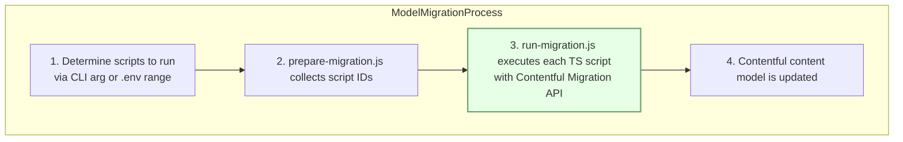

# Contentful Migrations – Comprehensive Codebase Guide

## Introduction

**Contentful Migrations** is a repository that automates and scripts content migrations for Contentful (a headless CMS). It serves as an **automation hub for Contentful housekeeping**, allowing teams to avoid manual UI operations. In practical terms, when new ventures launch or page layouts change, the scripts in this codebase can **export live content, transform it offline, and publish the result back to Contentful**, instead of requiring manual clicks in Contentful’s web interface[GitHub](https://gitlab.ballys.tech/excite/applications/contentful-migrations/blob/e4839227b0cf8654b3d5aa8e489ea1fb3aab3114/README.md#L3-L6). This makes content updates and model changes repeatable, consistent, and version-controlled.

From a technical perspective, the project consists of **two complementary toolchains** for managing Contentful content: one for **data migrations** (content entry data) and one for **model migrations** (content model/schema). The data migration toolchain is essentially a Node.js/Deno-based ETL pipeline that handles entry-level data transformations, while the model migration toolchain is a TypeScript-driven runner that executes Contentful’s official `contentful-migration` scripts for schema changes[GitHub](https://gitlab.ballys.tech/excite/applications/contentful-migrations/blob/e4839227b0cf8654b3d5aa8e489ea1fb3aab3114/README.md#L3-L6). Both subsystems share common configuration via environment variables (in `.env` files) to know which Contentful *space*, *environment*, and *API token* to target[GitHub](https://gitlab.ballys.tech/excite/applications/contentful-migrations/blob/e4839227b0cf8654b3d5aa8e489ea1fb3aab3114/README.md#L3-L6). In summary:

- **For non-technical stakeholders:** This repository provides an automated way to keep Contentful content and schemas up-to-date with business needs, without manual editing. It exports content, processes it according to defined rules, and updates Contentful automatically[GitHub](https://gitlab.ballys.tech/excite/applications/contentful-migrations/blob/e4839227b0cf8654b3d5aa8e489ea1fb3aab3114/README.md#L3-L6).
- **For developers:** This is a code-driven migration framework. It offers a repeatable, version-controlled process to refactor content entries and evolve content models across different environments, using scripts and code instead of manual CMS changes[GitHub](https://gitlab.ballys.tech/excite/applications/contentful-migrations/blob/e4839227b0cf8654b3d5aa8e489ea1fb3aab3114/README.md#L3-L6).

## Tech Stack

The project uses a modern JavaScript/TypeScript stack oriented around Node.js and Contentful’s tooling:

- **Runtime & Environment:** Node.js 20+ (JavaScript/TypeScript), with optional Deno support for running TypeScript directly. Yarn (or npm) is used for scripting tasks[GitHub](https://gitlab.ballys.tech/excite/applications/contentful-migrations/blob/e4839227b0cf8654b3d5aa8e489ea1fb3aab3114/README.md#L12-L15).
- **Contentful API Access:** Uses Contentful’s official libraries:
    - **contentful-management** (Content Management API SDK) for direct API calls to fetch, create, update, publish entries.
    - **contentful-export** and **contentful-import** for bulk exporting and importing of content datasets.
    - **contentful-migration** for content model changes via scripted migrations[GitHub](https://gitlab.ballys.tech/excite/applications/contentful-migrations/blob/e4839227b0cf8654b3d5aa8e489ea1fb3aab3114/README.md#L12-L15).
- **Languages & Libraries:** Code is written in both **JavaScript and TypeScript**. The data migration tool primarily uses modern JavaScript (ES modules), while model migrations are written in TypeScript. Utilities include `ts-node` (to run TypeScript files at runtime), `dotenv` (for config), `minimist` (for CLI argument parsing), `axios` (for HTTP requests, if needed), and `bottleneck` (for rate-limiting API calls to avoid throttling)[GitHub](https://gitlab.ballys.tech/excite/applications/contentful-migrations/blob/e4839227b0cf8654b3d5aa8e489ea1fb3aab3114/README.md#L12-L15).
- **Utilities & Tooling:** The repository uses **ESLint** for code linting/formatting (especially in the data-migration workspace) to maintain code quality[GitHub](https://gitlab.ballys.tech/excite/applications/contentful-migrations/blob/e4839227b0cf8654b3d5aa8e489ea1fb3aab3114/README.md#L12-L16). There’s also use of Node’s built-in modules (like `fs`, `path`) for file operations and a dependency on `xlsx` for reading/writing Excel files (used in specific migrations). A small Python script is included for converting Excel data to JSON in one scenario (more on this in the **Data Migration** section).

Overall, the tech stack is a combination of Node.js scripting and Contentful’s ecosystem libraries, enabling both content data manipulation and content model (schema) manipulation in a programmatic way.

## Repository Structure and Architectural Overview

The repository is structured into two main directories at the root, each corresponding to one of the toolchains:

```
contentful-migrations/
├── data-migration/     # Entry-level ETL scripts (content/data migrations)
└── model-migration/    # Content model migrations (schema migrations)

```

[GitHub](https://gitlab.ballys.tech/excite/applications/contentful-migrations/blob/e4839227b0cf8654b3d5aa8e489ea1fb3aab3114/README.md#L20-L23)

- **`data-migration/`** – This contains the **Data Migration workspace**, responsible for entry/content data migrations. It is essentially an ETL pipeline implementation for Contentful entries. Each specific migration is a script (or set of scripts) in its own subfolder under `data-migration/src/`. The data-migration code is primarily JavaScript (with some TypeScript support) and can run with Node or Deno.
- **`model-migration/`** – This contains the **Model Migration workspace**, which wraps Contentful’s migration CLI. It focuses on content model changes (creating or altering content types, fields, etc.). The model-migration code is in TypeScript and uses the `contentful-migration` library to apply schema changes.

Beyond these, the repository may include additional supporting files or folders, such as **documentation** or AWS integration code:

- **Docs & Diagrams:** The repository’s documentation (like this guide, README, and any design docs) explain usage and architecture. (Any PDF or PNG diagrams in a `docs/` folder would be analyzed to convey architecture, but none were found explicitly in the main branch. Instead, the README and inline documentation provide the architectural context.)
- **AWS Lambda Functions:** Notably, there is mention of an `aws-lambda-funcs/` directory in the project (for AWS Lambda scripts related to contentful migrations). These would contain Node.js functions that integrate the migration logic into an AWS cloud environment (e.g. to trigger migrations on a schedule or via events). *For instance, an AWS Lambda function could be used to run a specific data migration script in response to a CloudWatch scheduled event or a Contentful webhook.* (While the exact code in `aws-lambda-funcs/` isn’t shown here, its presence indicates the ability to deploy parts of this migration tool as serverless functions within AWS, aligning with the automation of the content flow in a cloud infrastructure.)

### High-Level Architecture

At a high level, the Contentful Migrations project can be viewed as two parallel pipelines that interact with the Contentful CMS, one for content entries and one for content models. The diagram below illustrates this architecture:

```mermaid
flowchart LR
    subgraph Contentful_CMS_Cloud [Contentful CMS (Space & Environment)]
      direction TB
      C1[Contentful Content<br/> (Entries & Models)]
    end
    subgraph Data_Migration_Tool [Data Migration Tool (Entry ETL)]
      D1[Export Contentful entries]<br/> via API/Export
      D2[Transform data offline]
      D3[Import/Update entries]<br/> via API/Import
    end
    subgraph Model_Migration_Tool [Model Migration Tool (Schema)]
      M1[Content Model scripts]<br/>(TypeScript)
      M2[Apply schema changes]<br/> via contentful-migration CLI
    end

    C1 -- read entries --> D1
    D3 -- updated entries --> C1
    M2 -- update types/fields --> C1

```

**Explanation:** The Data Migration tool (left side) extracts content entries from Contentful (either via the Contentful Export tool or Management API), transforms the data according to the migration’s logic, and then loads the changes back into Contentful (via Import tool or API). The Model Migration tool (right side) runs migration scripts that directly communicate with Contentful to create/modify content types and fields (the schema), using Contentful’s migration API under the hood. Both tools ultimately interact with the Contentful space/environment (cloud) to apply changes.

Despite being separate, these two parts share configuration (they need the same Space ID, environment, and an API access token to operate). Developers set these via environment variables in each workspace’s `.env` file so that the tools know which Contentful environment to target.

## Data Migration Workflow (Content Entries ETL)

The **data-migration workspace** is designed as a flexible ETL pipeline to handle content entries. “ETL” here means **Extract – Transform – Load** for content data. Each data migration is implemented as a script (or set of scripts) that can extract content from Contentful, manipulate it, and then write it back. Key aspects of the data-migration workflow:

- **Invocation & Entry Point:** To run a data migration, you navigate into `contentful-migrations/data-migration/` and use the Yarn script `yarn migrate <scriptName>` (where `<scriptName>` corresponds to a folder under `src/`). For example:
    
    ```bash
    cd contentful-migrations/data-migration
    yarn migrate gameModelV2 --space=<SPACE_ID> --env=<ENV_ID> --accessToken=<TOKEN>
    
    ```
    
    This command will run the migration script located in `src/gameModelV2` against the specified Contentful space, environment, and using the given access token. If you omit the `--space`, `--env`, and `--accessToken` flags, the tool will fall back to values set in the `.env` file[GitHub](https://gitlab.ballys.tech/excite/applications/contentful-migrations/blob/e4839227b0cf8654b3d5aa8e489ea1fb3aab3114/README.md#L83-L89). There’s also a `yarn migrate:deno` variant, which uses Deno to run the same script (allowing TypeScript files to execute without a compile step)[GitHub](https://gitlab.ballys.tech/excite/applications/contentful-migrations/blob/e4839227b0cf8654b3d5aa8e489ea1fb3aab3114/README.md#L83-L89).
    
- **Runner (`index.js`):** The central runner is `data-migration/src/index.js`. This file handles parsing the command-line arguments and bootstrapping the migration:
    1. It loads configuration from the environment (using `dotenv` for `.env` files) and CLI args (using `minimist`). It expects the first positional argument to be the script name to run[GitHub](https://gitlab.ballys.tech/excite/applications/contentful-migrations/blob/e4839227b0cf8654b3d5aa8e489ea1fb3aab3114/data-migration/src/index.js#L9-L18)[GitHub](https://gitlab.ballys.tech/excite/applications/contentful-migrations/blob/e4839227b0cf8654b3d5aa8e489ea1fb3aab3114/data-migration/src/index.js#L37-L45).
    2. It ensures that required parameters (Space ID, Access Token, Environment) are provided (either via CLI or .env)[GitHub](https://gitlab.ballys.tech/excite/applications/contentful-migrations/blob/e4839227b0cf8654b3d5aa8e489ea1fb3aab3114/data-migration/src/index.js#L37-L45).
    3. It then dynamically imports the specified script’s module. It looks in `src/<scriptName>/` for an `index.ts` or `index.js` file. If an `index.ts` exists, it will prefer that (this allows writing migrations in TypeScript). If only `.js` is present, it will use that[GitHub](https://gitlab.ballys.tech/excite/applications/contentful-migrations/blob/e4839227b0cf8654b3d5aa8e489ea1fb3aab3114/data-migration/src/index.js#L46-L55). The dynamic import is asynchronous, and the script is expected to export a default async function.
    4. Once imported, it calls the script’s default function, passing in an object `{ space, accessToken, env }` as parameters[GitHub](https://gitlab.ballys.tech/excite/applications/contentful-migrations/blob/e4839227b0cf8654b3d5aa8e489ea1fb3aab3114/data-migration/src/index.js#L52-L60). This means each migration script is a self-contained function that knows how to use those parameters to perform its job.
- **Migration Script Structure:** Each migration resides in its own folder under `src/` (e.g. `src/gameModelV2/`, `src/naNewLobbyDesign/`, `src/participantsDataMigration/`, etc.). By design, **each script folder is independent**, which allows adding new migrations without modifying a central list – you just add a folder and run it by name. A typical migration script (the `index.js`/`index.ts` in that folder) will orchestrate a sequence of steps. For example, in a complex migration like `gameModelV2`, the script does the following[GitHub](https://gitlab.ballys.tech/excite/applications/contentful-migrations/blob/e4839227b0cf8654b3d5aa8e489ea1fb3aab3114/README.md#L29-L36):
    - **Extract:** Use Contentful’s Management API or `contentful-export` to fetch and export the relevant existing entries from the space (often filtering by content type or other criteria). There might be a module like `extract/` in the script folder that encapsulates the export logic[GitHub](https://gitlab.ballys.tech/excite/applications/contentful-migrations/blob/e4839227b0cf8654b3d5aa8e489ea1fb3aab3114/README.md#L30-L34). For instance, calling Contentful Export CLI to dump content of certain types to JSON files.
    - **Transform:** Apply transformation logic to the exported data. This could be implemented in a `transform/` module or directly in the script. The transformation code reshapes the JSON data to fit a new schema or applies changes (e.g. renaming fields, splitting one entry into multiple, merging entries, changing values, etc.)[GitHub](https://gitlab.ballys.tech/excite/applications/contentful-migrations/blob/e4839227b0cf8654b3d5aa8e489ea1fb3aab3114/README.md#L31-L34). Essentially, this is the “business logic” of the migration – it defines how data from the old structure is converted to the new structure.
    - **Load:** Import the transformed data back into Contentful. This might use `contentful-import` for bulk import of a modified JSON export, or use the Contentful Management API to create/update entries programmatically. Many scripts have a `load/` helper that, for example, takes the transformed JSON and uses the API to create new entries or update existing ones, then publish them[GitHub](https://gitlab.ballys.tech/excite/applications/contentful-migrations/blob/e4839227b0cf8654b3d5aa8e489ea1fb3aab3114/README.md#L32-L34). Publishing ensures the entries become visible in the Contentful environment.
    - Throughout these steps, there are utility modules and constants available. For example, a `managementApi.js` wrapper might create an authenticated client (`contentful-management` SDK client) for API calls[GitHub](https://gitlab.ballys.tech/excite/applications/contentful-migrations/blob/e4839227b0cf8654b3d5aa8e489ea1fb3aab3114/README.md#L30-L33). Shared **constants** (in `constants.js`) often define content type IDs or other identifiers relevant across migrations, and **utility functions** (in `utils/`, e.g., logging utilities) provide common functionality[GitHub](https://gitlab.ballys.tech/excite/applications/contentful-migrations/blob/e4839227b0cf8654b3d5aa8e489ea1fb3aab3114/README.md#L31-L35).
    
    Each data migration script defines its own workflow – so the exact steps can vary. Some migrations might skip the export step and instead define the data internally or come from external sources. Others might not do an import because they only gather metrics. But generally, **export → transform → load** is the common pattern.
    
- **Scaling and Organization:** Because each migration is in its own folder with its own entry script, the project can scale to dozens of migrations without needing to alter the core runner logic[GitHub](https://gitlab.ballys.tech/excite/applications/contentful-migrations/blob/e4839227b0cf8654b3d5aa8e489ea1fb3aab3114/README.md#L35-L37). To add a new data migration, one simply creates a new folder under `data-migration/src/`, writes an `index.js` or `index.ts` that exports a default async function, and then runs it via `yarn migrate <folderName>`. This design keeps migrations decoupled and auditable in version control – each migration can be reviewed independently.
- **Deno Support:** The data-migration runner optionally supports Deno. If developers prefer writing the migration in TypeScript without a build step, they can write an `index.ts` and run `yarn migrate:deno`. This uses Deno to execute `src/index.js` (the main runner) which will then import the `.ts` script. Under Deno, importing TypeScript files is allowed natively. Under Node, by default the `.ts` import might require an experimental loader, so Deno provides a cleaner path. In short, Node will execute compiled JS if present, whereas Deno can run TS directly. This is mostly a developer convenience; both achieve the same end result[GitHub](https://gitlab.ballys.tech/excite/applications/contentful-migrations/blob/e4839227b0cf8654b3d5aa8e489ea1fb3aab3114/README.md#L35-L38).
- **Example – Game Model V2 Migration:** To concretely illustrate, the **gameModelV2** script is a real example of a data migration. This script was used to migrate legacy game entries to a new Game Model V2 schema. According to the documentation, running `yarn migrate gameModelV2` will export legacy entries of certain content types, transform them into the new `gameV2`/`siteGameV2` schema, and then re-import/publish them into Contentful[GitHub](https://gitlab.ballys.tech/excite/applications/contentful-migrations/blob/e4839227b0cf8654b3d5aa8e489ea1fb3aab3114/README.md#L87-L89). This involves extracting all existing “game” entries, mapping their fields to the new model (splitting data between `gameV2` and a related `siteGameV2` content type), and loading the new entries back. The legacy entries might then be archived or left unchanged depending on the strategy. This example shows how a migration can refactor content data in bulk.
- **Example – External Data via Excel:** Not all data migrations work solely within Contentful’s existing data; some bring in **external data**. A notable case in this codebase is the **Participants Data Migration**. In this scenario, the team maintained a spreadsheet (`Participants.xlsx`) containing participant information (perhaps sports team data or similar) that needed to be imported into Contentful. The repository includes:
    - A `participantsDataMigration/` script folder to create new participant entries, and
    - A `participantsEditDataMigration/` to update existing entries.
        
        These migrations use a Python helper (`excel-to-json.py`) to convert the Excel file into a `participants.json` file that the Node script can read. The workflow (as documented in the repo) is: fill in the Excel sheet with the data to transfer, place it into the repo folder, run the Python script to generate the JSON, then run the migration which reads `participants.json` and creates/updates Contentful entries[GitHub](https://gitlab.ballys.tech/excite/applications/contentful-migrations/blob/e4839227b0cf8654b3d5aa8e489ea1fb3aab3114/data-migration/src/participantsDataMigration/README.md#L28-L34). The script checks each participant entry and either creates new “sportsParticipant” or “sportsParticipantLogo” entries or updates fields on existing ones, publishing them via the Contentful Management API[GitHub](https://gitlab.ballys.tech/excite/applications/contentful-migrations/blob/e4839227b0cf8654b3d5aa8e489ea1fb3aab3114/data-migration/src/participantsDataMigration/index.js#L60-L70)[GitHub](https://gitlab.ballys.tech/excite/applications/contentful-migrations/blob/e4839227b0cf8654b3d5aa8e489ea1fb3aab3114/data-migration/src/participantsDataMigration/index.js#L48-L56). This example demonstrates that migrations can integrate with external data sources. The repository even provides README instructions for these steps to guide developers on using the Excel input[GitHub](https://gitlab.ballys.tech/excite/applications/contentful-migrations/blob/e4839227b0cf8654b3d5aa8e489ea1fb3aab3114/data-migration/src/participantsDataMigration/README.md#L13-L19)[GitHub](https://gitlab.ballys.tech/excite/applications/contentful-migrations/blob/e4839227b0cf8654b3d5aa8e489ea1fb3aab3114/data-migration/src/participantsDataMigration/README.md#L28-L34).
        

**Data Migration Summary:** The data-migration part of the project is a robust framework to perform content entry migrations. It leverages Contentful’s APIs to **extract** current content, uses Node/TS logic to **transform** data as needed, and then **loads** the results back. This can handle tasks like renaming fields in hundreds of entries, merging content types, bulk creating new content based on old content, or importing new content from external sources. All migrations are tracked as code, meaning they’re repeatable and can be reviewed or run in different environments (e.g., run first in a staging Contentful environment, then in production). Non-technical stakeholders benefit by seeing that content updates are performed consistently and can be rolled out to multiple environments reliably. Developers benefit by having a clear, scripted process instead of ad-hoc manual changes.

```mermaid
flowchart TD
    A[Contentful Space (current data)] -- export entries --> B[Data migration script<br/>(Node/Deno)];
    B -- transform data --> C[Transformed data (JSON/in-memory)];
    C -- import or update via API --> D[Contentful Space (updated data)];
    style B fill:#eaeaff,stroke:#7377cf,stroke-width:2px

```

*(Diagram: A typical Data Migration flow – the script exports content from Contentful, transforms it, and loads it back, resulting in updated content in Contentful.)*

## Model Migration Workflow (Content Model & Schema)

The **model-migration workspace** is dedicated to migrating the content model itself – that is, creating, modifying, or deleting content types and fields in the Contentful schema. This part of the codebase wraps Contentful’s official migration tool (`contentful-migration` library/CLI) and provides a structured way to manage schema changes over time.

Key aspects of the model migration process:

- **Migration Scripts Directory:** In `contentful-migrations/model-migration/scripts/`, you will find a series of TypeScript files, each prefixed with a sequential number and a short name (for example, `001-games-migration.ts`, `042-game-model.ts`, up to numbers in the hundreds). Each file exports a migration function following Contentful’s Migration SDK format. These scripts use the Contentful migration DSL to define schema changes – such as creating a new content type, adding a field to an existing type, migrating field values, or changing validations. The numbering and naming scheme imposes an order: these are typically executed in ascending order to apply incremental changes to the model over time.
- **Runner (`prepare-migration.js` and `run-migration.js`):** The model-migration has a two-step runner mechanism:
    1. **Preparation Phase** – `prepare-migration.js` is invoked (via a Yarn script) to interpret which migrations to run. It can take a CLI argument `-script=<number>` for a single migration, or developers can set an environment variable `SCRIPT_NUMBER` (in the `.env` or via CLI) to a range like `100...110` to run a batch[GitHub](https://gitlab.ballys.tech/excite/applications/contentful-migrations/blob/e4839227b0cf8654b3d5aa8e489ea1fb3aab3114/README.md#L43-L47). The prepare script expands ranges (e.g., `164...172`) into a sequence of individual migration numbers and then calls the run phase for each, one by one[GitHub](https://gitlab.ballys.tech/excite/applications/contentful-migrations/blob/e4839227b0cf8654b3d5aa8e489ea1fb3aab3114/README.md#L43-L46). It also captures any failures: if one migration in the batch fails, it doesn’t stop the whole batch; it records the failed script number and continues with the rest[GitHub](https://gitlab.ballys.tech/excite/applications/contentful-migrations/blob/e4839227b0cf8654b3d5aa8e489ea1fb3aab3114/README.md#L43-L47).
    2. **Run Phase** – `run-migration.js` is responsible for actually executing a single migration script. It takes the numeric identifier (like `042`) passed to it (from the prepare step or directly via `-script`) and resolves the corresponding file in the `scripts/` directory (e.g., finds `042-*.ts`)[GitHub](https://gitlab.ballys.tech/excite/applications/contentful-migrations/blob/e4839227b0cf8654b3d5aa8e489ea1fb3aab3114/README.md#L41-L45). It then spawns the Contentful Migration CLI to run that script. Under the hood, it uses `ts-node` to execute the TypeScript file with the necessary environment variables (SPACE, ACCESS_TOKEN, ENV) injected[GitHub](https://gitlab.ballys.tech/excite/applications/contentful-migrations/blob/e4839227b0cf8654b3d5aa8e489ea1fb3aab3114/README.md#L43-L45). Essentially, `run-migration.js` programmatically calls something equivalent to: `contentful-migration --space $SPACE --environment $ENV --access-token $ACCESS_TOKEN --yes --module-path scripts/042-game-model.ts` (the exact mechanics are handled by the library). The output (success/failure logs from the migration CLI) is streamed to the console for visibility[GitHub](https://gitlab.ballys.tech/excite/applications/contentful-migrations/blob/e4839227b0cf8654b3d5aa8e489ea1fb3aab3114/README.md#L43-L46).
- **Running Migrations:** From the `model-migration/` directory, you execute the migrations via Yarn as well. For example:
    - Run a single migration script number:
        
        ```bash
        cd contentful-migrations/model-migration
        yarn migrate --script=042
        
        ```
        
        This will apply migration number 042 (e.g., creating a content type or field as defined in `042-*.ts`).
        
    - Run a range of migrations in sequence (useful if you’ve added several and want to deploy them all):
        
        ```bash
        SCRIPT_NUMBER=164...172 yarn migrate
        
        ```
        
        In this case, `prepare-migration` will interpret the range and run each migration from 164 up to 172 in order[GitHub](https://gitlab.ballys.tech/excite/applications/contentful-migrations/blob/e4839227b0cf8654b3d5aa8e489ea1fb3aab3114/README.md#L95-L100). If any script in that range fails, it will note which ones failed at the end of the run without interrupting the rest[GitHub](https://gitlab.ballys.tech/excite/applications/contentful-migrations/blob/e4839227b0cf8654b3d5aa8e489ea1fb3aab3114/README.md#L95-L100). After running, you can re-run just the failed ones once you fix issues.
        
    
    The design ensures that content model changes are **chronologically ordered and repeatable**. Each migration script carries an irreversible change (like deleting a field or altering its type), so having them numbered and in source control means you can track what changes were made, when, and why.
    
- **Migration Script Contents:** Each model migration script uses the Contentful Migration API provided by the `contentful-migration` library. For example, a script might look like:
    
    ```tsx
    module.exports = function(migration) {
        const blogPost = migration.editContentType('blogPost');
        blogPost.createField('summary').name('Summary').type('Text');
        // ... more steps ...
    };
    
    ```
    
    (In TypeScript, they export an `MigrationFunction` which receives a `migration` object.) In this repository’s scripts, because TypeScript is used, they often import types like `MigrationFunction`, define field structures, etc. A real example from this codebase is `042-game-model.ts`, which programmatically defines a new content type `gameV2` with a list of fields and their options (ID, name, type, validations, etc.), then uses loops to add those fields to the content type, and possibly sets up editor interface controls (field appearance)[GitHub](https://gitlab.ballys.tech/excite/applications/contentful-migrations/blob/e4839227b0cf8654b3d5aa8e489ea1fb3aab3114/model-migration/scripts/042-game-model.ts#L17-L26)[GitHub](https://gitlab.ballys.tech/excite/applications/contentful-migrations/blob/e4839227b0cf8654b3d5aa8e489ea1fb3aab3114/model-migration/scripts/042-game-model.ts#L60-L68). Another script might modify an existing content type – for instance, adding a new field or changing a field’s validations.
    
    The Contentful migration library ensures that when such a script runs, it applies the changes transactionally to the target Contentful environment’s content model. If something fails (e.g., trying to create a content type that already exists), the script will error out.
    
- **Safe Batch Execution:** The separation into prepare and run stages, and the sequential execution, means you can run a whole batch of model changes safely. By **not halting on the first failure**, the tool allows collecting all problematic migrations in one pass[GitHub](https://gitlab.ballys.tech/excite/applications/contentful-migrations/blob/e4839227b0cf8654b3d5aa8e489ea1fb3aab3114/README.md#L95-L100). You can then address the issues and re-run only those that failed, which is convenient in a CI/CD context where you might attempt to apply multiple pending migrations at once.
- **Reviewability:** Since each schema change is a code file, changes to content model are **code-reviewed** like any other code. This is very important because content model changes (unlike content entries) are often irreversible or at least non-trivial to roll back. By keeping them in code, this repository ensures that adding or modifying a content type is done via pull requests and can be traced via Git history. As the README emphasizes, this approach “keeps irreversible model changes reviewable”[GitHub](https://gitlab.ballys.tech/excite/applications/contentful-migrations/blob/e4839227b0cf8654b3d5aa8e489ea1fb3aab3114/README.md#L43-L48) – you can see exactly what fields a migration script will create or alter before running it.

**Model Migration Summary:** The model-migration toolchain provides a controlled way to evolve the structure of content in Contentful. Instead of using the web UI or ad-hoc scripts, developers write migration scripts that describe the intended schema changes. These scripts are executed in order, and they alter the Contentful space’s content model accordingly. Non-technical stakeholders can be confident that schema changes (which might affect how content appears on the site or how editors input data) are applied systematically and are documented. If needed, one can read the script file to understand what changed (e.g., “we added a field called `summary` to Blog Post content type in migration 005”). For developers, this system integrates with version control and deployment processes, making content model deployment as manageable as application code deployments.



*(Diagram: Model Migration process – scripts are identified then run sequentially, each applying changes to the Contentful content model.)*

## Configuration and Environment Setup

Both tools (data and model migrations) require configuration to know which Contentful space/environment to target and how to authenticate. This is done via environment variables and `.env` files:

- Each of `data-migration/` and `model-migration/` can have its own `.env` file. At minimum, you need to provide:
    - `ACCESS_TOKEN` – A Contentful Content Management API token (this typically is a Personal Access Token or a CMA token with access to the space).
    - `SPACE` – The Contentful Space ID you are targeting.
    - `ENV` – The Contentful Environment within that space (such as `master`, or any development environment name)[GitHub](https://gitlab.ballys.tech/excite/applications/contentful-migrations/blob/e4839227b0cf8654b3d5aa8e489ea1fb3aab3114/README.md#L63-L72).
    - Additionally, `data-migration` allows an optional default `SCRIPT` name in the .env (so you could set e.g. `SCRIPT=gameModelV2` to avoid typing it each time), and `model-migration` uses `SCRIPT_NUMBER` in .env to specify a default migration or range[GitHub](https://gitlab.ballys.tech/excite/applications/contentful-migrations/blob/e4839227b0cf8654b3d5aa8e489ea1fb3aab3114/README.md#L65-L73). These are optional conveniences.
- It’s important to **never commit actual sensitive values** for these; the `.env` files are in .gitignore (the README reminds to keep tokens out of version control[GitHub](https://gitlab.ballys.tech/excite/applications/contentful-migrations/blob/e4839227b0cf8654b3d5aa8e489ea1fb3aab3114/README.md#L73-L76)). Each developer or each runtime environment (CI server, etc.) will supply its own credentials.
- When running migrations, the CLI flags `-space`, `-env`, and `-accessToken` can override the .env values or provide them if you prefer not to use .env files. This is especially useful in CI pipelines or when triggering via AWS Lambdas where you can pass configuration at runtime.
- The **Contentful space and environment** specified should typically correspond to the stage you want to migrate. For example, you might run migrations on a **staging** environment first, verify content and model changes, then run on **production**. Because the migrations are code, the exact same script that ran on staging can be run on production, ensuring consistency.
- The repository is designed to support multiple environments by just changing these variables. The scripts themselves often even account for environment differences – for example, some code checks the space ID to choose a locale (if a particular space uses `en-GB` vs `en-US` as default locale, as seen in some scripts)[GitHub](https://gitlab.ballys.tech/excite/applications/contentful-migrations/blob/e4839227b0cf8654b3d5aa8e489ea1fb3aab3114/model-migration/scripts/042-game-model.ts#L13-L21)[GitHub](https://gitlab.ballys.tech/excite/applications/contentful-migrations/blob/e4839227b0cf8654b3d5aa8e489ea1fb3aab3114/data-migration/src/participantsDataMigration/index.js#L60-L68). This kind of dynamic behavior means one migration script can adapt to multiple contentful environments if needed.

## Usage Summary – How to Run Migrations

For a new developer onboarding to this project, here’s a quick summary of how you would use the tools:

- **Setup:** Clone the repository and install dependencies in both `data-migration` and `model-migration` subfolders (each is a separate Node project)[GitHub](https://gitlab.ballys.tech/excite/applications/contentful-migrations/blob/e4839227b0cf8654b3d5aa8e489ea1fb3aab3114/README.md#L51-L60). Then create your `.env` files with the required Contentful credentials for whichever space you are working on[GitHub](https://gitlab.ballys.tech/excite/applications/contentful-migrations/blob/e4839227b0cf8654b3d5aa8e489ea1fb3aab3114/README.md#L63-L72).
- **Running a Data Migration:** From the `data-migration` directory, run `yarn migrate <scriptName>` to execute a migration. Ensure the script name corresponds to one of the folders in `src/`. For example:
    - `yarn migrate layoutMigrationV2` – would run the script in `src/layoutMigrationV2/`.
    - You can provide `-space`, `-env`, `-accessToken` if not in .env. If they are in .env or if you want to use those defaults, just omit them[GitHub](https://gitlab.ballys.tech/excite/applications/contentful-migrations/blob/e4839227b0cf8654b3d5aa8e489ea1fb3aab3114/README.md#L83-L89).
    - Watch the console output – typically the script will log what it’s doing (e.g., how many entries exported, or confirmations of creations/updates). On completion, it may log something like “Migration finished successfully.”
- **Running a Model Migration:** From `model-migration` directory, run `yarn migrate --script=<number>` or set `SCRIPT_NUMBER` and run `yarn migrate` to run one or a batch of schema migrations[GitHub](https://gitlab.ballys.tech/excite/applications/contentful-migrations/blob/e4839227b0cf8654b3d5aa8e489ea1fb3aab3114/README.md#L95-L100). Examples:
    - `yarn migrate --script=101` – run migration 101 only.
    - `SCRIPT_NUMBER=200...205 yarn migrate` – run migrations 200 through 205 in sequence.
    - During execution, you’ll see output from each migration script (the Contentful CLI usually prints out each step’s result, or any errors). If a migration fails, the tool will list it at the end. You can then fix the script (or the content model state) and retry that migration.
- **Verifying Results:** After running, developers should verify in the Contentful web app:
    - For data migrations, spot-check that content entries have been created/updated as expected (e.g., a new content type instance appears, fields have the new values, etc.).
    - For model migrations, check the Content Model section to confirm new fields/content types are present and configured correctly. Also verify that no unintended side-effects (like removed fields) occurred unless that was intended by the script.
- **Contributing New Migrations:** As an onboarded developer, you’ll likely be writing new migration scripts over time. The process to add a migration is:
    - **For a content (data) migration:** create a new folder under `data-migration/src/` with an appropriate name (descriptive of the migration, e.g., `updateFooterLinks` or `2024NewGameLaunch`). Inside it, create an `index.ts` (or .js) that exports a default async function. This function should use the Contentful Management API or export/import utilities to perform the data changes needed. Follow the established patterns from earlier migrations. Once your script is written, you can run `yarn migrate <yourFolderName>` to test it on a sandbox environment[GitHub](https://gitlab.ballys.tech/excite/applications/contentful-migrations/blob/e4839227b0cf8654b3d5aa8e489ea1fb3aab3114/README.md#L104-L111).
    - **For a content model migration:** create a new TypeScript file under `model-migration/scripts/` with the next sequential number that hasn’t been used. For example, if the last migration is `300-some-change.ts`, and you need to add a new content type, you might create `301-add-newContentType.ts`. Implement the migration function using the Contentful migration DSL. Update the `.env` or command to include `SCRIPT_NUMBER=301` when running, or just run it directly with `yarn migrate --script=301`. This ensures the new schema change is applied in order[GitHub](https://gitlab.ballys.tech/excite/applications/contentful-migrations/blob/e4839227b0cf8654b3d5aa8e489ea1fb3aab3114/README.md#L104-L111).
    - In both cases, update documentation if needed (the project maintainers encourage adjusting docs like the README to include any new patterns or notes)[GitHub](https://gitlab.ballys.tech/excite/applications/contentful-migrations/blob/e4839227b0cf8654b3d5aa8e489ea1fb3aab3114/README.md#L104-L107), test your migration on a non-production environment, and then commit. Typically, you’d go through a code review process (or at least get an internal approval via an issue/ticket) before applying to production[GitHub](https://gitlab.ballys.tech/excite/applications/contentful-migrations/blob/e4839227b0cf8654b3d5aa8e489ea1fb3aab3114/README.md#L104-L108). Having a rollback plan is also wise for risky migrations (though model migrations can’t always be easily rolled back, sometimes a follow-up script is needed to undo changes).
    
    By following these contribution guidelines[GitHub](https://gitlab.ballys.tech/excite/applications/contentful-migrations/blob/e4839227b0cf8654b3d5aa8e489ea1fb3aab3114/README.md#L104-L111), the project stays organized: every change is tracked, migrations are auditable, and environments remain consistent.
    

## Conclusion

**Contentful Migrations** is both a toolkit and a library of scripts that together ensure content and configuration in Contentful can be managed as code. For a newcomer, the key takeaways are:

- The repository automates moving and transforming **content data** and **content models** in Contentful, using Node/TS scripts.
- It’s split into **data-migration** (for entries) and **model-migration** (for schema) parts, each with its own runner and scripts[GitHub](https://gitlab.ballys.tech/excite/applications/contentful-migrations/blob/e4839227b0cf8654b3d5aa8e489ea1fb3aab3114/README.md#L20-L28)[GitHub](https://gitlab.ballys.tech/excite/applications/contentful-migrations/blob/e4839227b0cf8654b3d5aa8e489ea1fb3aab3114/README.md#L41-L48).
- Migrations are run via simple Yarn commands and configured via environment variables, making it straightforward to target the desired Contentful space/environment[GitHub](https://gitlab.ballys.tech/excite/applications/contentful-migrations/blob/e4839227b0cf8654b3d5aa8e489ea1fb3aab3114/README.md#L83-L89)[GitHub](https://gitlab.ballys.tech/excite/applications/contentful-migrations/blob/e4839227b0cf8654b3d5aa8e489ea1fb3aab3114/README.md#L95-L100).
- All changes are done through code: this means they are repeatable, testable in different environments, and version-controlled. This is a huge improvement over manual content updates, providing traceability and confidence.
- The tech stack is Node.js/TypeScript with Contentful’s own libraries, so if you’re familiar with Node and REST APIs, you can quickly grasp the implementation. There are also conveniences like Deno support for TS and utilities for rate limiting and logging, indicating the system is built to handle potentially large migrations without hitting API limits.
- **Non-technical stakeholders** can appreciate that this system reduces errors and downtime: content updates and model changes can be executed quickly and consistently across sites or ventures. For example, launching a new brand might involve running a migration script to clone and adjust content for that brand’s space – all done in minutes via a script, rather than hours of manual entry.
- **Developers** will appreciate the well-defined structure for adding migrations and the ability to review changes. As the content model evolves (say new features requiring new content types), developers add migration scripts to implement those changes. The history of these scripts is essentially the history of the content model’s evolution.

## Summary

This codebase provides a **safe, automated, and scalable approach to managing Contentful content and schemas**. It bridges the gap between development and content management by treating CMS changes with the same rigor as application code deployments. By following the patterns and examples in the repository, a new developer can quickly get up to speed on creating and running migrations, ensuring that Contentful data operations for the “lobby personalization” and other content flows are efficient and error-free. All migrations can be audited and reproduced in any environment, which is crucial for maintaining parity between development, staging, and production contentful environments.