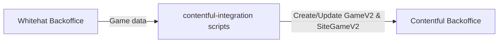
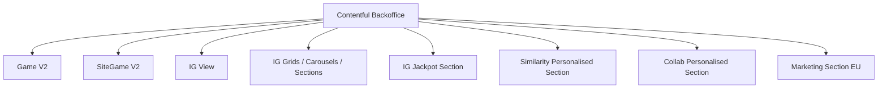
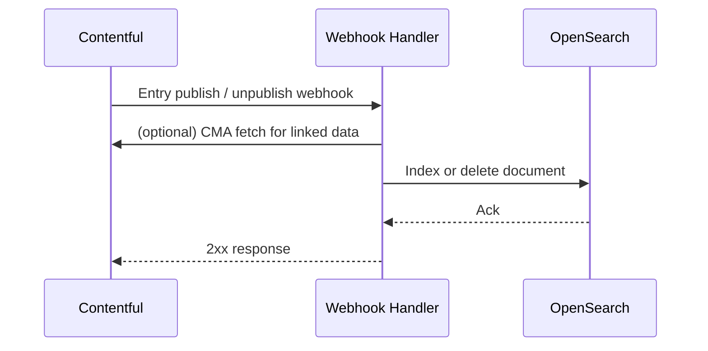
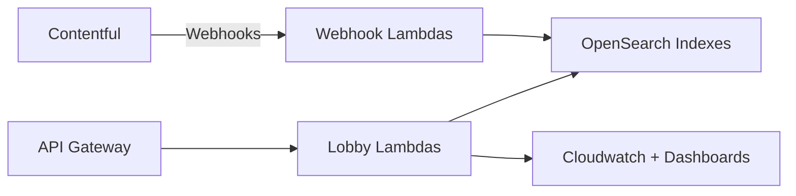

# Contentful CMS Custom Apps Architecture

## 1. Overview

This document explains the end to end architecture of the iGaming Contentful CMS and its custom apps, based on the "Contentful CMS Custom Apps Architecture" diagram.

The flow starts from the external game backoffice, ingests game metadata into Contentful, enhances it with custom apps, and then synchronises changes to AWS OpenSearch and Lobby Lambdas, with observability through Webhooks monitoring and Splunk.

---

## 2. Zones and responsibilities

### 2.1 External zone

- **Whitehat Backoffice**
  - Primary source of truth for the game catalogue.
  - Provides raw game data such as identifiers, names, providers, and configuration.
  - Data is pulled and transformed into the internal `GameV2` and `SiteGameV2` models.

- **contentful-integration scripts**
  - Service or script repository responsible for:
    - Pulling game data from Whitehat Backoffice.
    - Transforming it into the schema expected by Contentful.
    - Managing creation and updates of `GameV2` and `SiteGameV2` entries.
  - Effectively owns the **inbound ETL**: external → CMS.

---

## 2.2 Contentful Backoffice

The backoffice box groups all Contentful models and data, plus admin/custom apps.

**Core models:**

- `Game V2 Model` — canonical game metadata.
- `SiteGame V2 Model` — venture/site scoped wrapper with availability and regulation.
- `IG Jackpot Section Model` — jackpot rows for the lobby.
- `IG View Model` — full lobby screen or page.
- `IG Grid A–G Models` — business sections, each with specific rules.
- `IG Carousel A & B Models` — carousel style sections.
- `igSimilarityBasedPersonalisedSection` — similarity ML personalised row.
- `igCollabBasedPersonalisedSection` — collaborative filtering ML personalised row.
- `igMarketingSectionModel (EU specific)` — EU marketing section model.

**Custom apps inside Contentful:**

- **Platform Config Metadata app**
  - Manages platform-wide configuration entities in Contentful (ventures, platforms, channel flags, etc.).
- **Game Metadata Sync Bot**
  - Ensures external game metadata is regularly synchronised into `GameV2` and `SiteGameV2`.
  - Can run on schedule or react to events.
- **Headless Jackpot app**
  - Manages jackpot configuration fields on relevant section models.
  - Gives editors a tailored UI for jackpot campaigns.
- **Conditional Flexible Fields app**
  - Adds conditional logic to field visibility and validation in the Editor UI.
  - Example: show “Jackpot configuration” fields only when `sectionType` is `jackpot`.
- **Recommended games app**
  - Lets editors curate or override recommended games lists for certain sections or ventures.
- **Contentful Admin Dashboard app**
  - External UI (but logically part of Contentful tooling) that:
    - Pulls data from multiple environments.
    - Shows admin overviews (e.g. per-venture game counts, broken webhooks, unpublished views).
    - Pops up games restricted by venture for quick operations.

---

## 2.3 Contentful Editor UI

- The standard Contentful web interface used by editors.
- Hosts custom apps as sidebars, dialogs or entry editors.
- **Listens on data changes** for chosen models and environments (via Contentful App SDK):
  - Runs additional validations.
  - Shows warnings before publish.
  - Highlights configuration errors.

Editors interact with:

- `GameV2` / `SiteGameV2` entries.
- IG views and section entries.
- Platform config entries.

Custom apps add guardrails so that the data entering the pipeline to OpenSearch is consistent and valid.

---

## 2.4 Webhooks and sync to OpenSearch

**Webhooks DEV/STG/PROD**

- For each environment, Contentful emits webhooks on changes to:
  - IG views
  - IG section entries (grids, carousels, jackpots, ML sections, marketing sections)
  - Game related entries (`SiteGameV2`, `GameV2`)
  - Navigation and theme/venture entries
- Webhook handlers:
  - Receive the event payload.
  - Fetch the canonical entry from CMA if required.
  - Transform it into the OpenSearch document format.
  - Upsert the document into corresponding OS index.

**Webhooks monitor cron**

- A scheduled job that:
  - Reads logs or DLQ/failed webhook events.
  - Aggregates failures and metrics.
  - Forwards logs to Splunk for long-term analysis.

This provides an independent health signal for the CMS→OS synchronisation path.

---

## 3. AWS Lobby and OpenSearch layer

Within the **AWS STG/PROD** zone the following components appear:

- **API Gateway**
  - Public entrypoint for lobby APIs.
- **Lobby Lambdas**
  - Implement read APIs for clients (web / native).
  - Query OpenSearch using venture, view, session and platform filters.
  - Apply business logic (e.g. fallbacks, personalisation, A/B experiments).
- **OpenSearch (OS)**
  - Stores denormalised documents for:
    - game sections
    - personalised sections and defaults
    - marketing sections
    - themes
    - games v2
    - navigation
    - views
    - ventures
- **Cloudwatch + Dashboards**
  - Capture Lambda logs and metrics (invocation counts, latency, throttles, errors).
  - Provide dashboards for runtime health.
- **OS DEV/STG/PROD**
  - Multiple OS clusters or domains per environment.
  - Webhook handlers push to relevant cluster depending on Contentful environment.

---

## 4. Observability and logging

- **Webhooks monitor cron → Splunk Instance**
  - Streams log lines and derived metrics from webhook processing.
  - Allows correlation of “game not visible in lobby” incidents with webhook failures.
- **Lobby Lambdas → Cloudwatch → Splunk**
  - Core application logs remain in Cloudwatch.
  - Selected streams can be ingested into Splunk for cross-system analysis.

Together these paths give:

- Visibility into CMS→OS sync health.
- Visibility into API query behaviour and OS performance.

---

## 5. How to use this document with a custom GPT

- As a reference when reasoning about **where** to add new behaviour:
  - Is it a CMS custom app concern?
  - A webhook / indexing concern?
  - Or a Lobby Lambda / search concern?
- As ground truth when designing new features:
  - GPT can map new requirements (e.g., new section type) to the correct models, webhooks and indexes.
