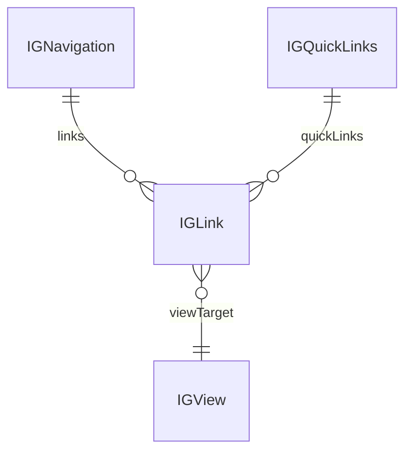
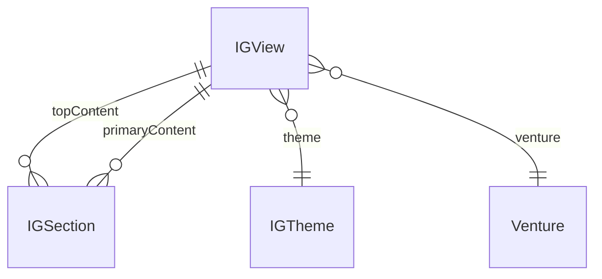
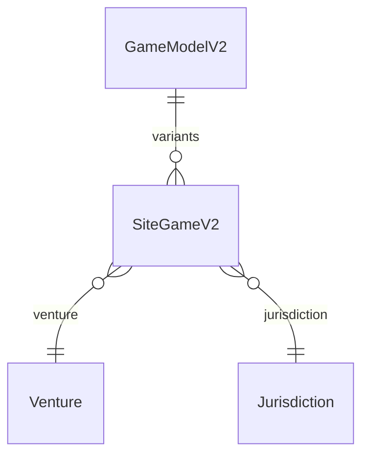
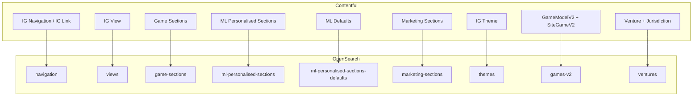

# Contentful iGaming Models and OpenSearch Index Mapping

## 1. Overview

This document describes the iGaming Contentful models shown in the "Contentful models to OS indexes mapping" diagram and how they conceptually map to OpenSearch indexes.

The models are organised into logical groups:

- Navigation
- Views
- Game sections
- ML personalised sections and defaults
- Marketing sections
- Themes
- Games-v2
- Ventures

Each group corresponds to a dedicated OpenSearch index in the runtime architecture.

---

## 2. Navigation models

**Types:**

- `IG Navigation`
- `IG Quick Links`
- `IG Link`

**Responsibilities:**

- Represent the navigation structure of the iGaming lobby (header, quick links, etc.).
- `IG Link` acts as a **central link object** that other domains reuse.

**Fields on IG Link (conceptual):**

- Label / title
- Target `IG View` reference for internal pages
- External URL
- Icon
- Visibility flags (platform, session, environment)

Content from these types is denormalised into the **`navigation`** OpenSearch index.

---

## 3. View models

**Type: `IG View`**

Main fields:

- `entryTitle` (short text, required)
- `name` (short text, required)
- `viewSlug` (short text, required, 2–60 chars)
- `platformVisibility` (array, required)
- `sessionVisibility` (array, required)
- `environmentVisibility` (array, required)
- `venture` (reference to `Venture`, required)
- `topContent` (references, many)
- `primaryContent` (references, many, required)
- `theme` (reference to `IG Theme`)
- `isHidden` (boolean)
- `classification` (short text)
- `validationStatus` (JSON object, internal/disabled in UI)

**Role:**

- Represents a full screen or page in the lobby.
- Composes **sections** in `topContent` and `primaryContent` arrays.

View documents live in the **`views`** OpenSearch index.

---

## 4. Game section models (`game-sections` index)

Included types:

- `IG DFG Section`
- `IG Grid A Section`
- `IG Grid B Section`
- `IG Grid C Section`
- `IG Grid D Section`
- `IG Grid E Section`
- `IG Grid F Section`
- `IG Grid G Section`
- `IG Carousel A Section`
- `IG Carousel B Section`
- `IG Jackpots Section`
- `IG Jackpots Sections Block`
- `IG Game Shuffle`
- `IG Search Results`

**Responsibilities:**

- Each section type encapsulates a business-driven row or block of games:
  - curated lists
  - rule-based lists
  - jackpots
  - dynamic searches
  - shuffle behaviour.
- Sections reference `SiteGameV2` entries for their game lists.
- Sections also reference ventures, jurisdictions or other config where needed.

These types together populate the **`game-sections`** OpenSearch index via webhooks.

---

## 5. ML personalised sections

### 5.1 Runtime sections (`ml-personalised-sections` index)

- `IG Collab Based Personalised Section`
- `IG Similarity Based Personalised Section`

These sections describe the **slot configuration** for ML-powered rows:

- Input signals (e.g. collaborative or similarity model)
- Falls back to defaults when ML has no data.

### 5.2 Default content (`ml-personalised-sections-defaults` index)

- `IG Suggested Games`

Stores editorial fallbacks when the ML engine has no predictions. These entries are indexed into **`ml-personalised-sections-defaults`**.

---

## 6. Marketing section models (`marketing-sections` index)

Types:

- `IG Banner`
- `IG Braze Promos Section`
- `IG Promotions Grid`
- `IG Marketing Section`

Responsibilities:

- Provide marketing and promotional blocks integrated into views:
  - Static or dynamic banners.
  - Braze-driven promotional rows.
  - Promotions grids for campaign pages.

All are indexed into the **`marketing-sections`** index.

---

## 7. Themes, Games and Ventures

### 7.1 Themes (`themes` index)

- `IG Theme`
  - Controls the styling theme referenced by views.
  - May include color scheme, typography, assets, etc.

### 7.2 Games (`games-v2` index)

- `Site Game V2`
- `Game Model V2`

These represent canonical game data and venture-specific metadata (availability, restrictions, highlights).

### 7.3 Ventures (`ventures` index)

- `Venture`
- `Jurisdiction`

Encodes which ventures and jurisdictions exist, their codes, and relationships. IG views and sections use venture references for scoping and availability rules.

---

## 8. Conceptual mapping to OpenSearch indexes

---

## 9. How to use this document with a custom GPT

- When asked “Which index should this model go into?”, GPT uses this mapping.
- When designing new sections, GPT can:
  - Suggest whether they belong in `game-sections`, `marketing-sections` or a new index.
  - Advise on required references (views, ventures, games) for proper indexing.
