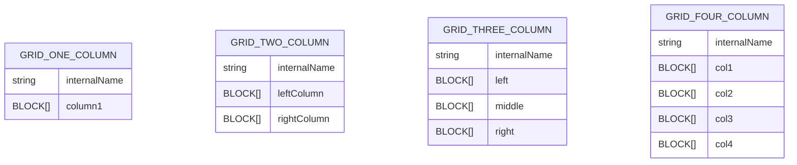

# 02 · Grid and Layout Modeling Patterns

**Audience:** architects, frontend leads, content modeling experts  
**Scope:** how to model grid-style layouts (rows/columns) in a headless CMS, and how that connects to iGaming IG Grid / Section models.

---

## 1. What is a grid layout model?

A **grid layout model** lets editors assemble pages from reusable **rows and columns**, where each column can contain blocks like:

- Banners / heroes
- Game sections
- Rich text / articles
- FAQ / help blocks
- Nested grids

The goal is to give **layout flexibility** without:

- Hardcoding templates per campaign.
- Letting the schema degenerate into “anything goes” chaos.

---

## 2. Why model grids explicitly?

- Authors can build complex pages **without new code**.
- Designers get consistent, controlled layouts (e.g., only certain column splits).
- Developers avoid a combinatorial explosion of templates.

Benefits:

- Faster go-to-market for campaigns and landing pages.
- Clear separation of **content** vs **layout** vs **styling**.

---

## 3. Recommended grid content types

For a typical website or experience layer, use **four explicit grid types**:

- `GridOneColumn`
- `GridTwoColumn`
- `GridThreeColumn`
- `GridFourColumn`

Each type has **fixed, explicit column fields**.



Where `BLOCK` is a union of allowed block types (banner, text, game section, etc.).

---

## 4. Why not a single “generic grid” type?

A single `Grid` with a `columns` array (each column being an object) sounds elegant, but in practice it causes issues:

1. **Authoring complexity**
   - Editors must add/remove columns manually.
   - Easy to create invalid states (3 columns configured on a “2-column design” page).

2. **Validation complexity**
   - Hard to enforce “only 2 columns allowed” in a generic array.
   - Hard to enforce allowed column splits (e.g., 25/75, 50/50).

3. **Developer burden**
   - Frontend must handle many permutations of column counts and shapes dynamically.
   - Queries become more complex (looping over arrays, nested blocks).

Explicit types solve this by making:

- The number of columns **part of the schema**.
- Queries **predictable** for each grid type.

---

## 5. When to use grid models

Use this pattern when:

- You build or redesign a **headless website**, **lobby**, or **marketing site**.
- You need non-technical editors to assemble:
  - Homepages
  - Casino / lobby overview pages
  - Campaign landing pages
  - Help / info hubs

For pure iGaming home / lobby where **business-driven sections** dominate, you might combine grid thinking with **section-specific models** (see Document 06 for IG-specific hybrid strategies).

---

## 6. Conditions for using grid models

- CMS must support **reference fields** to link grids → blocks.
- You should have:
  - A clear list of allowed block types.
  - A design system defining approved column splits.
- The team must agree that **layout flexibility is a product need**, not just a nice-to-have.

---

## 7. Implementation highlights

Key fields per grid type:

- `internalName` — editorial label.
- `layoutVariant` — enum of allowed splits:
  - `one-column-full`
  - `two-column-50-50`
  - `two-column-25-75`
  - `three-column-equal`
  - etc.
- Column fields:
  - `column1Blocks`
  - `leftBlocks` / `rightBlocks`
  - etc.

Example (two-column):

```text
GridTwoColumn
- internalName: "Homepage top band"
- layoutVariant: "two-column-25-75"
- leftBlocks: [HeroBanner]
- rightBlocks: [GameSection, PromoBlock, TextBlock]
```

---

## 8. Relation to IG Grid & Carousel models

In the iGaming context, you already have **explicit section models**:

- `IG Grid A` … `IG Grid G`
- `IG Carousel A`, `IG Carousel B`

These are not pure “grid layout” types; they are **business sections** with specific behaviour and rules.

However, the same principles apply:

- Explicit content types instead of one giant, overloaded super model.
- Predictable fields per type.
- Strong validation and placement rules (`topContent`, `primaryContent`, etc.).

IG Grids behave like “specialised grid blocks” inside views.

---

## 9. Flexibility vs governance

Important trade-off:

- Too much flexibility → chaotic layouts, brand inconsistency.
- Too much governance → editors blocked, need dev work for every change.

Strategy:

- Offer **a small set of standard grids** (1–4 columns).
- Allow nesting **only where truly needed** (e.g., a nested two-column inside a hero).
- Use validations and block allowlists to control what can go into which column.

---

## 10. Future evolution / hybrid approach

For advanced iGaming / Netflix-style homepages, you can:

- Keep **explicit section types** for business-critical rows (Recommended, Top Jackpots, New Games).
- Optionally add **generic grid types** for marketing / editorial flexibility in non-critical zones.

Hybrid model:

- **Row type** (section) chooses its rendering:
  - `type: igGrid`, `igCarousel`, `editorialGrid`, `staticContent`.
- Some rows are strictly controlled (IG Grids with strong business rules).
- Others are flexible grids that follow the grid principles in this doc.

---

## 11. How this document should be used by a custom GPT

- As a **pattern library** when the user asks “How should I model landing pages / column layouts?”.
- As a **comparison lens** for IG Grid / Carousel discussions:
  - GPT should reference this document when explaining why IG chose explicit types.
- As input when proposing **future hybrid models**:
  - One base type with `gridVariant` and `allowedPlacement`, while preserving guardrails.
