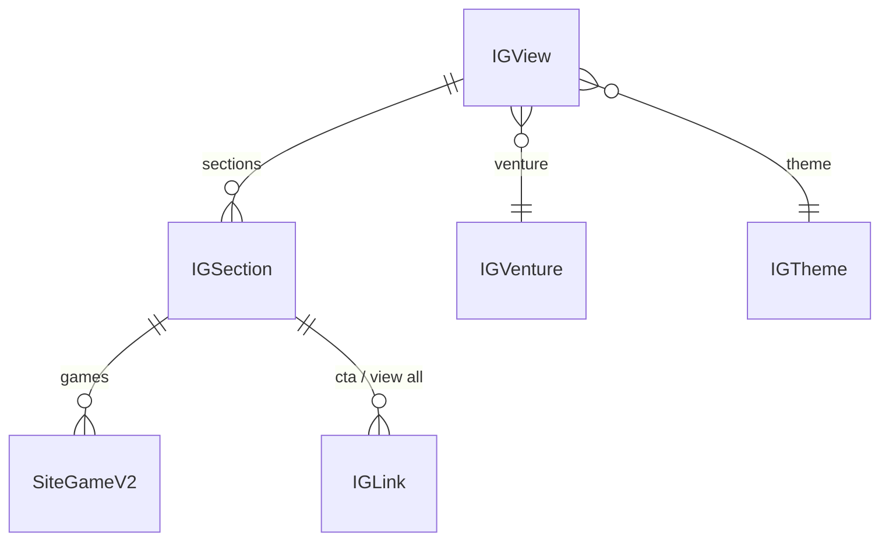
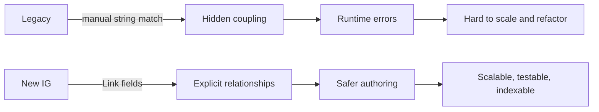

# 03 · iGaming CMS Model ADR (IG Views, Grids, Carousels, Visibility)

**Audience:** architects, platform engineers, CMS owners  
**Scope:** the iGaming Experience (IG) content model family — how it is structured, why it is better than the legacy design, and how it should evolve.

---

## 1. Context & problem

The legacy CMS design used:

- Implicit relationships (manual string matching between `category.id` and `layout.name`).
- Overloaded generic models (`section`, `layout`) with weak validation.
- Mixed concerns (layout, business rules, visibility) in ambiguous fields.

This caused:

- Fragile dependencies (small typo → entire section breaks).
- Difficult migrations and refactors.
- Poor authoring experience.

The **IG model** is the new architecture aiming to:

- Make relationships explicit via `Link` fields.
- Separate business sections into clear content types.
- Provide strong visibility and placement rules.

---

## 2. Key entities (IG family)

Core types (names are conceptual; actual implementation may have prefixes / variants):

- `IG View`
  - Represents a full screen / page (e.g., lobby, home, search results).
  - References one or more **sections** (grids, carousels, personalised sections).
- `IG Grid Sections (A–G)`
  - Business sections with specific behaviour and properties:
    - Different truncation rules.
    - Different allowed placements.
    - Different game / promo composition rules.
- `IG Carousels (A, B, …)`
  - Horizontal carousels for games or content.
  - Support specific layouts and personalisation options.
- `IG Link`
  - Central reusable link object:
    - `label`
    - `view` (page reference)
    - `externalUrl` / `internalUrl`
    - `subMenu` (recursive)
    - Visibility flags
- `SiteGameV2`
  - Site-specific game wrapper around canonical `Game` model.
- `IG Venture`, `IG Jurisdiction`, `IG Theme`
  - Reusable entities for brand, region, and styling.

---

## 3. Architectural decisions

### 3.1 Explicit relationships via Link fields

- All major relationships are enforced with `Link` fields + `linkContentType` validations.
- Examples:
  - `IG View` → `IG Sections`
  - `IG Section` → `SiteGameV2` / `IG Link`
  - Navigation → `IG Link`

**Benefits:**

- No manual string matching (e.g., `category.id` vs `layout.name`).
- Strong referential integrity.
- CMS can prevent invalid associations at authoring time.

---

### 3.2 Strict field validations

The IG models apply strict validations for:

- **Visibility** (`platformVisibility`, `sessionVisibility`, `environmentVisibility`)
- **Layout** (`layoutType`, `expandedSectionLayoutType`)
- **Uniqueness** (`entryTitle` uniqueness, etc.)

Benefits:

- Data quality is enforced at creation time.
- Clients can rely on well-formed structures without defensive boilerplate everywhere.

---

### 3.3 Separation of IG grid sections

Instead of one giant “section” type, the IG design intentionally uses:

- Separate content types for `IG Grid A`, `IG Grid B`, … `IG Grid G`.
- Separate types for carousels and personalised sections.

Reasons:

- Each section has different properties:
  - Some have truncation counts.
  - Some are personalised (collab, similarity-based).
  - Some are special-purpose (jackpots, DFG, promos).
- Having separate types allows:
  - Tailored field sets.
  - Clear validation rules.
  - Easier A/B testing and deprecation.

---

### 3.4 Visibility fields embedded per model

- Visibility fields (`platformVisibility`, `sessionVisibility`, `environmentVisibility`) live on the section / experience-level models.
- They allow:
  - Different visibility rules per section type.
  - Fine-grained control for experiments and per-platform behaviour.

Trade-off:

- Some duplication of visibility fields across models.
- But easier content authoring and clear, localised rules.

---

### 3.5 Reusable core components

IG models use:

- `SiteGameV2` as the unified game reference for all sections.
- `IG Link` as the single source of truth for links across navigation, quick links, footers, and promos.
- Shared objects like `IG Venture`, `IG Jurisdiction`, `IG Theme`.

Benefits:

- Consistency: one definition of game, link, venture, theme.
- Simpler indexing and caching (e.g., OpenSearch indices built around `SiteGameV2`).

---

## 4. Legacy vs new design

**Legacy issues:**

- Implicit relationships (string matching) created hidden coupling.
- Overloaded `section` / `layout` models tried to do too many things.
- Weak validations and vague field semantics (`partner`, `slides`, `videoUrl`).

**New IG design improvements:**

- Explicit links between models via `linkContentType`.
- Strong validation on enums and relationships.
- Separation into **clear, purpose-built section models**.
- Centralised reusable entities (game, link, venture, theme).

---

## 5. Pros, cons, and trade-offs

### Pros

- ✅ Modern, modular, reusable patterns aligned with big-tech “block-based” designs.
- ✅ Shallow reference chains (typically 1–2 levels) for views → sections → games/links.
- ✅ Strong editorial guardrails via validation and explicit section types.
- ✅ Easy to integrate with personalisation (site games + visibility + taxonomy later).

### Cons / challenges

- ⚠️ Many similar grid and carousel types (A–G) → type sprawl.
- ⚠️ Visibility fields duplicated across many models.
- ⚠️ Requires good documentation so authors understand which section type to choose.

---

## 6. Future evolution: hybrid model

To reduce type sprawl from multiple grid/carousel types while preserving guardrails, use a **hybrid model**:

- Introduce a **base IG Grid Section** type with:
  - `gridVariant: A | B | C | D | E | F | G`
  - `allowedPlacement: topContent | primaryContent | both`
  - `hasPersonalisation: boolean`
  - `hasCollabContent: boolean`
  - Shared fields for games, promos, CTAs.
- Use UI extensions / conditional logic to show fields only for relevant variants.

Benefits:

- Reduce from ~7 grid types → 1 base type with controlled variants.
- Preserve strict business rules with validations on `gridVariant` + `allowedPlacement`.
- Easier to deprecate a variant (remove from enum, keep schema intact).

This hybrid approach sits between:

- Highly explicit separate types (current IG model).
- Over-generic super model (not recommended).

---

## 7. How this document should be used by a custom GPT

- As the **canonical ADR** for the iGaming experience model.
- When the user asks “Why did we split grids A–G?” or “Should we merge IG grids?”:
  - GPT should draw directly from the reasoning here.
- When proposing **new sections, variants, or refactors**:
  - GPT should check consistency with decisions and future-hybrid strategy described in this document.
