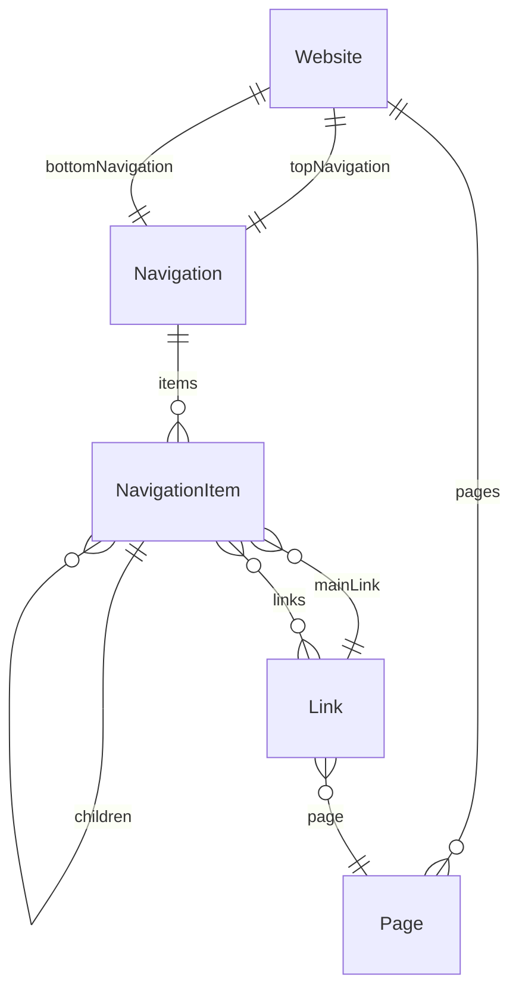
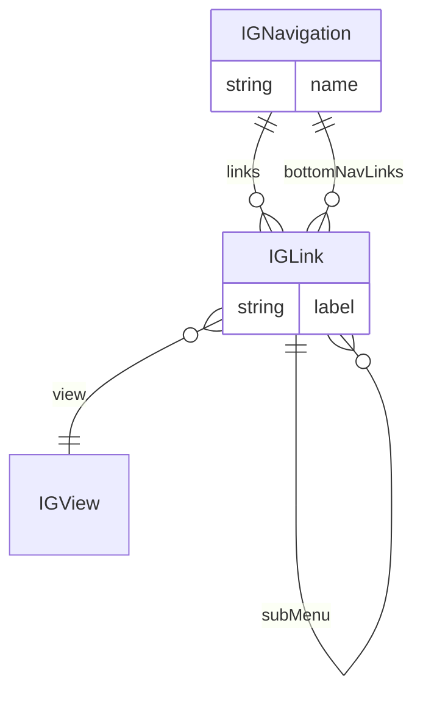

# 04 · Navigation Architecture (Generic + IG)

**Audience:** architects, frontend leads, CMS owners  
**Scope:** generic website navigation modeling + specific IG navigation patterns.

---

## 1. Goals of the navigation model

- Support multiple navigation areas:
  - Top nav, footer nav, side nav, account menus, in-product navigation.
- Enable **deep hierarchies** (dropdowns, megamenus, nested categories).
- Provide a **single source of truth** for links and pages.
- Avoid duplicated “TopNav”, “FooterNav” types.
- Work well in **multi-site / multi-venture** environments.

---

## 2. Generic navigation model

### 2.1 Key content types

- `Website`
  - Container for a specific site / venture.
  - Fields:
    - `internalName`
    - `externalName`
    - `codeId`
    - References:
      - `pages` → `[Page]`
      - `topNavigation` → `Navigation`
      - `bottomNavigation` → `Navigation`
- `Navigation`
  - A named navigation area (header, footer, sidebar, etc.).
  - Fields:
    - `internalName`
    - `externalName`
    - `codeId`
    - `items` → `[NavigationItem]`
- `NavigationItem`
  - A node in the navigation tree; can represent either:
    - A single link.
    - A container with child links / items (megamenus).
  - Fields:
    - `internalName`
    - `externalName`
    - `codeId`
    - `mainLink` → `Link` (0..1)
    - `links` → `[Link]`
    - `children` → `[NavigationItem]`
- `Link`
  - The actual destination object.
  - Fields:
    - `internalName`
    - `externalName`
    - `codeId`
    - `page` → `Page` (0..1)
    - `externalUrl` (optional)
    - `openInNewWindow` (bool)
    - `icon` (asset)
- `Page`
  - Represents an internal page.
  - Fields:
    - `internalName`
    - `externalName`
    - `codeId`
    - `slug`

---

## 3. Design principles embodied in this model

- **Reusability:**
  - `Link` is central and reusable across header, footer, side menus, promos.
- **Minimal content types:**
  - Single `Navigation` and `NavigationItem` type for all nav contexts.
  - No `TopNavigation`, `FooterNavigation` clones.
- **Recursion for flexibility:**
  - `NavigationItem` can contain child `NavigationItem`s, enabling nested structures.
- **Link abstraction:**
  - `Link` hides whether a target is internal or external.

Benefits:

- Update one `Link` entry → all navs referencing it update automatically.
- Easy to support multi-site scenarios:
  - One `Website` entry per venture, each with its own navigation references.

---

## 4. IG navigation model (domain-specific)

Within the iGaming / experience layer, the IG navigation model follows similar principles but is specialised:

- `IG Navigation`
  - Fields:
    - `links` → `[IG Link]`
    - `bottomNavLinks` → `[IG Link]`
    - `venture` → `IG Venture`
- `IG Link`
  - Central link object used in:
    - navigation
    - quick links
    - promos / banners
    - other UX surfaces
  - Fields (conceptual):
    - `label`
    - `view` → `IG View` (internal content view)
    - `externalUrl`
    - `internalUrl`
    - `subMenu` → `IG Link` (recursive)
    - `iconAsset`
    - `platformVisibility`
    - `environmentVisibility`
    - `sessionVisibility`

---

## 5. Comparison: Generic vs IG model

| Principle                    | Generic Nav Model                 | IG Nav Model                            |
|-----------------------------|-----------------------------------|-----------------------------------------|
| Reusability of links        | Central `Link`                    | Central `IG Link` across many surfaces  |
| Minimal content types       | 1 `Navigation`, 1 `NavigationItem`| 1 `IG Navigation`, 1 `IG Link`          |
| Recursion                   | `NavigationItem.children`         | `IG Link.subMenu`                       |
| Visibility control          | Usually separate or minimal       | Strong per-link visibility fields       |
| Multi-site support          | Website → Navigations             | IG Navigation + venture reference       |

IG navigation is a **specialisation** of the generic pattern, optimised for:

- Dynamic views (`IG View`)
- Multi-platform visibility
- Gaming-specific marketing / experience needs

---

## 6. Authoring UX considerations

- Editors primarily interact with:
  - `IG Navigation` entries to manage overall menus.
  - `IG Link` entries to configure destinations, labels, icons, and visibility.
- Reuse patterns:
  - The same `IG Link` can appear in:
    - Header
    - Footer
    - In-page quick links
  - This is by design and should be encouraged.

Guidelines:

- Provide clear help text on:
  - How `subMenu` is used to create dropdowns / nested menus.
  - When to use `view` vs `externalUrl`.
  - How visibility interacts with platform / session / environment.

---

## 7. Developer usage patterns

- FE / API typically queries:
  - Navigation by code (e.g., “main-header”, “footer-main”).
  - For IG: `IG Navigation` for a venture, then resolve `IG Links`.
- Recursive structures (subMenu or child items) should be:
  - Traversed carefully with depth limits (to avoid infinite loops).
  - Rendered as nested menus or megamenus depending on design.

Recommended: enforce a **maximum nesting depth** (e.g., 2–3) in guidelines, even if the schema technically allows more.

---

## 8. How this document should be used by a custom GPT

- As a **reference pattern** when the user asks:
  - “How should we model navigation?”
  - “How do IG links fit into the general navigation architecture?”
- To evaluate proposals:
  - GPT should warn when a user suggests separate `TopNav` and `FooterNav` types instead of using the `Navigation` pattern.
  - GPT should map new ideas for IG-specific navigation back to the `IG Link` + visibility model.
