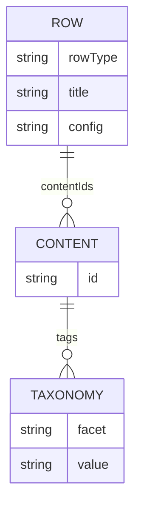

# 06 · Taxonomy, Netflix-Style Modeling, and Future Strategy

**Audience:** architects, personalisation engineers, CMS owners  
**Scope:** how taxonomy and Netflix-style patterns fit with the current IG model, and how to evolve towards a more flexible yet governed system.

---

## 1. Big-tech patterns (Netflix, Spotify, Amazon)

Common themes in large-scale media / content platforms:

- **Block-based homepages / experiences**:
  - Rows (sections) like “Trending Now”, “Because you watched X”, “Jackpots”, “New & Popular”.
  - Each row is a **block** with a `type` and a list of content IDs.
- **Faceted taxonomy / tagging systems**:
  - Genre, mood, theme, provider, feature flags, audience, regulation, etc.
  - Tags drive which content appears in which row.
- **Shallow schema**:
  - Rows → content IDs.
  - Avoid deep, nested hierarchical content models.



---

## 2. Where the IG model already aligns

The IG models already adopt many of these patterns:

- **Block-based sections** (IG grids, carousels, personalised sections).
- **Shallow referencing**:
  - `IG View` → `IG Section` → `SiteGameV2` / `IG Link`.
- **Visibility and platform flags** on sections (`platformVisibility`, `sessionVisibility`, `environmentVisibility`).

Current gaps / opportunities:

- Limited explicit **taxonomy / tagging** across games and sections.
- Multiple **section types** for variants that could be expressed as configuration.

---

## 3. Taxonomy strategy for iGaming

### 3.1 Central Tag / Taxonomy model

Introduce a `Tag` / `Concept` model with:

- `name`
- `slug`
- `group` / `scheme` (e.g., `genre`, `mechanic`, `providerStudio`, `regulation`, `persona`)
- `description`

Attach tags to:

- `Game` / `SiteGameV2`
- Possibly to sections / views for editorial grouping.

This allows:

- Dynamic rows based on tags (e.g., “Top Megaways”, “Exclusive Jackpots”, “New in Spain”).
- Advanced segmentation and personalisation.

---

### 3.2 Taxonomy + IG sections

Instead of creating a separate content type for every curated slice, you can:

- Keep a smaller set of **section types**, but configure them via:
  - `selectionMode: curated | ruleBased`
  - `ruleConfig` (e.g., tags, provider filters, min RTP, etc.)
  - `maxItems`

Example:

```text
IG Taxonomy Section
- title: "Top Exclusive Jackpots"
- selectionMode: "ruleBased"
- ruleConfig:
    tags: ["exclusive", "jackpot"]
    jurisdictions: ["UK"]
    minJackpotValue: 500000
    sort: "jackpotValueDesc"
- maxItems: 20
```

The FE or backend service uses `ruleConfig` + search index (e.g., OpenSearch) to populate games.

---

## 4. Reducing type sprawl with variants and taxonomy

### 4.1 From many IG grid types → fewer base types

Current state:

- `IG Grid A`, `IG Grid B`, …, `IG Grid G` as separate content types.

Future state (example):

- `IG Grid Section` (base type)
  - `gridVariant: A | B | C | D | E | F | G`
  - `allowedPlacement: topContent | primaryContent | both`
  - `selectionMode: curated | ruleBased`
  - `ruleConfig` (when rule-based)
  - Common game / content references for curated mode.

Guardrails:

- Validation rules ensure some variants are only allowed in certain placements.
- UI extensions hide/show fields depending on `gridVariant` and `selectionMode`.

---

### 4.2 Why this is *not* a generic super model

The future hybrid design **does not** revert to an unstructured super model:

- You still have strong enums for:
  - `gridVariant`
  - `allowedPlacement`
  - `selectionMode`
- You keep fields explicit (no deep JSON blobs for everything).
- You preserve guardrails via validations and UI logic.

This is a **controlled consolidation**, not a free-form schema.

---

## 5. DX & Sports: taxonomy as a rescue tool (with limits)

For DX & Sports, taxonomy can help:

- Group content without new types.
- Enable rule-based sections / pages.

But:

- It **does not** automatically solve deep nesting and type sprawl.
- Some structural consolidation is still required:
  - Merge similar tile / tab models into base types with variants.
  - Flatten multi-level grouping where possible.

---

## 6. Roadmap recommendations

1. **Introduce taxonomy / tags** for games and possibly other domains.
2. **Design unified IG section types** with:
   - `variant`
   - `placement`
   - `selectionMode`
   - `ruleConfig`
3. **Refactor search & availability indices** to leverage taxonomy:
   - Enable queries like “all exclusive Megaways in UK, sorted by performance”.
4. **Gradually simplify DX & Sports** based on IG + taxonomy patterns.

---

## 7. How this document should be used by a custom GPT

- As the **strategy brain** when the user asks about:
  - Netflix-style modelling.
  - Taxonomy / tagging, faceted search, personalisation.
  - Consolidating grid / section types.
- GPT should:
  - Tie user ideas back to this roadmap.
  - Explain pros/cons of structural vs taxonomic approaches.
  - Ensure proposals keep the strengths of the existing IG model (guardrails, shallow depth, reusable blocks).
