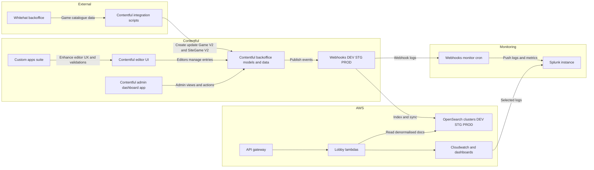
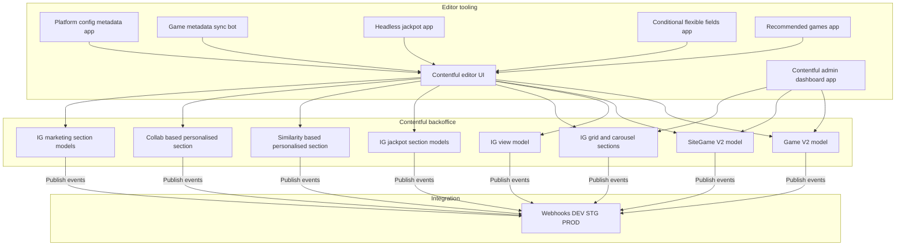
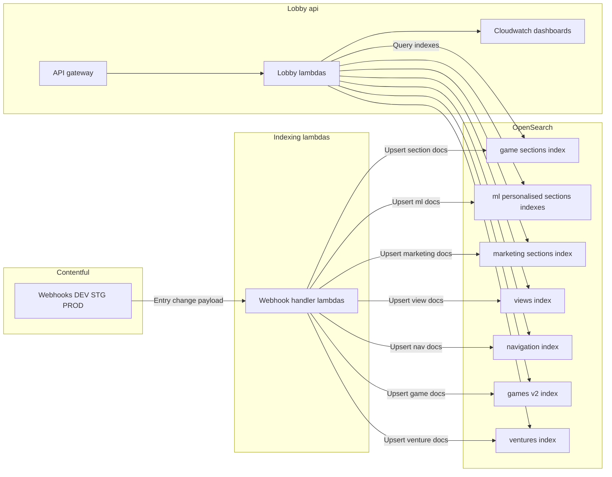
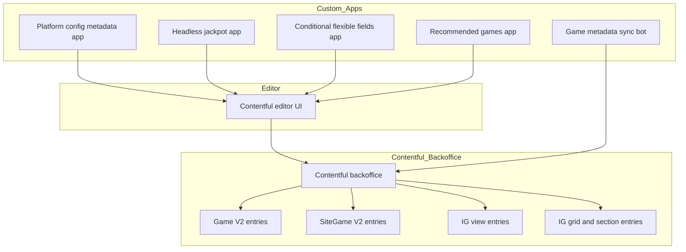
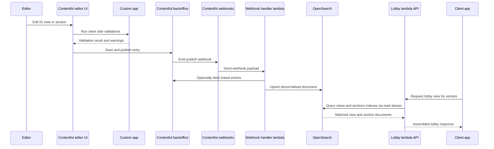
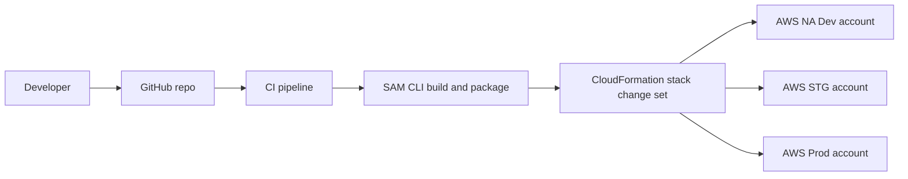
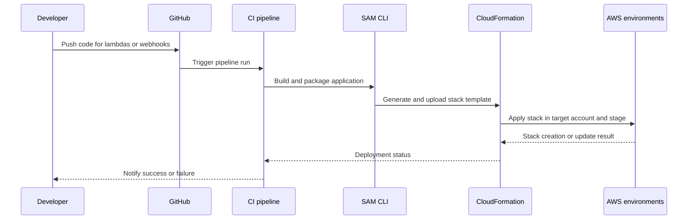

# Contentful CMS Custom Apps Architecture

## High level architecture – External → Contentful → AWS → Monitoring


## Contentful internals – models, custom apps, and webhooks


## Runtime side – webhooks, indexing and lobby API



## End to end sequence – from external game change to lobby response

```
sequenceDiagram
  participant WH as Whitehat backoffice
  participant CIS as Integration scripts
  participant CF as Contentful
  participant APP as Custom apps and editor
  participant WHK as Webhook endpoint
  participant IDX as Indexer lambda
  participant OS as OpenSearch
  participant API as API gateway
  participant LBL as Lobby lambda
  participant CL as Client app

  WH->>CIS: Game change or new game
  CIS->>CF: Create update Game V2 and SiteGame V2
  APP->>CF: Editor adjusts IG views and sections
  CF-->>WHK: Webhook call on publish or update

  WHK->>IDX: Normalised event payload
  IDX->>CF: Fetch full entry and links
  IDX->>OS: Upsert documents in modelling indexes
  OS-->>IDX: Acknowledge write

  CL->>API: Request lobby view for venture and context
  API->>LBL: Forward request
  LBL->>OS: Query views and sections for venture
  OS-->>LBL: Denormalised section docs
  LBL-->>CL: Response with lobby layout and games
```

## System context — External → Contentful → AWS
flowchart LR
  subgraph External
    WH[Whitehat backoffice]
    CIS[Contentful integration scripts]
  end

  subgraph Contentful
    CB[Contentful backoffice models and data]
    CE[Contentful editor UI]
    CA[Custom apps]
    CAD[Contentful admin dashboard app]
    WHK[Webhooks DEV STG PROD]
    WM[Webhooks monitor cron]
  end

  subgraph AWS[AWS STG PROD]
    API[API gateway]
    LAM[Lobby lambdas]
    OS[OpenSearch domain]
    CW[Cloudwatch dashboards]
  end

  subgraph Observability
    SPL[Splunk instance]
  end

  WH -->|Game data| CIS
  CIS -->|Create and update GameV2 and SiteGameV2| CB

  CE -->|Editors manage entries| CB
  CA -->|Enhance validation and UI| CE
  CAD -->|Read data from environments| CB

  CB -->|Emit content change webhooks| WHK
  WHK -->|Index documents| OS

  WM -->|Read webhook logs| WHK
  WM -->|Send aggregated events| SPL

  API -->|Invoke lobby endpoints| LAM
  LAM -->|Query game and section indexes| OS
  LAM -->|Send runtime metrics| CW

  CW -->|Forward selected logs| SPL
```

## Contentful apps and models landscape



## Game ingestion flow — Whitehat → Contentful → OpenSearch
```
sequenceDiagram
  participant WH as Whitehat backoffice
  participant CIS as Integration scripts
  participant CB as Contentful backoffice
  participant WHK as Contentful webhooks
  participant WHH as Webhook handler lambda
  participant OS as OpenSearch

  WH->>CIS: Export game metadata
  CIS->>CIS: Transform to GameV2 and SiteGameV2 schema
  CIS->>CB: Create or update GameV2 entry
  CIS->>CB: Create or update SiteGameV2 entry

  CB->>WHK: Publish events for GameV2 and SiteGameV2
  WHK->>WHH: Deliver webhook payload
  WHH->>CB: Fetch latest entry data if required
  WHH->>OS: Upsert game document into games v2 index
```

## Content change flow — Editor publish → Webhook → OS → Lobby API



## Deployment pipeline — GitHub → SAM → CloudFormation → AWS

### High level flow


### Detailed sequence for a change

