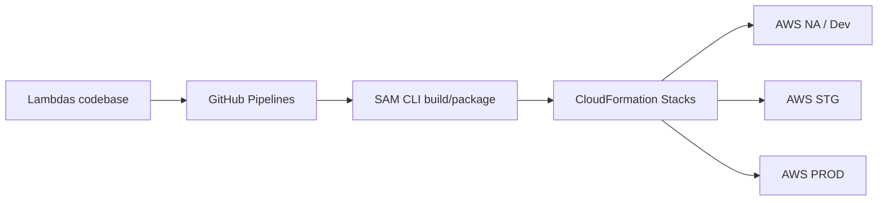
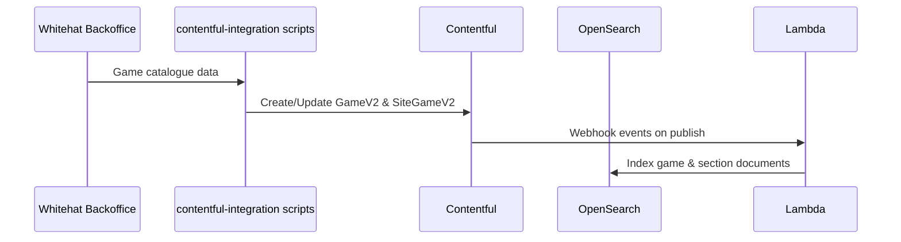
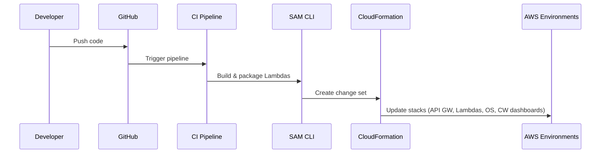

# iGaming CMS Repo / Resource Oriented Architecture

## 1. Overview

This document expands the runtime architecture into a **repo and resource oriented view**, based on the "iGaming CMS Repo-Resource Oriented Architecture View" diagram.

Every runtime component (webhook handler, lobby lambda, OS cluster, etc.) is linked to one or more repositories and infra-as-code definitions. This clarifies ownership and deployment flows.

---

## 2. Code and configuration repositories

- **contentful-integration scripts repo**
  - Owns the scripts or services that ingest data from Whitehat Backoffice into Contentful.

- **Custom apps repos**
  - Host the code for Contentful custom apps such as:
    - Platform Config Metadata
    - Game Metadata Sync Bot
    - Headless Jackpot
    - Conditional Flexible Fields
    - Recommended Games
  - These repos produce app bundles configured in the Contentful organisation.

- **Contentful Admin Dashboard app repo**
  - Source code of the Admin Dashboard front-end and back-end (if any).
  - Uses Contentful Delivery/Management APIs to present admin views.

- **Webhooks repo**
  - Defines the webhook endpoints, request handlers and associated infrastructure for DEV/STG/PROD.
  - May include IaC code to register webhooks with Contentful spaces.

- **Webhooks monitor repo**
  - Contains the scheduled job (cron Lambda, ECS task, etc.) that inspects webhook logs and sends data to Splunk.

- **Lambdas codebase**
  - Shared or multiple repos containing the logic for:
    - Webhook handlers (CMS→OS indexers).
    - Lobby Lambdas (client facing APIs).

- **AWS infra as code repo (CloudFormation)**
  - Owns the CloudFormation stacks for:
    - API Gateway
    - Lambda functions
    - OpenSearch domains
    - Cloudwatch dashboards
    - IAM roles and policies.

- **OS migrations repos**
  - Own templates and scripts to create and migrate OpenSearch indexes.
  - Guarantee consistent mappings and settings across Dev / STG / Prod clusters.

---

## 3. Deployment pipeline

- **GitHub pipelines**
  - Triggered on pushes / PR merges.
  - Run tests and build steps.
  - Invoke **SAM CLI** to package lambda code and generate CloudFormation change sets.
  - Apply CloudFormation stacks into target accounts/environments.

- **SAM CLI**
  - Handles packaging of Lambda artefacts and definition of API Gateway + Lambda resources.

---

## 4. AWS environments

### 4.1 AWS NA / AWS Dev

Components inside this environment:

- API Gateway  
- Lambda API (Lobby Lambdas and webhook handlers)  
- OpenSearch (OS Dev domain)  
- Cloudwatch + Dashboards  
- Parameter Store  

**Parameter Store** keeps configuration such as:

- OS endpoint URLs  
- API keys / secrets for external systems  
- Feature flags for development

### 4.2 AWS STG/PROD

Mirrors the DEV setup but for staging and production:

- Separate API Gateway endpoints for STG/PROD.
- OS STG/PROD domains.
- Lobby Lambdas compiled and deployed via the same pipeline but with prod configuration.

Webhooks for DEV/STG/PROD environments push to the appropriate OS cluster.

---

## 5. Data and control flows

### 5.1 Game ingestion path

### 5.2 Deployment and infra management

---

## 6. Monitoring and observability

- **Webhooks monitor repo → Webhooks monitor runtime → Splunk**
  - Scheduled checks of webhook invocations and failures.
  - Centralised logs for CMS→OS synchronisation issues.

- **Lobby Lambdas → Cloudwatch → dashboards / Splunk**
  - Metrics for latency, error rates, throttling.
  - Logs for troubleshooting search and personalisation behaviour.

---

## 7. Usage by a custom GPT

- Connects requirements to the appropriate repository and component:
  - “We need a new index for XYZ” → OS migrations repo + CloudFormation for new domain/config.
  - “We need an extra field from Contentful in search results” → webhook handler Lambda + index template.
- Helps reason about deployment impact:
  - Changes to Lambdas or webhooks require pipeline changes but not necessarily CMS schema changes.
