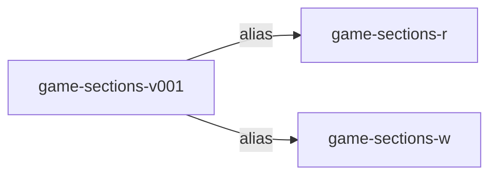
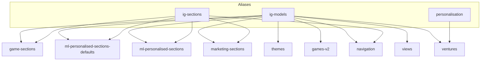

# OpenSearch Indexes and Aliases for iGaming Models

## 1. Overview

This document describes the OpenSearch indexes and their aliases shown in the "OS Indexes and available aliases" diagram.

The design uses:

- Dedicated indexes per domain (sections, ML, marketing, themes, games, navigation, views, ventures).
- Per-index read/write aliases (`*-r` and `*-w`).
- Shared cross-index aliases (`ig-models`, `ig-sections`, `personalisation`).

---

## 2. Per-index aliases

| Index                            | Aliases                                                                 |
|----------------------------------|-------------------------------------------------------------------------|
| `game-sections`                  | `game-sections-r`, `game-sections-w`, `ig-models`, `ig-sections`       |
| `ml-personalised-sections-defaults` | `ml-sections-defaults-r`, `ml-sections-defaults-w`, `ig-models`, `ig-sections` |
| `ml-personalised-sections`      | `ml-sections-r`, `ml-sections-w`, `ig-models`, `ig-sections`           |
| `marketing-sections`            | `marketing-sections-r`, `marketing-sections-w`, `ig-models`, `ig-sections` |
| `themes`                        | `themes-r`, `themes-w`, `ig-models`                                    |
| `games-v2`                      | `games-v2-r`, `games-v2-w`, `ig-models`                                |
| `navigation`                    | `navigation-r`, `navigation-w`, `ig-models`, `ig-sections`             |
| `views`                         | `views-r`, `views-w`, `ig-models`                                      |
| `ventures`                      | `ventures-r`, `ventures-w`, `ig-models`, `personalisation`             |

### 2.1 Read / write aliases

Pattern:

- `*-r` aliases: safe for search / read-only operations.
- `*-w` aliases: write targets for indexing pipelines and migrations.

This allows:

- Zero-downtime reindexing via index versioning and alias flips.
- Different retention or performance settings per physical index while keeping stable logical names.

---

## 3. Shared cross-index aliases

### 3.1 `ig-models`

Attached to:

- `game-sections`
- `ml-personalised-sections-defaults`
- `ml-personalised-sections`
- `marketing-sections`
- `themes`
- `games-v2`
- `navigation`
- `views`
- `ventures`

Purpose:

- Provide a **single logical view of all modelling documents**.
- Used for cross-entity search (e.g. debugging, ad-hoc analytics, admin tools).
- Enables queries like “find all documents referencing venture X across all models”.

### 3.2 `ig-sections`

Attached to:

- `game-sections`
- `ml-personalised-sections-defaults`
- `ml-personalised-sections`
- `marketing-sections`
- `navigation`

Purpose:

- Provide a **focused view of section-level entities** that are used to compose IG views.
- Ideal for APIs that:
  - Expand `IG View` into its sections.
  - Fetch the configuration of all rows and navigation for a given venture.

### 3.3 `personalisation`

Attached to:

- `ventures`

Purpose:

- Expose ventures data needed by personalisation services under a stable alias.
- Allows independent scaling/reindexing of `ventures` without breaking ML pipelines.

---

## 4. Design rationale

- Multi-index aliases (`ig-models`, `ig-sections`) are used instead of a single mega-index.
- Each domain has its own mapping tuned for the document shape.
- Aliases allow:
  - Cohesive querying where necessary.
  - Independent scaling, retention and lifecycle policies per index.

---

## 5. Usage patterns for APIs and tools

- **Lobby APIs:**
  - Typically query concrete indices via read aliases, e.g. `game-sections-r`, `views-r`.
  - May occasionally join across `ig-sections` when composing full views.
- **Admin / Debug tools:**
  - Use `ig-models` for broad searches.
  - Use per-index aliases for focused tasks (bulk reindex, one-off fixes).
- **ML / personalisation services:**
  - Use `personalisation` alias to read venture metadata.

---

## 6. How this document should be used by a custom GPT

- To answer “which alias should I query or write to?” questions.
- To propose safe reindexing strategies using `*-r` and `*-w` patterns.
- To reason about cross-index joins and which alias is appropriate for each use case.
