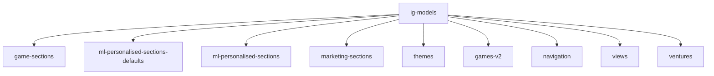
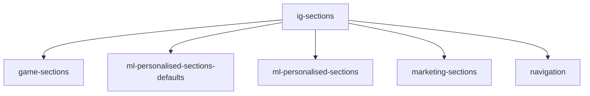

# OpenSearch Shared Aliases: ig-models and ig-sections

## 1. Overview

This short document zooms in on the alias-to-index mappings shown in the "OS Indexes Shared aliases" diagram and explains their intent.

---

## 2. Alias ig-models

**Mapped indexes:**

- `game-sections`
- `ml-personalised-sections-defaults`
- `ml-personalised-sections`
- `marketing-sections`
- `themes`
- `games-v2`
- `navigation`
- `views`
- `ventures`

**Use cases:**

- Unified search across **all modelling documents**.
- Ad-hoc analytics where the user wants to see any document that matches a query, regardless of type.
- Support for admin tools that need to:
  - Find broken references by ID.
  - Search for a field value across all models.

---

## 3. Alias ig-sections

**Mapped indexes:**

- `game-sections`
- `ml-personalised-sections-defaults`
- `ml-personalised-sections`
- `marketing-sections`
- `navigation`

**Use cases:**

- APIs that build **lobby views** by assembling sections and navigation.
- Queries that need only “row / block / nav” documents, not themes or raw game models.
- Faster, more targeted queries compared to ig-models.

---

## 4. Design considerations

- Having both aliases allows clear separation of concerns:
  - `ig-models` for **wide** queries.
  - `ig-sections` for **view-composition-focused** queries.
- New indexes can be added to one or both aliases depending on their role.

---

## 5. How this document should be used by a custom GPT

- To choose between ig-models and ig-sections when recommending query patterns.
- To reason about performance trade-offs and data-scoping in OpenSearch.
