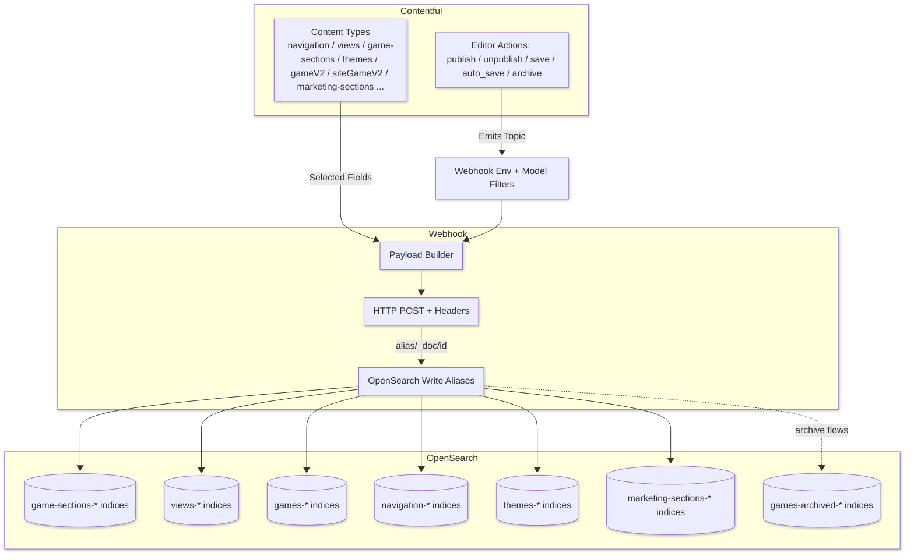
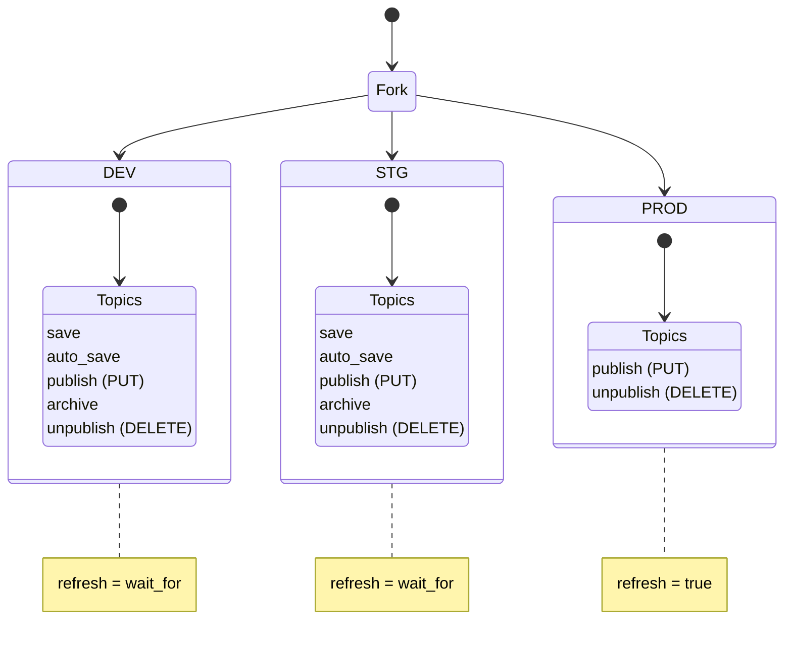

# Contentful → OpenSearch Integration (Deep-Dive Summary)

---



## 1) Webhook Suite: What/why

### Key characteristics

- **Bulk environment bootstrap.** The system creates a **complete** webhook ecosystem for a target environment in one shot (no partial creation) and separates **V2** and **V3** suites. If **any** creation fails, the process stops (fail-fast).
- **Deterministic order.** Webhooks are generated in a fixed sequence to respect dependencies. Update-type webhooks are created before delete-type ones.
- **Uniform payload + headers.** All webhook bodies follow shared payload builders; headers include a **User-Agent**, **Basic auth**, and a diagnostic **X-Query-Metadata** that echoes the Contentful type.&#x20;
- **Environment specific.** A common **environment filter** prevents cross-environment leakage. Configuration (URLs, credentials) comes from a single env-aware source.&#x20;

### V2 vs V3 suites

- **V2 (10 hooks):** ventures, categories, sections, personalised sections, layouts, gameV2, siteGameV2, suggested games, general delete, gameV2 delete.
- **V3 (12 hooks):** ventures (v3), navigation, view, **game-sections**, marketing-sections, ML sections, ML defaults, games (v3), siteGames (v3), themes, general delete (v3), gameV2 delete (v3).

> The **text suffixes** used to name hooks ensure predictable matching and clarity in UIs and logs (e.g., `[Update] OpenSearch - game-sections`). The mapping also asserts which hooks are **v2** vs **v3**.

---

## 2) Events, Topics, and Environments

### Contentful event topics used

- **Core events:** `Entry.publish`, `Entry.unpublish`, `Entry.save`, `Entry.auto_save`, `Entry.archive`.&#x20;
- **Prod** tends to be **publish/unpublish only** (for writes and deletes respectively). **Dev/Stg** accept **save/auto_save** as well to speed iteration:

  - PUT topics (Dev/Stg): `save, auto_save, publish`. DELETE topics (Dev/Stg): `archive, unpublish`.&#x20;
  - PUT/DELETE topics (Prod): `publish` / `unpublish`.&#x20;

### Archive handling for game titles

- **On archive** → write the game into an **archive** index.
- **On publish** → remove the game from that archive index. (Explicit mirrored topics exist per env.)&#x20;

---

## 3) OpenSearch index targets (aliases) and refresh behavior

### Write aliases

The webhooks write to **aliases** (not raw indices), keeping rollover/versioning flexible:

- **Shared v2 aliases:** `ventures-w`, `categories-w`, `layouts-w`, `sections-w`, `games-w`, `personalisation-defaults-w`, `personalised-sections-w`, `games-archived-w` (+ `games-archived-r` read alias) and a global alias group `personalisation`.&#x20;
- **V3 aliases:** `navigation-w`, `views-w`, `game-sections-w`, `games-v2-w`, `marketing-sections-w`, `themes-w`, `ml-sections-w`, `ml-sections-defaults-w`, shared read alias `ig-models`.&#x20;

### Refresh behavior per environment

- **dev/stg:** `refresh=wait_for` → consistent reads for QA without hammering cluster.
- **prod:** `refresh=true` → immediate visibility prioritized (safer for user-facing content).&#x20;

---

## 4) Common webhook structure

Each webhook definition contains:

- **Name:** synthesized via a helper + a constant suffix (e.g., `createHookName(..., "[Update] OpenSearch - game-sections")`).
- **URL:** `<osHost><alias>/_doc/{/payload/sys/id}?[routing?]&refresh=...`
- **Filters:** ensure the hook only fires for a **specific environment** and **specific models** (exact match or regex for model IDs).
- **Active flag:** enabled on creation.
- **Payload:** a **custom minimal JSON** built by path-expressions such as `{/payload/fields/title}`; this avoids shipping the entire Contentful envelope.

Apply the **shared environment filter**:

```json
{
  "equals": [{ "doc": "sys.environment.sys.id" }, "<contentfulEnv>"]
}
```

…and add a **model-matching** filter: either `equals` (single model) or `regexp` against a union of models.&#x20;

Headers include:

- `User-Agent`
- `Authorization: Basic <base64>`
- `X-Query-Metadata: type: {/payload/sys/type}, contentType: {/payload/sys/contentType/sys/id}`

---

## 5) Model-to-Index wiring (high-level map)

> The table shows **Contentful content types** → **OpenSearch write alias** → **doc id** and special behaviors.

| Contentful models (examples)                                                                             | Filter type       | OpenSearch write alias | Doc id   | Notes                                                                                              |
| -------------------------------------------------------------------------------------------------------- | ----------------- | ---------------------- | -------- | -------------------------------------------------------------------------------------------------- |
| `igGrid*Section`, `igCarousel*`, `igJackpotsSection`, `igDfgSection`, `igGameShuffle`, `igSearchResults` | regex union       | `game-sections-w`      | `sys.id` | Rich visual section payload (images, viewAll\*, jackpots, Bynder metadata, etc.).                  |
| `igView`, `igMiniGames`                                                                                  | regex union       | `views-w`              | `sys.id` | Holds **sections** link arrays and visibility classifications.                                     |
| `igTheme`                                                                                                | equals            | `themes-w`             | `sys.id` | Basic theming: image, primary/secondary colors, venture.                                           |
| `igNavigation`, `igLink`, `igQuickLinks`                                                                 | regex union       | `navigation-w`         | `sys.id` | Menu structure, links (internal/external), submenus; classification + visibility fields.           |
| `gameV2`                                                                                                 | equals            | `games-v2-w`           | `sys.id` | Canonical game metadata (title, vendor, launchCode, bets, tags, images…). **No routing**.          |
| `siteGameV2`                                                                                             | equals            | `games-v2-w`           | `sys.id` | Site-specific envelope (venture, sash, min/max bet, visibility…). **Routed** by `gameId` (parent). |
| `igMarketingSections` (regex set)                                                                        | regex union       | `marketing-sections-w` | `sys.id` | Banners & promo media payload.                                                                     |
| `venture`                                                                                                | equals            | `ventures-w`           | `sys.id` | Name, jurisdiction, env metadata (v2 and v3 naming variants supported).                            |
| Archive flows for `gameV2`                                                                               | n/a (topic-based) | `games-archived-w`     | `sys.id` | Move to archive on **archive**; remove on **publish**.                                             |

**Why routing for `siteGameV2`:** Writes use `?routing={/payload/fields/game/en-GB/sys/id}` so that all siteGame variants for a specific `gameId` land on the same shard — this optimizes locality for parent/child or fan-out reads.

---

## 6) Payload design (selected)

### A) Game Sections (`game-sections-w`)

A single section doc aggregates **presentation + linkage** fields so the front-end can render without runtime joins. The persisted structure includes:

- Identity + meta: `id`, `contentType`, `entryTitle`, `cmsEnv`, `updatedAt`.
- Visibility + classification: `platformVisibility`, `sessionVisibility`, `environmentVisibility`, `classification`.
- Layout + navigation: `layoutType`, `expandedSectionLayoutType`, `viewAllType`, `viewAllActionText`, `viewAllAction`, `slug`, `title`.
- Content links: `game` (single) and/or `games` (array) as Contentful link objects; sometimes `gameIds` as denormalized string/keyword array for direct lookups.
- Media: **Bynder** objects (`headerImageBynder`, `backgroundImageBynder`, `pot[1..3]ImageBynder`) plus simple string/image pointers, `mediaLoggedIn/out`, `dynamicBackground`, `dynamicLogo`, `bynderMedia`, `bynderDynamicBackground`, `bynderDynamicLogo`.
- Jackpot decorations: `jackpotType`, `jackpots`, `headlessJackpot`.

> The webhook’s filter uses a **regex** that enumerates all supported section model IDs to centralize maintenance.&#x20;

### B) Views (`views-w`)

- Identity + visibility: `id`, `contentType`, `entryTitle`, `platformVisibility`, `sessionVisibility`, `environmentVisibility`, `classification`, `cmsEnv`, `updatedAt`.
- View structure: `name`, `viewSlug`, `sections`, `topContent`, `primaryContent`, `liveHidden`, `venture`.

### C) Themes (`themes-w`)

- Identity + theme properties: `image`, `primaryColor`, `secondaryColor`, `venture`, `cmsEnv`, `updatedAt`.

### D) GameV2 (`games-v2-w`)

- Rich canonical game metadata: `title`, `vendor`, `launchCode`, `minBet`, `maxBet`, `tags`, multiple image URL patterns, fun-panel config fields, platform visibility flags, and custom `webComponentData`.

### E) SiteGameV2 (`games-v2-w`, **with routing**)

- A **two-part payload**: a lightweight **relation** (`game_to_sitegame`) that anchors the siteGame to its parent game, and a rich **siteGame** block (venture, sash/tags, min/max bet, `headlessJackpot`, visibility flags, and `gameId`).

### F) Navigation (`navigation-w`)

- Menu graph: `links`, `bottomNavLinks`, `subMenu`, `view`, plus `internalUrl`/`externalUrl`, media, venture, classification, and visibility.

### G) Marketing Sections (`marketing-sections-w`)

- Promo blocks: `banners`, `bynderMedia`, image/video URLs, link, display type/size.

---

## 7) OpenSearch Index mappings (what is indexed and how)

### A) `game-sections` mapping

- **Bynder asset fields** are captured as nested objects with rich metadata (`brandId`, `src`, `thumbnails.*`, `date*`, `width/height`, etc.). Each text field also has a `.keyword` subfield for exact filtering/sorting.
- **Link objects** (`game`, `games`, `viewAllAction`, `venture`, `jackpots`) preserve the Contentful `sys` link triple (`id/linkType/type`) so the doc can be resolved or joined externally when needed. Each inner text also has `keyword` variants.&#x20;
- **Visibility and layout fields** (`platformVisibility`, `sessionVisibility`, `environmentVisibility`, `layoutType`, `expandedSectionLayoutType`, `viewAllType`, `viewAllActionText`) are consistently `text` with `.keyword` for aggregations. Multilingual shapes (e.g., `en-GB`, `en-US`, `es`) are baked in where relevant (e.g., `title`).&#x20;

**Why this matters:** the schema supports **both** free-text (analyzed) and exact matching/aggregations (keyword) across most user-facing fields. Assets are first-class, enabling UI selection by rendition without another lookup.

### B) `personalised-sections` mapping

- Keeps a compact shape: identity (`id`, `contentType`, `cmsEnv`), shell fields (`name`, `entryTitle`, `platform`), `games` as link arrays, and scheduling/priority (`publishedAt`, `publishedVersion`, `priorityOverride`). All text fields again have `.keyword`.

**Net effect:** the indices are tuned for **facet-friendly** filtering and stable joins without heavy nested queries; most strings have dual representations for search & aggregations.

---

## 8) End-to-end flow (typical write)

1. **Editor action in Contentful** (e.g., publish `igGridASection`) triggers the configured event topic.
2. **Webhook** fires **only** if filters match the **environment** and **model** (regex/equals).&#x20;
3. The system **builds the payload** via JSON-paths (e.g., `{/payload/fields/title}`), adds shared headers incl. **Basic auth** and `X-Query-Metadata`.&#x20;
4. The POST goes to the **write alias** `…/<alias>/_doc/{id}` with `refresh` tuned by env; **siteGameV2** also includes a **routing** to `gameId`.&#x20;
5. The write becomes visible according to refresh policy (immediately in prod, wait-for in dev/stg).

**Delete / archive flows:** on **unpublish** the relevant delete hooks remove docs; for `gameV2` **archive**, content is indexed to a dedicated archive alias; **publish** removes it from that archive.&#x20;

---

## 9) Design choices that reduce risk & cost

- **Alias-first strategy**: permits index evolution (mappings, reindex migrations) with zero webhook changes.
- **Env-aware refresh**: avoids unnecessary Lucene segment churn in lower envs while keeping prod snappy.&#x20;
- **Regex unions for families of models**: one webhook covers all section variants; adding a new section type is a **single regex edit** instead of a new webhook.&#x20;
- **Dual string fields (text + keyword)**: supports both relevance and aggregations without separate materialization.
- **Routing of siteGameV2**: shard affinity by parent `gameId` improves colocation and read patterns for “all site variants of a game”.

---

## 10) Environment policies



## 11) Quick operator guide

- **Creating webhooks:** run the environment bootstrap once per env; verify that all entries appear in the **expected order** (updates → deletes).
- **Troubleshooting writes:**

  - Check **X-Query-Metadata** header in downstream logs to confirm the triggering content type.&#x20;
  - Confirm environment match via the **shared env filter** (`sys.environment.sys.id`).&#x20;
  - Validate **refresh mode** for the env (prod should be `true`, others `wait_for`).&#x20;
  - For `siteGameV2`, ensure **routing** param is present and the referenced `gameId` exists.

---

## 12) Things to watch / future simplifications

- **Regex sprawl**: each new section model requires updating the single regex; centralize these regex constants in a shared module for both **webhook setup** and **runtime** to avoid drift.&#x20;
- **Payload drift**: keep a single payload builder per model family; today, payloads are consistent but spread across helpers.
- **Archive lifecycle**: validate that **unpublish** does not conflict with **archive** flows for edge cases (e.g., unpublish after archive).

---

