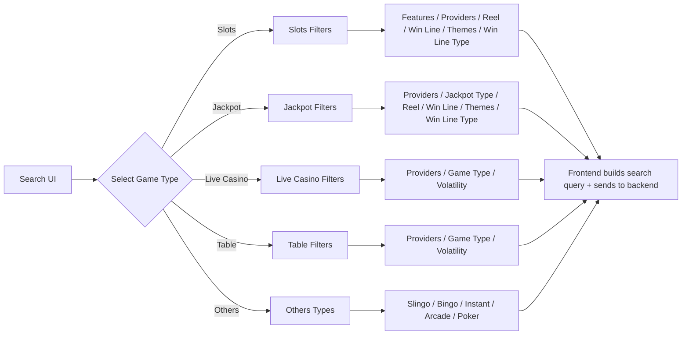

# VISION BOARD – Search Improvements   

## SEARCH  
**Best in class design with continuous optimisation & discovery.**  
Search will enable players to quickly find the game they want and help drive discovery to new content with engaging UI.  

---

## SEAMLESS PLAYER JOURNEYS  
**Reduce customer friction points and optimize core player journeys**  
and provide seamless experience. Continuous improvement with small innovative features to engage players with mobile first approach.  

---

## PLAYERS FEEL VALUED  
**Ensure our players feel rewarded and valued**  
through surprise and delight features, bonus penetration and portfolio of innovative and leading cost and tax efficient promotional tools that players love.  

---

## CONTENT  
**Content as a USP and retention tool. Encourage game discovery to diversify gameplay and extend player lifecycles.**  
Display dynamic game tile UI with key live dealer and jackpot information so players can easily select the game they want.  

---

## PERSONAL AND LOCALISED  
Offer our players new exciting content that is  
**personalized, ordered and localised to the game mechanics, features, themes they love to play.**  
Generate new innovative clusters of content that can be dynamically displayed to keep our lobby engaging for players.  

---

## PERFORMANT AND MODULARISED  
Make it fast. Lighthouse performance score and time to interact.  
Interoperable, consistent, scalable, regulation adaptable, monitored central codebase that can be localized and rolled out quickly into new territories.  

---

# Lobby Front End Enhancements  

## What?  
- Revitalize lobby features to significantly enhance user interactions and overall experience.  
- Seamlessly integrate and showcase data from multiple providers, including Pragmatic, Stakelogic, and Evolution, to provide a richer user experience.  
- Simplify the deposit process directly from the game menu to improve player retention and increase Average Revenue Per User (ARPU).  
- Utilize live data to display dynamic values enriching player engagement. e.g. Live deal tiles, Jackpot values and power bolts.  

## Why?  
- Interactive widgets and personalized recommendations encourage exploration, leading to increased player retention and more unique active game sessions.  
- A refreshed lobby experience elevates player journeys by minimizing barriers to game access and maximizing enjoyment.  
- Real-time updates and dynamic visuals foster deeper user engagement, ultimately maximizing customer lifetime value.  

---

## SCOPE  
- UK, ES and NA  
- Web and Native  

## TEAMS INVOLVED  
- Native  
- Web (Front end and BFF)  

---

# Lobby Front End – Features at a glance  

- GAME SHUFFLE WIDGET  
- LIVE DEALER GAME TILES  
- LOBBY REDESIGN – EU  
- Search  
- GAME GRIDS  
- JACKPOT WIDGETS  
- QUICK DEPOSIT  
- WINNERS FEED  
- PROVIDER DOWNTIME SCRIPT  
- BYNDER INTEGRATION  
- BINGO GAME TILES  
- BINGO POWERBOLTS TILE / WIDGET  
- JACKPOT GAME TILES / WIDGETS  
- DFG COMPONENT (QUICK WIN)  
- IN GAME MENU  

---

# SEARCH IMPROVEMENTS  

## WHAT?  
- Index and allow players to search across the metadata stored for each game using elasticsearch.  
- Enhance the search feature to show Lower RTP games in the top results.  
- Update the search UI using the latest design and UX guidelines.  
- Improve the speed which results are returned, retain search history, commercially weight results, add fuzzy logic and stop ‘dead’ ends to always show results.  
- Add filters using the metadata that allows players to narrow down their search results.  
- Add collections to provide players with pre-generated groups of content.  
- Order results by commercial weighting (from ML personalisation).  

## WHY?  
- Since 90% of clicks occur on the top three results, promoting Lower RTP games can increase revenue by encouraging more profitable and growth.  
- We believe there is a lot of opportunity to improve our search product. We want to leverage this as a tool which encourages players to explore our content library or allow them to more quickly find the game they want to play if they don’t know the exact name.  
- We will target a reduction the number of searches without game launch and grow the number of game launches from search as players use it more. We aim to ultimately grow the game launches per session and cash actives by reducing sessions without game launch.  

---

## SCOPE  
- UK, ES and NA  
- Web and Native  

## TEAMS  
- Web  
- Native  
- Data  

---

# UX Designs concepts  
**Figma Link**  

The step-by-step flow examples of user interactions with the search and filter system:  

1. **User is on the search page and taps ‘Slots’ in the ‘Quick Filters’ section.**  
   A list of slot games is displayed.  

2. **User taps on Free Spins.**  
   The list updates to show slot games with the Free Spins feature.  

3. **User taps on Inspired.**  
   The list updates again to show slot games with Free Spins provided by Inspired.  

4. **User taps on 3–3 Reels.**  
   The results are narrowed further to only those games with 3 reels that match the above criteria.  

5. **User clears filters.**  
   The applied filters are removed, and when there are few matching results, recommended games are shown.  

---

# UX Designs Concept
**Figma Link**  

The flow of game filter menus and Bingo-specific interactions:  

1. **User is on the search page and taps ‘game filter’.**  
   The game filter menu opens with categories like Slots, Jackpots, Live Casino, Table, Slingo, Bingo, Instant, and Arcade.  

2. **User taps ‘Bingo’.**  
   Since Bingo has no child filters, the Bingo games list opens directly.  

3. **If user re-opens the filter menu, they see Bingo still active.**  
   The active filter appears, and the user can clear it.  

4. **User clears Bingo.**  
   They return to the full game filter menu view showing all categories.  

---

# Feature Example Use case – Slots, Jackpot, Live Casino, Table, Other  
## High Level Scope  

| Player Action | Filter Used | Selected Criteria | Result Displayed |
|---------------|-------------|-------------------|------------------|
| Click Search  | Slot        | Slot              | Available Slot Games |
| Click Filter  | Features    | Free Spins        | List of games with Free Spins |
| Click Filter  | Provider    | Inspired          | List of games by Inspired provider |
| Click Filter  | Reels       | 3–3               | List of games with 3 reels |

| Player Action | Filter Used | Selected Criteria | Result Displayed |
|---------------|-------------|-------------------|------------------|
| Click Search  | Jackpot     | Jackpot           | List of all jackpot games |
| Click Filter  | Provider    | Inspired          | List of jackpot games |
| Click Filter  | Reel        | Megaways          | List of megaways games |
| Click Filter  | Jackpot Type| Platform Progressive | List of available games |

| Player Action | Filter Used | Selected Criteria | Result Displayed |
|---------------|-------------|-------------------|------------------|
| Click Search  | Live Casino | Live Casino       | All live casino displayed |
| Click Filter  | Live Blackjack | Live Blackjack | All Live Blackjack games |
| Click Filter  | Provider    | Evolution         | Live Blackjack games by Evo |
| Click Filter  | Volatility  | Medium            | Shows all Medium volatility Live Blackjack games by Evolution |

| Player Action | Filter Used | Selected Criteria | Result Displayed |
|---------------|-------------|-------------------|------------------|
| Click Search  | Table       | Table             | List all table games |
| Click Filter  | Provider    | Inspired          | All games from provider |
| Click Filter  | Game Type   | Roulette          | List Roulette Games |
| Click Filter  | Volatility  | Medium            | Shows all medium volatile Roulette games by Inspired |

| Player Action | Filter Used | Selected Criteria | Result Displayed |
|---------------|-------------|-------------------|------------------|
| Click Search  | Others*     | Others            | List all other games |
| Click Filter  | Slingo      | Slingo            | List all Slingo games |

*Others: Slingo, Bingo, Poker, Arcade, Instant  

---

# Game Finder and Filter  
## High Level  

It’s a taxonomy & filter specification for the Search experience. Filters are grouped by game types: Slots, Jackpot, Live Casino, Table, Others. Within each game type category, it lists the filter dimensions that apply to that game type/category (e.g., Features, Providers, Reel, Win Line, Themes, Game Type, Volatility, Jackpot Type, Win Line Type).
Practically, the Search UI menus have categories, filters and which filters appear per game type/category.
The game finder should define which filters exist per game class/types and what values each filter can take, so the product can build a consistent, discoverable filtering UI and the backend can validate/compose queries that match these controlled vocabularies.

Game Finder Examples:
- Slots games are filterable by Features (a long list of mechanics like Free Spins, Respins, Cascading Reels), Providers (the studios/vendors), Reel configurations (e.g., Megaways, 3-Mar), Win Line counts, Win Line Type (e.g., Ways), and Themes (e.g., Animal, Historic).
- Jackpot games share many of the same axes as Slots (Providers, Reel, Win Line, Themes, Win Line Type) but add Jackpot Type (e.g., Fixed Prize, Progressive, Platform Progressive).
- Live Casino games has a tighter set: Providers, SubGame Type (Roulette, Blackjack, etc.), and Volatility (Low/Medium/High).
- Table games use Providers, SubGame Type (Roulette, Blackjack, Baccarat, Dice, Craps, Poker), and Volatility.
- Others games encapsulates types/categories like Slingo, Bingo, Instant, Arcade, Poker (minimal/flat taxonomy).

Therefore a canonical mapping from [Game Type → Filter → Values], establishing how the Search screen’s Quick Filters, Menus should behave and exactly which values are valid for search and browsing.

---

# Feature List  
## High Level Scope  

### Legend:  
**M = Must, S = Should, C = Could, W = Won’t**  

| No. | What Feature | Priority | Comments | Team |
|-----|--------------|----------|----------|------|
| 1 | Index and allow players to search across the metadata stored for each game using elasticsearch. | Must | Foundational element for search. Without it, nothing else works. | Backend/Frontend |
| 2 | Add filters using the metadata that allows players to narrow down their search results. | Must | Improves usability, allows players to refine searches. | UX, ML, Frontend |
| 3 | Improve the speed at which results are returned. | Must | Use caching, results < 2 secs. | Backend, ML |
| 4 | Search results should be commercially weighted, ordered by highest margin. | Must | Boosts relevant games and revenue. | Backend/Frontend |
| 5 | Implement fuzzy logic and prevent ‘dead’ ends to ensure results are always displayed. | Must | Handle misspellings, show similar results, recommend games ordered by margin. | Backend/Frontend |
| 6 | Update the search UI using the latest design and UX guidelines. | Must | Enhances overall user experience. | UX, Frontend |
| 7 | Ensure robust error handling and fallback mechanisms. | Should | – | – |

---

# Feature List
## High Level Scope  

| R.No | What Feature | Priority | Comments | Team |
|------|--------------|----------|----------|------|
| 8 | Implement semantic search so players find games based on their intent rather the exact keyword rules. | Must | Semantic search goes beyond keywords, uses NLP/ML to understand context and intent. | Backend/Frontend |
| 9 | Semantic search should effectively use games metadata. | Must | Ensure all games tagged with relevant themes/features. Aggregation across providers. Only show providers live in Contentful for jurisdiction. | Content Team / Backend |
| 10 | Prefill Search Suggestion when Typing. | Should | Display relevant suggestions as the player types. | Frontend, ML |
| 11 | Retain player search history. | Could | Retain last 5 searches. | Backend/Frontend |
| 12 | Update Google analytics for effective monitoring. | Should | Ensure enhanced search features are captured. | Product Analytics |

---

