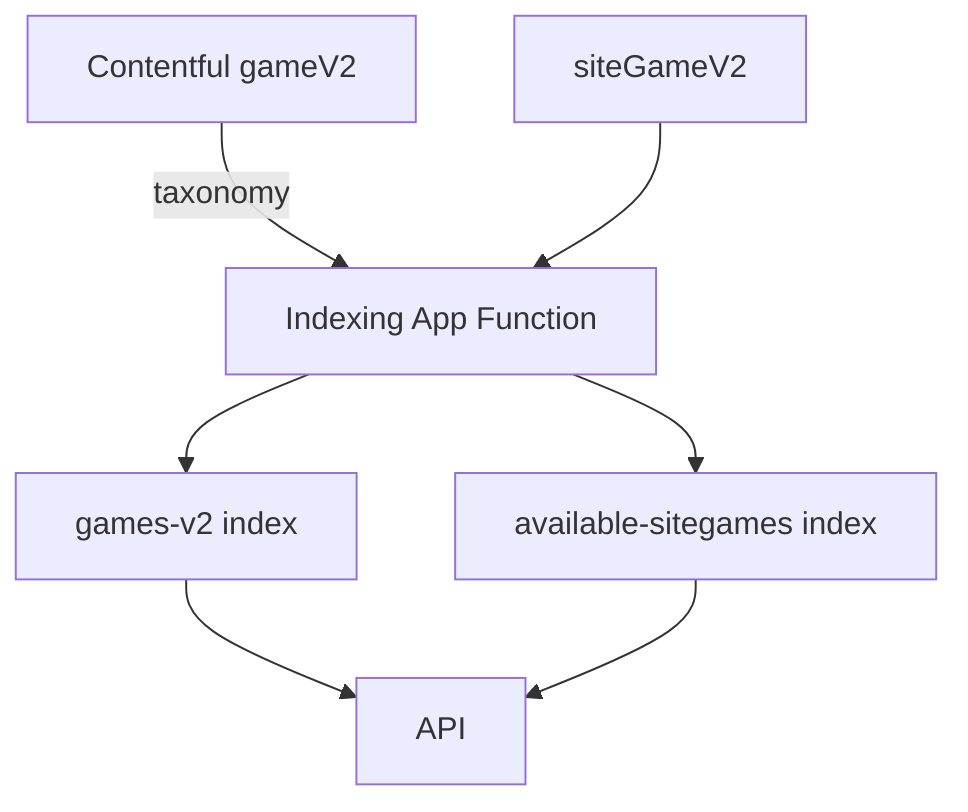

# **Recommended Technical Solution Strategy — Contentful Taxonomy Integration**

### *(Aligned with the Recommended-Flattened Phase-1 & Phase-2 Architecture for Advanced Search)*

---

## **1. Overview**

As part of the Advanced Search initiative, the platform needs a unified, scalable, and editor-friendly way to classify games using **filterable, consistent, reusable attributes** such as:

* Game Type (Slots, Live Casino, Bingo…)
* Features (Free Spins, Megaways…)
* Themes (Fruit, Egyptian, Mythical…)
* Providers
* Reels Layout
* Volatility
* Jackpot Type
  …etc.

The recommended approach is to introduce a **Contentful Taxonomy Concept System**, fully integrated into the **flattened OpenSearch indexing model** defined in Phase-1 and Phase-2.

This taxonomy system becomes the **primary metadata backbone** powering:

* Advanced multi-faceted search
* Quick filters
* Game Finder
* Dynamic filter pills
* Future personalization
* Semantic search integration (Phase-3)

---

## **2. Design Principles**

The taxonomy model must align with the goals of the flattened architecture:

### **2.1 Flat, denormalized, query-optimized docs**

Taxonomy concepts are resolved during indexing and stored as:

```json
"gameType": ["Slots"],
"features": ["Free Spins", "Megaways"],
"themes": ["Animals", "Mythical"],
"provider": ["Pragmatic Play"]
```

This enables **millisecond filtering** with a single OpenSearch request.

### **2.2 No nested structures**

Nested metadata fields (e.g., deep objects inside `gamePlatformConfig`) are avoided. All filterable metadata lives as flat keyword lists → best performance.

### **2.3 CMS-driven metadata**

Editors control taxonomy assignments directly in Contentful. No schema changes required to introduce new search filters.

### **2.4 Decoupled from venture/siteGame**

Taxonomy attaches to **gameV2**, not siteGameV2.
siteGame inherits taxonomy tags at indexing time → no duplication → cleaner modeling.

---

## **3. Why Introduce Taxonomy?**

### **3.1 Replace legacy nested metadata**

Today, game classification lives partially inside:

* Deep `gamePlatformConfig` objects
* Mixed manual strings
* Non-standard naming
* Hard-coded UI logic

This results in:

* Inconsistent filter values
* Difficult search queries
* Higher indexing complexity
* Poor editor experience

### **3.2 Enable Amazon-style multi-facet filtering**

Taxonomies provide standardization so you can easily build:

* Slot + Megaways + Free Spins
* Provider = Pragmatic + Feature = Bonus Buy
* Volatility = High AND Type = Live Casino

### **3.3 Required for Phase-2 Flattened Indexing**

Flattened index documents depend on **flat keyword arrays** to support single-query filtering.

### **3.4 Required for Semantic Search (Phase-3)**

Taxonomy concepts give the ML/semantic layer a normalized structure:

* Similarity across same features
* Embedding vectors from consistent tags
* Improved fuzzy recall and ranking

---

## **4. Contentful Taxonomy Model**

### **4.1 Taxonomy Schemes**

A taxonomy scheme defines a category of tags.
Recommended schemes:

| Scheme            | Concept Examples                          |
| ----------------- | ----------------------------------------- |
| **Game Type**     | Slots, Table, Live Casino, Jackpot, Bingo |
| **Features**      | Free Spins, Megaways, Sticky Wilds        |
| **Themes**        | Animals, Egypt, Mythical                  |
| **Provider**      | Evolution, Pragmatic Play                 |
| **Reels Layout**  | 3x3, 5x3, 6x4                             |
| **Win Line Type** | Standard, Cluster, Both Ways              |
| **Volatility**    | Low, Medium, High                         |
| **Jackpot Type**  | Fixed, Progressive                        |
| **Symbol Types**  | Wild, Scatter, Multiplier                 |

You may extend this without schema changes.

---

## **5. How Taxonomy Connects to Models**

### **5.1 gameV2**

Each gameV2 entry links to taxonomy concepts via a multi-reference field:

```
gameV2.taxonomyConcepts[] → taxonomyConcept
```

### **5.2 siteGameV2**

siteGameV2 **does not store taxonomy**.
It simply links to gameV2.

During indexing, taxonomy concepts flow through the flattening pipeline into the OpenSearch doc for each siteGame:

```
siteGame.taxonomy = gameV2.taxonomyConcepts
```

### **5.3 No reverse references**

Parents (gameV2) do not require reverse pointers to siteGame.

---

## **6. Indexing Workflow (Flattened Phase-1 & Phase-2)**

### **6.1 Data Flow**



### **6.2 Indexing Rules**

* Resolve gameV2 taxonomy
* Resolve gamePlatformConfig metadata
* Combine taxonomy + core metadata
* Produce flattened documents
* Write to:

  * **games-v2** index (global metadata)
  * **available-sitegames** index (site-game mappings)

---

## **7. Flattened Document Structure**

### **7.1 games-v2 Index Document**

```json
{
  "gameId": "g123",
  "title": "Mega Wild Spins",
  "provider": ["Pragmatic Play"],
  "gameType": ["Slots"],
  "features": ["Free Spins", "Megaways"],
  "themes": ["Animals"],
  "symbolTypes": ["Wild"],
  "volatility": ["High"],
  "reelsLayout": ["5x3"],
  "winLineType": ["Standard"],
  "jackpotType": [],
  "platforms": ["web", "ios"],
  "visibility": true
}
```

### **7.2 available-sitegames Index Document**

```json
{
  "siteGameId": "sg991",
  "gameId": "g123",
  "venture": "ballyuk",
  "linkedSections": ["sec12"],
  "linkedViews": ["viewA"],
  "linkedNavLinks": ["nl5"],
  "linkedNavigations": ["navRoot"],
  "isAvailable": true,
  "taxonomy": ["Slots", "Free Spins", "Megaways", "Animals", "High Volatility"]
}
```

---

## **8. Query Strategy (Phase-2 Single OS Query)**

A single OpenSearch request can now:

1. Filter on taxonomy (e.g., "Slots", "Free Spins", "Megaways")
2. Filter on navigation context (e.g., "navRoot")
3. Return siteGame IDs **and** attach game metadata directly from flattened docs

### Example Query

```json
{
  "query": {
    "bool": {
      "filter": [
        { "terms": { "linkedNavigations": ["navRoot"] } },
        { "terms": { "features": ["Free Spins"] } },
        { "terms": { "gameType": ["Slots"] } }
      ]
    }
  }
}
```

### Result:

* Only one index hit
* No joins
* No second query required

---

## **9. Benefits of the Taxonomy-Driven Flattened Architecture**

### **Performance**

* One OpenSearch query for all search filters
* Highly optimized inverted index on keywords
* Scales to millions of game entries

### **Editor Experience**

* Editors manage filters in Contentful Taxonomies
* No technical intervention
* No schema updates

### **Engineering Velocity**

* New filters → just add new taxonomy concepts
* No additional fields, migrations, or code refactors

### **UX**

* Multi-select filters
* Dynamic pill bar
* Quick filters
* Game Finder combinations
* Search suggestions

### **Future ML & Semantic Search**

* Normalized ontology structure used for embeddings
* Better relevance ranking
* Elastic neural query support
* Synonym expansion using taxonomy grouping

---

## **10. Conclusion**

Introducing **Contentful Taxonomy Concepts**, tightly integrated into the **flattened Phase-1 & Phase-2 indexing architecture**, is the recommended long-term solution for building a scalable, powerful, and extensible Advanced Search capability.

It enables:

* Faster queries
* Cleaner architecture
* Better metadata consistency
* More powerful filtering
* Future semantic search
* A fully CMS-driven search taxonomy

This model is modern, maintainable, big-tech-aligned, and removes all legacy limitations around deeply nested metadata.

---

Here’s a cleaned-up, Phase-1/Phase-2–aligned version you can drop in as a “Taxonomy Concept for Advanced Search” page in your solution pack.

---

# Taxonomy Concept for Advanced Search Capabilities

*(Aligned with Recommended-Flattened Phase-1 & Phase-2)*

## 1. Purpose

The taxonomy concept is the metadata backbone for the **Advanced Search** product initiative.

It defines how games are **classified in Contentful** and **indexed in OpenSearch** so that:

* The client can run **one simple OpenSearch query** against the **flattened `available-sitegames` index**.
* Filters (game type, features, themes, provider, reels, volatility, jackpot type, etc.) are driven by **taxonomy tags**, not hard-coded fields or nested JSON.
* Future enhancements (semantic search, ML ranking, “Game Finder”, personalized results) can reuse the same taxonomy structure.

This document refines the taxonomy strategy to match the **recommended-flattened Phase-1 and Phase-2 architecture**.

---

## 2. Business Goals

* Increase **game launches from search** and reduce “no result” queries.
* Promote lower RTP (higher margin) games via **commercial weighting**.
* Help players **discover new games** through engaging, multi-facet filtering (slots, providers, features, reels, etc.).
* Support **personalization** and **collections** (pre-defined sets like “Megaways”, “Free Spins”, “Top Providers”).
* Enable UX patterns similar to **Amazon / Spotify**:

  * Quick filters
  * Filter “pills”
  * Clear-all
  * Dynamic facet counts

---

## 3. Technical Goals (Phase-1 & Phase-2)

* Replace legacy, nested, multi-join search with **flat, denormalized indexes**.
* Use **Contentful taxonomy concepts** as the single source of truth for filterable metadata.
* Store taxonomy as **flat keyword arrays** in:

  * `games-v2` (game-level metadata; Phase-1)
  * `available-sitegames` (siteGame view with availability + hierarchy + game metadata; Phase-2)
* Support **multi-facet filters** using OpenSearch `bool` + `terms` queries.
* Dynamically update indexes via **Contentful App Functions + Indexer Lambdas**.
* Keep **semantic search, fuzzy matching, and ML ranking** as Phase-3+ (uses the same taxonomy but not implemented here).

---

## 4. Core Problems with Legacy Search

* Deeply nested models and Contentful reference chains → **expensive joins** and **multiple lookups**.
* Filterable metadata (features, themes, volatility, etc.) scattered across:

  * `gamePlatformConfig` blocks
  * Free-text fields
  * Hard-coded logic in the FE/API.
* Hard to add new filters (schema changes, code changes, reindexing).
* No consistent tagging model to support advanced UX flows and semantic search.

---

## 5. Taxonomy-Driven, Flattened Strategy

### 5.1 High-Level Approach

1. **Model** all filterable attributes as **taxonomy concepts** in Contentful.
2. Attach taxonomy to **gameV2** entries (not siteGameV2).
3. In the indexing pipeline:

   * Phase-1: write taxonomy to `games-v2` as flat keyword arrays.
   * Phase-2: **denormalize** relevant taxonomy fields onto each `available-sitegames` document per siteGame.
4. Search API hits **only `available-sitegames`** for Advanced Search:

   * Availability + hierarchy from `linked*` + `isAvailable`
   * Game filters from taxonomy fields (e.g., `gameType`, `themes`, `features`, …)
   * Venture/platform constraints from `siteGame.*`

### 5.2 Why this fits Phase-1 & Phase-2

* **Phase-1 (games-v2)**: canonical, global game metadata + taxonomy for all games.
* **Phase-2 (available-sitegames)**: per-siteGame flattened view, used by `/search` to serve **one-query** search with all filters applied.

---

## 6. Taxonomy Model in Contentful

### 6.1 Concept Schemes

Each scheme represents one dimension of filtering. Examples:

| Scheme        | Example Concepts                                 | Used For                        |
| ------------- | ------------------------------------------------ | ------------------------------- |
| Game Type     | Slots, Table, Live Casino, Jackpot, Bingo        | Category filters, quick filters |
| Provider      | Evolution, Pragmatic Play, NetEnt, Blueprint     | Provider filters                |
| Features      | Free Spins, Megaways, Bonus Buy, Hold & Win      | Feature filters                 |
| Themes        | Animals, Adventure, Egypt, Mythology, Fruit      | Theme filters                   |
| Reels Layout  | 3x3, 5x3, 6x4, 243 Ways                          | Reel setup filters              |
| Win Lines     | 5, 10, 25, 50, 243                               | Lines filters                   |
| Win Line Type | Standard, Cluster Pays, Pay Both Ways            | Mechanics filters               |
| Volatility    | Low, Medium, High                                | Volatility filters              |
| Jackpot Type  | Fixed Prize, In-game Progressive, Platform Prog. | Jackpot filters                 |
| Symbol Types  | Scatter, Wild, Bonus, Multiplier                 | Symbol filters                  |

### 6.2 Where They Are Used

* **In `gameV2`**

  * Add a field like `taxonomyConcepts` (multi-reference to taxonomy entries).
  * Game editors choose concepts from the schemes above.
* **In `siteGameV2`**

  * No direct taxonomy fields; it references `gameV2`.
  * At index time, siteGame inherits game’s taxonomy → used in `available-sitegames`.

---

## 7. Phase-1: Taxonomy in `games-v2` Index

### 7.1 Mapping

Example mapping fragment for `games-v2` (canonical game index):

```json
{
  "mappings": {
    "properties": {
      "gameId":      { "type": "keyword" },
      "title":       { "type": "text" },
      "provider":    { "type": "keyword" },
      "gameType":    { "type": "keyword" },
      "themes":      { "type": "keyword" },
      "features":    { "type": "keyword" },
      "reelsLayout": { "type": "keyword" },
      "volatility":  { "type": "keyword" },
      "winLineType": { "type": "keyword" },
      "jackpotType": { "type": "keyword" },
      "symbolTypes": { "type": "keyword" },
      "taxonomyConcepts": { "type": "keyword" }
    }
  }
}
```

### 7.2 Example Document

```json
{
  "gameId": "play-big-bull",
  "title": "Big Bull",
  "provider": "Games Global",
  "gameType": ["Slots"],
  "themes": ["Adventure"],
  "features": ["Free Spins", "Megaways"],
  "reelsLayout": ["5x3"],
  "volatility": ["Medium"],
  "winLineType": ["Ways-to-Win"],
  "jackpotType": [],
  "symbolTypes": ["Wilds"],
  "taxonomyConcepts": ["slots", "adventure", "free-spins", "megaways"]
}
```

This is **not** the search index yet; this is the **canonical source** for game-level metadata (+ future ML/semantic features).

---

## 8. Phase-2: Taxonomy in `available-sitegames` (Flattened Search Index)

### 8.1 Flattened SiteGame + Game Doc

Each doc in `available-sitegames` represents a **single siteGame** with:

* siteGame-level metadata (venture, env, platforms, flags).
* hierarchy (linkedSections/views/navLinks/navigations).
* **denormalized game taxonomy** (from `games-v2`).

Example document:

```json
{
  "id": "sg2",
  "gameId": "g11",

  "siteGame": {
    "env": "prod",
    "ventureId": "venture-ballys-es",
    "platforms": ["web"],
    "liveHidden": false
  },

  "linkedSections":    ["sec-slots-es"],
  "linkedViews":       ["view-home-es"],
  "linkedNavLinks":    ["navLink-main-slots-es"],
  "linkedNavigations": ["nav-main-es"],
  "isAvailable": true,

  "game": {
    "title": "Mega Bull",
    "provider": "Games Global",
    "gameType": ["Slots"],
    "features": ["Free Spins", "Megaways"],
    "themes": ["Animals", "Adventure"],
    "reelsLayout": ["5x3"],
    "volatility": ["High"],
    "winLineType": ["Standard"],
    "jackpotType": [],
    "symbolTypes": ["Scatter", "Wild"]
  },

  "updatedAt": "2025-01-19T12:32:00.000Z"
}
```

### 8.2 Mapping Fragment

```json
{
  "mappings": {
    "properties": {
      "id":     { "type": "keyword" },
      "gameId": { "type": "keyword" },

      "siteGame": {
        "properties": {
          "env":       { "type": "keyword" },
          "ventureId": { "type": "keyword" },
          "platforms": { "type": "keyword" },
          "liveHidden":{ "type": "boolean" }
        }
      },

      "linkedSections":    { "type": "keyword" },
      "linkedViews":       { "type": "keyword" },
      "linkedNavLinks":    { "type": "keyword" },
      "linkedNavigations": { "type": "keyword" },
      "isAvailable":       { "type": "boolean" },

      "game": {
        "properties": {
          "title": {
            "type": "text",
            "fields": {
              "keyword": { "type": "keyword" },
              "search":  { "type": "search_as_you_type" }
            }
          },
          "provider":    { "type": "keyword" },
          "gameType":    { "type": "keyword" },
          "features":    { "type": "keyword" },
          "themes":      { "type": "keyword" },
          "reelsLayout": { "type": "keyword" },
          "volatility":  { "type": "keyword" },
          "winLineType": { "type": "keyword" },
          "jackpotType": { "type": "keyword" },
          "symbolTypes": { "type": "keyword" }
        }
      }
    }
  }
}
```

---

## 9. Query / Search Architecture (Flattened)

### 9.1 Single-Query Pattern

The FE sends structured filters:

* navigationId(s)
* venture/platform
* taxonomy filters (gameType, features, provider, themes, volatility, etc.)
* optional free-text `q`

The Search API builds a single OpenSearch query to `available-sitegames`:

```json
POST available-sitegames/_search
{
  "size": 24,
  "query": {
    "bool": {
      "filter": [
        { "term":  { "siteGame.env": "prod" } },
        { "term":  { "siteGame.ventureId": "venture-ballys-es" } },
        { "term":  { "isAvailable": true } },
        { "terms": { "siteGame.platforms": ["web"] } },

        { "terms": { "linkedNavigations": ["nav-main-es"] } },

        { "terms": { "game.gameType": ["Slots"] } },
        { "terms": { "game.features": ["Free Spins","Megaways"] } },
        { "terms": { "game.provider": ["Games Global"] } }
      ],
      "must": [
        {
          "multi_match": {
            "query": "bull",
            "fields": ["game.title_search"],
            "fuzziness": "AUTO"
          }
        }
      ]
    }
  },
  "aggs": {
    "providers": { "terms": { "field": "game.provider", "size": 30 } },
    "gameTypes": { "terms": { "field": "game.gameType", "size": 20 } },
    "features":  { "terms": { "field": "game.features", "size": 40 } },
    "themes":    { "terms": { "field": "game.themes", "size": 40 } },
    "volatility":{ "terms": { "field": "game.volatility", "size": 10 } }
  }
}
```

This **one query** handles:

* availability, venture, platform
* navigation hierarchy
* all taxonomy filters
* fuzzy title search
* dynamic facets

No joins, no second index lookups.

---

## 10. UX Implications

Taxonomy + flattened indexing enables:

* **Quick filters** mapped 1-1 to taxonomy concepts (e.g., “Slots”, “Free Spins”).
* **Filter pills** built directly from active `game.*` filter params.
* **Clear all** and partial removal using the same query model.
* **Game Finder** flows that are just curated combinations of taxonomy filters.
* Future **collections** that are content-defined groups of taxonomy conditions (and/or explicit sets of gameIds).

---

## 11. Migration Strategy (High-Level)

1. **Define taxonomy schemes** in Contentful.
2. **Attach taxonomyConcepts** to all `gameV2` entries.
3. Build/extend the **Phase-1 Orchestrator** to:

   * Resolve taxonomy for gameV2.
   * Write flattened game docs into `games-v2` with keyword arrays.
4. Extend the **Phase-2 Indexer** to:

   * Read taxonomy fields from `games-v2` (or Contentful).
   * Denormalize them into `available-sitegames` docs per siteGame.
5. **Backfill**:

   * Batch reindex all games and siteGames into the new structure.
6. Flip **/search** to use `available-sitegames` only for Advanced Search UI.

---

## 12. Why This is Better (Summary)

* **Performance & Cost**

  * Single query, flat keyword filters, no joins → low latency, predictable cost.

* **Editor Empowerment**

  * Taxonomies are managed entirely in Contentful, no code change for new filters.

* **Architecture Simplicity**

  * Phase-1: `games-v2` = canonical metadata.
  * Phase-2: `available-sitegames` = read-optimized index for search.

* **Future-Proof**

  * Semantic search, fuzzy expansion, ML ranking can reuse taxonomy fields.
  * Collections, personalization, and recommendations plug directly into the same model.

This is the taxonomy foundation for the **recommended-flattened Phase-1 & Phase-2 Advanced Search solution**.
