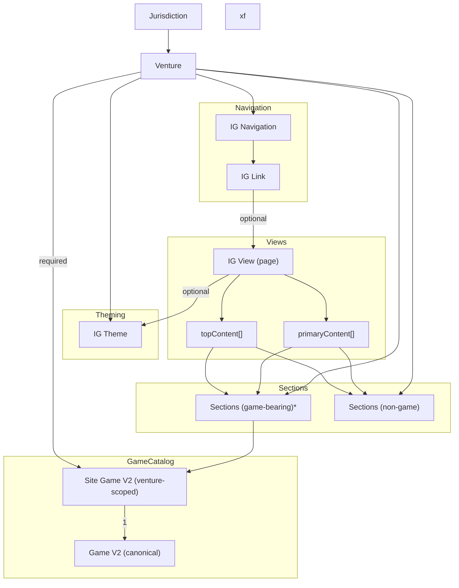
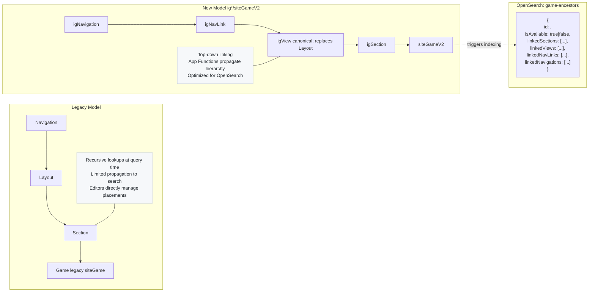

# Contentful CMS: IG (iGaming) Content Models & Relationships

## 1) Core Domain Entities

### Venture & Jurisdiction

* **Venture** has `entryTitle`, `name`, and a required link to **Jurisdiction**.&#x20;
* **Jurisdiction** carries `entryTitle` and `name`.&#x20;

### Game Model V2 (`gameV2`)

Canonical game metadata used across the lobby:

* Required localized **title**, required **platformVisibility** (`web`, `ios`, `android`), **vendor**, booleans like **progressiveJackpot**, **rgpEnabled**, **operatorBarDisabled**, rich media & Bynder fields, optional min/max bet, how-to-play, etc.&#x20;

### Site Game V2 (`siteGameV2`)

The venture-scoped, display-ready instance of a game:

* Required links to **Venture** and **GameV2**; required **environmentVisibility** (`staging`, `production`) and **platformVisibility** (`web`, `ios`, `android`); optional sash, localized min/max bet, how-to-play, headless jackpot, tags, etc.
  *(Cardinality: one `siteGameV2` → one `gameV2`; many `siteGameV2` can reference the same `gameV2`.)*&#x20;

---

## 2) Page Composition Model

### IG View (`igView`)

A **View** is a page-level container with:

* Required **venture** link; visibilities for **environment**, **platform**, **session**; slug and name.
* **topContent** can include: *Personalised sections, Quick Links, Carousel A, Banner, Braze Promos, Marketing, Promotions Grid*.
* **primaryContent** can include a broader set: *Grids A–G, Carousels A/B, DFG, Jackpots Section, Banner, Personalised sections, Search Results, Braze Promos, Jackpot Sections Block, Marketing, Promotions Grid, Game Shuffle*, etc.&#x20;

### Navigation & Links

* **IG Navigation**: venture-scoped menus with **links** and optional **bottomNavLinks** (both arrays of `igLink`).&#x20;
* **IG Link**: label + visibility controls; can point to an internal **View** or hold `externalUrl`/`internalUrl`; supports sub-menus (self-link to `igLink`), media, and `liveHidden`.&#x20;

### Theme

* **IG Theme**: venture-scoped colors and optional image, linkable from a **View**.&#x20;

---

## 3) Section Types (placed inside Views)

> Unless noted, most sections carry the standard visibility trio: **environment**, **platform**, **session**, + required **venture** link.

#### Carousels

* **Carousel A / B**: title, slug, venture; **games** (array of `siteGameV2`); optional **viewAllAction** (link to `igView`), text, and layout metadata. &#x20;

#### Grids (A–G)

* **Grid A** example: title, slug, venture; **games** (array of `siteGameV2`), optional truncation, and “view all” fields. Other grid variants (B–G) follow the same pattern with minor field deltas.&#x20;

#### Banner & Marketing

* **IG Banner**: single banner entity with media/url/color controls and visibility.&#x20;
* **IG Marketing Section**: collection of **Banners**; supports “view all” link to a **View** and **displayType**.&#x20;

#### Promotions

* **IG Promotions Grid**: section placeholder for Promotions page; venture + visibilities.&#x20;
* **IG Braze Promos Section**: container for Braze-driven promos; includes **sessionVisibility** (`loggedOut`, `loggedIn`).&#x20;

#### Jackpots

* **IG Jackpots Section**: title, **jackpotType**, optional headlessJackpot & Bynder images, **games** (`siteGameV2[]`), and “view all” options.&#x20;
* **IG Jackpot Sections Block**: a **carousel of jackpot sections** (`igJackpotsSection[]`).&#x20;

#### Search

* **IG Search Results**: structural placeholder used inside a View; slug/title; standard visibilities.&#x20;

#### Personalization

* **IG Collab Based Personalised Section** & **IG Similarity Based Personalised Section**: both venture-scoped; carry titles, slugs, visibilities; may include **games** (`siteGameV2[]`) for collab; both support **viewAllAction** to a View and `viewAllType`.&#x20;
* **IG Suggested Games**: **fallback** when no ML data—venture + `siteGameV2[]`.&#x20;

#### DFG & Shuffle

* **IG DFG Section**: interactive widget; venture + optional media/dynamic background/logo; `games` (`siteGameV2[]`).&#x20;
* **IG Game Shuffle**: titled section with visibilities; venture-scoped.&#x20;

#### Mini Games & Quick Links

* **IG Mini Games**: venture + **sections** array that references `igCarouselA`.&#x20;
* **IG Quick Links**: layout type + array of `igLink`.&#x20;

---

## 4) Utility / System Content

* **Localisation**: key/value entries (value localized) optionally scoped to a venture.&#x20;

---

## 5) End-to-End Relationship Map

---

## 6) Placement & Visibility Rules (Summary)

* **Every page** is an **IG View**. It composes `topContent[]` and `primaryContent[]` from allowed section types (see lists above), and can optionally apply an **IG Theme**.&#x20;
* **Sections** generally enforce **environment** (staging/production), **platform** (web/ios/android), **session** (loggedIn/loggedOut) and **venture** scopes. (See each section’s field list for exact validations.)&#x20;
* **Game list related sections** (Carousels, Grids, DFG, Jackpots, Personalised, Suggested) always reference **`siteGameV2[]`**, not `gameV2` directly—ensuring venture scoping and per-venture display config.   &#x20;

---

## 7) Key Modeling Insights

1. **Two-tier game model**

   * `gameV2` = canonical, vendor/media/platform metadata.
   * `siteGameV2` = venture-scoped playable instance with venture, environment & platform visibility and optional overrides.
     This ensures **reuse of global game facts** while isolating **per-venture presentation & availability**. &#x20;

2. **View-centric composition**
   Pages (**Views**) whitelist exactly which **Section** types can sit in **top** vs **primary** content zones—clear editorial guardrails and predictable rendering contracts.&#x20;

3. **Reusable navigation atoms**
   `igNavigation` + `igLink` provide a flexible internal-view routing or external deep-link system, with per-platform/session/environment gating and nested sub-menus. &#x20;

4. **Marketing & promos**
   Separation between **banners** (atoms), **marketing section** (banner collections), and **promotions grid** allows different page use-cases (hero strips vs promo hubs) while keeping a consistent visibility model.&#x20;

5. **Personalization lifecycle**

   * **ML-driven**: collab/similarity sections.
   * **Fallback**: suggested games.
     Editorial can place these anywhere a View permits, preserving UX continuity when ML signals are absent. &#x20;

6. **Jackpots as a first-class content family**
   Single jackpot sections (**IG Jackpots Section**) can be assembled into **Jackpot Sections Block** (carousel), each still ultimately referencing **`siteGameV2[]`**. &#x20;

7. **Localization and theming**
   `localisation` and `igTheme` keep strings and branding centralized yet venture-aware. &#x20;

---

## 8) Authoring Flow

1. Create **Jurisdiction**, then **Venture** (link the jurisdiction).&#x20;
2. Create **GameV2** entries (global).&#x20;
3. For each venture, create **SiteGameV2** entries linking **Venture** + **GameV2** and set visibility per platform/env.&#x20;
4. Create **Sections** (Carousels/Grids/Jackpots/etc.) referencing **SiteGameV2\[]** as needed.  &#x20;
5. Assemble a **View** by placing **topContent/primaryContent** from the allowed section list; optionally set **Theme**.&#x20;
6. Wire up **Navigation** using **IG Links** (to internal **Views** or external URLs). &#x20;

---

## 9) Quick Glossary

* **View**: a page container that whitelists which sections can appear where.&#x20;
* **Section**: a modular content block (grid, carousel, banner, DFG, jackpots, search, promos, etc.).
* **GameV2**: global game definition.&#x20;
* **SiteGameV2**: venture-scoped game instance used by sections.&#x20;
* **Navigation / Link**: reusable menu items; links may route to a View or external URL. &#x20;

---

