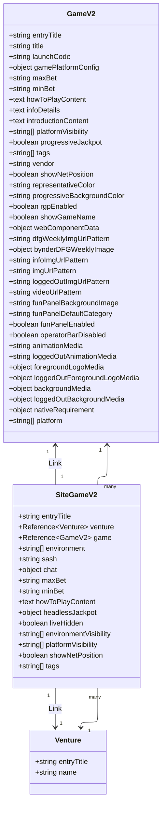

# Contentful Game Models Blueprint

## Contentful Game Models: `siteGameV2` ↔ `gameV2`

## 1) Relationship (cardinality & intent)

* **`siteGameV2` → `gameV2`**: **one required reference** from a site-specific wrapper to the canonical game record.

  * `siteGameV2.game` is a **Link<Entry<gameV2>>** and **required**.
* **`gameV2` → `siteGameV2`**: **implicit one-to-many** (a single game can power many site entries across ventures, countries, or pages). No back-reference field is defined on `gameV2`; the fan-out is materialized by multiple `siteGameV2` entries pointing to the same `gameV2`.

### Mermaid (compact model view)



---

## 2) `siteGameV2` — Full Field Spec

**Meta**

* **Name**: “Site Game V2”
* **Display field**: `entryTitle`
* **Purpose**: A site/venture-scoped wrapper that binds a canonical `gameV2` to a venture and adds site-specific visibility, flags, and presentation metadata.

**Fields**

1. `entryTitle` — **Symbol**, **required**, **unique**. Human-friendly identifier for editors.
2. `venture` — **Link<Entry<venture>>**, **required**. Ties the site game to a specific venture (brand/tenant).
3. `game` — **Link<Entry<gameV2>>**, **required**. Canonical game this wrapper renders.
4. `environment` — **Array<Symbol>**, values in `["staging","production"]`. Optional *allow-list* of environments this entry targets.
5. `sash` — **Symbol**. Optional label/ribbon text (e.g., “New”, “Hot”), free-form here (separate from `tags`).
6. `chat` — **Object**. Optional JSON object to configure chat/help widgets per game.
7. `maxBet` — **Symbol**, **localized**. Optional site-level override of max bet.
8. `minBet` — **Symbol**, **localized**. Optional site-level override of min bet.
9. `howToPlayContent` — **Text**, **localized**. Optional site-specific “How to play” copy.
10. `headlessJackpot` — **Object**. Optional JSON block for headless jackpot integration/config.
11. `liveHidden` — **Boolean**, default **false**. Hide from live experiences without deleting/unpublishing.
12. `environmentVisibility` — **Array<Symbol>**, **required**, default **["staging"]**; values in `["staging","production"]`. Controls visibility by environment.
13. `platformVisibility` — **Array<Symbol>**, **required**, default **["web","ios","android"]**; values constrained to those three. Controls platform gating at the site wrapper level.
14. `showNetPosition` — **Boolean**, default **true**. UI toggle for showing user net position with the game.
15. `tags` — **Array<Symbol>** with **enum** allow-list. Values include:

    * Marketing/placement: `hot`, `HOT`, `free`, `FREE`, `new`, `NEW!`, `suggested`, `SUGGESTED`, `bingo`, `BINGO`, `exclusive`, `EXCLUSIVE`, `sg-digital`
    * Table buckets: `TABLE 1` … `TABLE 10`
      *(Note: upper/lowercase variants are separately enumerated and valid.)*

---

## 3) `gameV2` — Full Field Spec

**Meta**

* **Name**: “Game Model V2”
* **Display field**: `entryTitle`
* **Purpose**: Canonical, vendor-agnostic game metadata used across ventures. Carries localizable text, platform targeting, media patterns, and operational flags.

**Identity & Core**

1. `entryTitle` — **Symbol**, **required**.
2. `title` — **Symbol**, **localized**, **required**. End-user visible display title.
3. `launchCode` — **Symbol**. Optional technical/game provider code.

**Executable/Platform Config**
4. `gamePlatformConfig` — **Object**, **required**. Vendor/runtime details (launch URLs, tech flags, capabilities, etc.).
5. `platformVisibility` — **Array<Symbol>**, **required**, default **["web","ios","android"]**; values constrained to those three.
6. `platform` — **Array<Symbol>**, optional; values in `["Desktop","Tablet","Phone"]`. (Device class hints, separate from platformVisibility.)

**Economy (localizable overrides)**
7. `maxBet` — **Symbol**, **localized**.
8. `minBet` — **Symbol**, **localized**.

**Long-form Content (localizable)**
9. `howToPlayContent` — **Text**, **localized**.
10. `infoDetails` — **Text**, **localized**.
11. `introductionContent` — **Text**, **localized**.

**Flags / Compliance / UI Behavior**
12. `progressiveJackpot` — **Boolean**, **required**, default **false**.
13. `rgpEnabled` — **Boolean**, **required**, default **false**. (Responsible gaming flag.)
14. `showNetPosition` — **Boolean**, **required**; default **true** in `en-GB`, **false** in some other locales (`en-CA`, `en-US`, `es`, `sv`).
15. `showGameName` — **Boolean**, default **false**.
16. `operatorBarDisabled` — **Boolean**, **required**, default **false**.
17. `funPanelEnabled` — **Boolean**, **required**, default **false**.

**Classification / Discovery**
18. `tags` — **Array<Symbol>** with **enum** allow-list (dup set to `siteGameV2` but order differs slightly). Includes:
- `sg-digital`, `HOT`, `FREE`, `NEW!`, `SUGGESTED`, `BINGO`, `EXCLUSIVE`
- Lowercase variants: `hot`, `free`, `new`, `suggested`, `bingo`, `exclusive`
- Table buckets: `TABLE 1` … `TABLE 10`
19. `vendor` — **Symbol**, **required**, **enum** allow-list:
`gamesys`, `roxor-rgp`, `lynx`, `engage`, `netent`, `evolution`, `igt`, `infinity`, `whitehat`.

**Branding & Colors**
20. `representativeColor` — **Symbol**, **localized**.
21. `progressiveBackgroundColor` — **Symbol**.

**Web Component & Media Patterns (mostly localizable)**
22. `webComponentData` — **Object**.
23. `dfgWeeklyImgUrlPattern` — **Symbol**, **localized**.
24. `bynderDFGWeeklyImage` — **Object**, **localized**.
25. `infoImgUrlPattern` — **Symbol**, **localized**.
26. `imgUrlPattern` — **Symbol**, **localized**.
27. `loggedOutImgUrlPattern` — **Symbol**, **localized**.
28. `videoUrlPattern` — **Symbol**, **localized**.
29. `funPanelBackgroundImage` — **Symbol**.
30. `funPanelDefaultCategory` — **Symbol**.
31. `animationMedia` — **Symbol**, **localized**, **enum**: `default` | `animated`.
32. `loggedOutAnimationMedia` — **Symbol**, **localized**, **enum**: `default` | `animated`.
33. `foregroundLogoMedia` — **Object**, **localized**.
34. `loggedOutForegroundLogoMedia` — **Object**, **localized**.
35. `backgroundMedia` — **Object**, **localized**.
36. `loggedOutBackgroundMedia` — **Object**, **localized**.
37. `nativeRequirement` — **Object**.

**Disabled/omitted (present historically, not editable)**

* `bynderGameInfoGameTile`, `bynderLoggedInGameTile`, `bynderLoggedOutGameTile`, `bynderVideoGameTile`, `bynderFunPanelBackgroundImage` are **disabled** (and in some cases **omitted**) — retained for backward compatibility but not in active use/editing.

### A) `gamePlatformConfig` is an **Object** field powered by a **custom Contentful React App**

* Although the Contentful field type is **Object**, the value is authored through a **custom React App** embedded in the entry editor.
* The app renders a structured metadata form with rich widgets (Select, Multiselect, Yes/No, TextInput), enforces validation, and writes a **single JSON object** back into `gameV2.gamePlatformConfig`.
* This design keeps the core content model simple while enabling deep, vendor-agnostic metadata capture for game discovery, search, compliance, and UI rendering.
* The app’s schema (below) represents the **authorable attributes** and option vocabularies currently in use. Your downstream systems (OpenSearch, personalization, audit) should read from `gamePlatformConfig` rather than scattering these fields across the top-level `gameV2`.

---

### B) `gamePlatformConfig` — Full Metadata Attribute Catalog (as used by the custom app)

Each entry shows: `name`, `uiWidget`, `valueType`, and **the full, exact options** where applicable. This mirrors the JSON driving the app and can be used to rebuild the UI or validate payloads.
The availabile current gamePlatformConfig field , metadata details is provided in the file: `/availaible-game-metadata-details.json` .

> Notes:
> • **Do not normalize or collapse case variants** unless you also update the app; values are case-sensitive.
> • Where lists include **apparent duplicates** (e.g., `gameAggregator`), this reflects the current source-of-truth list and should be mirrored exactly if you’re validating against it.

#### Metadata Attribute Catalog

| #  | Field (path under `gamePlatformConfig`) | UI Widget   | Value Type      | Notes / Semantics                                   |
| -- | --------------------------------------- | ----------- | --------------- | --------------------------------------------------- |
| 1  | `gameType`                              | Select      | string (enum)   | High-level category (slots, live, table, etc.).     |
| 2  | `gameProvider`                          | Select      | string (enum)   | Commercial provider/publisher.                      |
| 3  | `gameAggregator`                        | Select      | string (enum)   | Aggregation platform if applicable.                 |
| 4  | `gameStudio`                            | Select      | string (enum)   | Development studio/brand line.                      |
| 5  | `subGameType`                           | Select      | string (enum)   | Finer subtype (e.g., Auto Roulette, Megaways…).     |
| 6  | `federalGameType`                       | Select      | string (enum)   | Regulatory/base family type.                        |
| 7  | `brand`                                 | Select      | string (enum)   | Branded IP / franchise flags (incl. Yes/No).        |
| 8  | `themes`                                | Multiselect | string[] (enum) | Content themes (Egyptian, Vikings, etc.).           |
| 9  | `features`                              | Multiselect | string[] (enum) | Mechanics/modifiers (Megaways, Hold & Win…).        |
| 10 | `winLines`                              | Select      | string (enum)   | Declared payline count buckets.                     |
| 11 | `reel`                                  | Select      | string (enum)   | Reel/grid configuration (e.g., 5-3, 6-4, Megaways). |
| 12 | `winLineType`                           | Select      | string (enum)   | Ways/Lines/Cluster/Scatter/etc.                     |
| 13 | `waysToWin`                             | Select      | string (enum)   | Ways bucket (243, 117649, etc.).                    |
| 14 | `symbolCount`                           | TextInput   | string          | Max distinct symbols (raw author value).            |
| 15 | `maxMultiplier`                         | TextInput   | string          | Top advertised multiplier (raw).                    |
| 16 | `maxExposure`                           | TextInput   | string          | Max exposure/return figure (raw).                   |
| 17 | `symbolType`                            | Multiselect | string[] (enum) | Symbol families (Royals, Fruits, Gems…).            |
| 18 | `isJackpot`                             | YesNo       | boolean         | Any jackpot present.                                |
| 19 | `isJackpotFixedPrize`                   | YesNo       | boolean         | Fixed jackpot flag.                                 |
| 20 | `isJackpotInGameProgressive`            | YesNo       | boolean         | In-game progressive jackpot.                        |
| 21 | `isJackpotPlatformProgressive`          | YesNo       | boolean         | Platform-level progressive jackpot.                 |
| 22 | `isPersistence`                         | YesNo       | boolean         | Persistent state/meters across sessions.            |
| 23 | `liveDealer`                            | YesNo       | boolean         | Live dealer experience.                             |
| 24 | `sidebets`                              | YesNo       | boolean         | Side bets available.                                |
| 25 | `bonusRounds`                           | YesNo       | boolean         | Bonus rounds present.                               |
| 26 | `traditional`                           | YesNo       | boolean         | Classic/traditional gameplay feel.                  |
| 27 | `brandedSkin`                           | YesNo       | boolean         | Branded visual skin variant.                        |
| 28 | `volatility`                            | Select      | string (enum)   | Volatility tier (low/medium/high).                  |
| 29 | `averageGameRoundLength`                | Select      | string (enum)   | Round time bucket (0–29s, 30–59s, 60+).             |
| 30 | `maxMultiplierRange`                    | Select      | string (enum)   | Bucketed max multiplier (1–99x, 100–4999x, 5000x+). |
| 31 | `languages`                             | Multiselect | string[] (enum) | Supported UI/audio languages.                       |
| 32 | `rtp`                                   | TextInput   | number          | RTP percentage (numeric).                           |


---

#### Notes

* **Storage**: This object is written verbatim to `gameV2.gamePlatformConfig`.
* **Indexing**: Flatten with a stable prefix (e.g., `entry.gamePlatformConfig[spaceLocale].gameType`, `entry.gamePlatformConfig[spaceLocale].features[]`, `entry.gamePlatformConfig[spaceLocale].rtp`). Keep bucketed numerics as keywords; add sidecar numerics only if needed for ranges.
* **Validation**: The React app enforces enums/types; backend validators should mirror the same constraints.
* **Extensibility**: Because this lives in an `Object` field, you can add fields without schema migrations; version the UI config and keep downstream mappers aligned.

---


## 4) Localization Summary

* **Localized fields on `siteGameV2`**: `maxBet`, `minBet`, `howToPlayContent`.
* **Localized fields on `gameV2`**: `title`, `maxBet`, `minBet`, `howToPlayContent`, `infoDetails`, `introductionContent`, `dfgWeeklyImgUrlPattern`, `bynderDFGWeeklyImage`, `infoImgUrlPattern`, `imgUrlPattern`, `loggedOutImgUrlPattern`, `videoUrlPattern`, `animationMedia`, `loggedOutAnimationMedia`, `foregroundLogoMedia`, `loggedOutForegroundLogoMedia`, `backgroundMedia`, `loggedOutBackgroundMedia`, `representativeColor`.
* **Locale-specific defaults** exist for `showNetPosition` (true in en-GB, false in several others) on `gameV2`.

---

## 5) Requireds, Defaults, Enums (at a glance)

### `siteGameV2`

* **Required**: `entryTitle`, `venture`, `game`, `environmentVisibility`, `platformVisibility`.
* **Defaults**:

  * `liveHidden = false`
  * `environmentVisibility = ["staging"]`
  * `platformVisibility = ["web","ios","android"]`
  * `showNetPosition = true`
* **Enum fields**:

  * `environment`, `environmentVisibility`: `staging|production`
  * `platformVisibility`: `web|ios|android`
  * `tags`: `sg-digital|hot|HOT|free|FREE|new|NEW!|suggested|SUGGESTED|bingo|BINGO|exclusive|EXCLUSIVE|TABLE 1..TABLE 10`

### `gameV2`

* **Required**: `entryTitle`, `title`, `gamePlatformConfig`, `platformVisibility`, `progressiveJackpot`, `rgpEnabled`, `showNetPosition`, `funPanelEnabled`, `operatorBarDisabled`, `vendor`.
* **Defaults**:

  * `progressiveJackpot = false`
  * `rgpEnabled = false`
  * `showNetPosition = true (en-GB), false (several other locales)`
  * `funPanelEnabled = false`
  * `operatorBarDisabled = false`
  * `platformVisibility = ["web","ios","android"]`
* **Enum fields**:

  * `platformVisibility`: `web|ios|android`
  * `platform`: `Desktop|Tablet|Phone`
  * `tags`: same vocabulary as `siteGameV2` (incl. `TABLE 1..TABLE 10`, mixed case)
  * `animationMedia`, `loggedOutAnimationMedia`: `default|animated`
  * `vendor`: `gamesys|roxor-rgp|lynx|engage|netent|evolution|igt|infinity|whitehat`

---

## 6) Modeling Guidance & Usage Notes

* **Canonical vs. contextual**:

  * Put **game-intrinsic** facts (titles, vendor, RGP flags, platform affordances, default media patterns) in **`gameV2`**.
  * Put **site/venture-specific** decisions (which venture, environment/platform visibility, site overrides, local “how to play”, temporary hiding) in **`siteGameV2`**.
* **Visibility precedence**:

  * A game should be rendered only when **both** the `gameV2.platformVisibility` and the `siteGameV2.platformVisibility` allow the target platform; and the `siteGameV2.environmentVisibility` includes the runtime environment.
  * `liveHidden` on `siteGameV2` provides a quick kill-switch without affecting the canonical `gameV2`.
* **Economic overrides**:

  * If present, consider `siteGameV2.maxBet|minBet` as top-level overrides for UI/marketing copy; otherwise fall back to the localized values on `gameV2`.
* **Tag hygiene**:

  * The enum lists include **both uppercase and lowercase variants**. Decide a **single case convention** for authoring to avoid duplicate semantics (e.g., prefer uppercase in editorial policy) while still honoring the schema’s allowed values.
* **Vendor gating**:

  * `vendor` on `gameV2` is a **required**, enumerated field. Use it for downstream routing (launchers, wallet integrations, QA hand-offs).
* **Media strategy**:

  * Image/video **URL patterns** and **Bynder objects** are modeled on `gameV2` and largely localized. Several historical Bynder link fields are **disabled**; use current pattern fields/objects instead.
* **Compliance**:

  * `rgpEnabled` (required) and `operatorBarDisabled` (required) ensure downstream apps can enforce responsible-gaming and operator UI rules consistently.

---

## 7) Example Entry Skeletons

### `gameV2` (minimal viable)

```json
{
  "fields": {
    "entryTitle": { "en-GB": "g-1234 Book of Ra" },
    "title":      { "en-GB": "Book of Ra" },
    "gamePlatformConfig": { "en-GB": { "gameType": "slots", "gameProvider": "test" } },
    "platformVisibility": { "en-GB": ["web","ios","android"] },
    "progressiveJackpot": { "en-GB": false },
    "rgpEnabled":         { "en-GB": false },
    "showNetPosition":    { "en-GB": true },
    "funPanelEnabled":    { "en-GB": false },
    "operatorBarDisabled":{ "en-GB": false },
    "vendor":             { "en-GB": "netent" }
  },
  "metadata": { "tags": [] }
}
```

### `siteGameV2` (venture wrapper)

```json
{
  "fields": {
    "entryTitle": { "en-GB": "WH-UK • Book of Ra" },
    "venture": { "en-GB": { "sys": { "type": "Link", "linkType": "Entry", "id": "venture-wh-uk" } } },
    "game":    { "en-GB": { "sys": { "type": "Link", "linkType": "Entry", "id": "gameV2-g-1234" } } },
    "environmentVisibility": { "en-GB": ["staging"] },
    "platformVisibility":    { "en-GB": ["web","ios","android"] },
    "liveHidden":            { "en-GB": false },
    "showNetPosition":       { "en-GB": true },
    "tags":                  { "en-GB": ["NEW!", "TABLE 3"] }
  }
}
```

---

## 8) Validation Checklist (authoring & programmatic)

* Creating a `siteGameV2`:

  * Must set `entryTitle`, `venture`, `game`.
  * Ensure `environmentVisibility` contains at least one value and defaults to `["staging"]` for draft flows.
  * Ensure `platformVisibility` subset is valid (only `web|ios|android`).
* Creating a `gameV2`:

  * Must set `entryTitle`, localized `title`, `gamePlatformConfig`, `vendor`.
  * Required booleans must be explicitly set or left to schema defaults (`progressiveJackpot`, `rgpEnabled`, `showNetPosition`, `funPanelEnabled`, `operatorBarDisabled`).
  * If using animation media, only `default|animated` are valid.
* Linking:

  * A `siteGameV2` **cannot be published** without a valid link to a `gameV2`.
  * One `gameV2` can be referenced by **many** `siteGameV2` entries (per venture, per locale, or per placement need).

---


